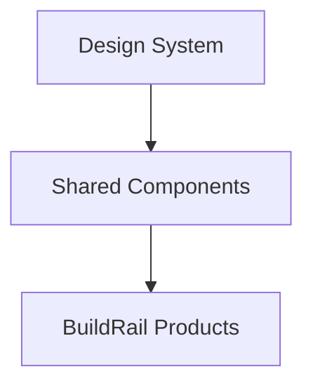

# BuildRail Design System

> **One platform. Multiple products. One recognizable experience.**

The BuildRail design system exists to ensure every product feels like part of the same company.

Whether a contractor is using:

- BuildRail Sites
- Estimator
- Field
- SiteVerdict
- Vault
- Local Lead OS

the experience should feel familiar.

---

# 1. Design Philosophy

BuildRail follows this principle:

> Professional software should feel calm, clear, and trustworthy.

Contractors are not looking for complicated enterprise software.

They need tools that:

- reduce stress
- save time
- improve professionalism
- help them make money

---

# 2. Product Experience Principles

## Principle 1 — Clarity Over Complexity

Every screen should answer:

1. What is happening?
2. What needs attention?
3. What should I do next?

Avoid:

- unnecessary dashboards
- excessive charts
- hidden actions

---

## Principle 2 — Professional, Not Flashy

BuildRail should feel like:

- Apple
- Linear
- Stripe
- Notion

Not:

- gaming interfaces
- overly animated SaaS templates
- crowded admin panels

---

## Principle 3 — Trust Is the Product

Contractors handle:

- customer relationships
- expensive projects
- business reputation

The interface must communicate:

- reliability
- accuracy
- confidence

---

# 3. Brand Personality

BuildRail should feel:

| Attribute    | Meaning                |
| ------------ | ---------------------- |
| Professional | Enterprise quality     |
| Modern       | Current technology     |
| Practical    | Built for real work    |
| Reliable     | Predictable experience |
| Intelligent  | AI-enhanced            |

---

# 4. Visual Direction

## Overall Style

BuildRail uses:

- clean layouts
- strong typography
- generous whitespace
- restrained color
- meaningful motion

Avoid:

- excessive gradients
- unnecessary cards
- visual noise

---

# 5. Color System

## Primary

BuildRail Blue

Purpose:

- primary actions
- trust indicators
- important states

Example:

```css
primary: blue-600;
```

---

## Neutral Palette

Used for:

- backgrounds
- text
- borders
- containers

Example:

```css
slate-50
slate-100
slate-500
slate-900
```

---

## Semantic Colors

| Purpose     | Color |
| ----------- | ----- |
| Success     | Green |
| Warning     | Amber |
| Error       | Red   |
| Information | Blue  |

---

# 6. Typography

BuildRail typography emphasizes:

- readability
- hierarchy
- confidence

Recommended:

## Display Font

DM Serif Display

Usage:

- marketing headlines
- major brand moments

---

## Interface Font

Manrope

Usage:

- applications
- dashboards
- forms
- navigation

---

# 7. Layout Standards

## Maximum Width

Applications:

```
max-w-7xl
```

Marketing:

```
max-w-6xl
```

---

## Spacing

Use consistent spacing:

```
4
8
12
16
24
32
48
64
```

Avoid arbitrary values.

---

# 8. Component Philosophy

Components should be:

- reusable
- predictable
- accessible
- composable

Architecture:



---

# 9. Component Standards

## Buttons

Primary action:

```
Blue filled button
```

Example:

```
Create Estimate
```

---

Secondary:

```
Outline button
```

Example:

```
Cancel
```

---

Destructive:

```
Red action
```

Example:

```
Delete Project
```

---

# 10. Cards

Cards should communicate grouping.

Good:

```
Project Summary

Customer
Timeline
Status
```

Bad:

```
Everything inside cards
```

Avoid dashboard-card overload.

---

# 11. Forms

Forms should:

- explain what information is needed
- validate immediately
- provide useful errors

Example:

Bad:

```
Invalid input
```

Good:

```
Phone number must include area code
```

---

# 12. Navigation Standards

Applications should use:

## Primary Navigation

Major workflows only.

Example:

```
Dashboard

Projects

Customers

Estimates

Reports
```

---

## Secondary Navigation

Less frequent actions.

Example:

```
Settings

Billing

Team
```

---

# 13. Data Display Standards

Tables:

Use for:

- many records
- comparison
- filtering

Cards:

Use for:

- summaries
- important metrics

Timeline:

Use for:

- project history
- activity

---

# 14. Empty States

Empty states should educate.

Bad:

```
No projects
```

Good:

```
No projects yet.

Create your first project to start managing your pipeline.
```

---

# 15. Loading States

Always provide feedback.

Preferred:

- skeleton loaders
- progressive loading

Avoid:

```
Loading...
```

---

# 16. AI Interface Standards

AI features should be recognizable but not distracting.

AI indicators:

Use:

- subtle sparkle icon
- "AI Assistant"
- "Generated by BuildRail AI"

Avoid:

- giant AI banners
- gimmicky animations

---

# 17. Motion Guidelines

Animation should communicate.

Good:

- loading
- transitions
- confirmation

Avoid:

- decorative movement

Timing:

```
150ms - 300ms
```

---

# 18. Accessibility Standards

Every interface must support:

- keyboard navigation
- screen readers
- sufficient contrast
- clear focus states

---

# 19. Technology Standards

BuildRail UI stack:

```
React

+

Next.js

+

Tailwind CSS

+

shadcn/ui

+

Lucide Icons

```

---

# 20. Component Location Standards

Shared components:

```
packages/ui
```

Product-specific components:

```
apps/[product]/components
```

---

# 21. Design Review Checklist

Before shipping UI:

## Does it feel like BuildRail?

☐ Consistent typography

☐ Consistent colors

☐ Consistent components

## Is it usable?

☐ Clear primary action

☐ Good empty state

☐ Good loading state

## Is it professional?

☐ No unnecessary complexity

☐ No visual clutter

☐ Customer trust maintained

---

# 22. Future Design System Expansion

Future documents:

```
docs/design/

├── design-system.md

├── components.md

├── ux-principles.md

├── brand-guidelines.md

└── accessibility.md
```

---

# Final Principle

The BuildRail design system exists for one reason:

Every interaction should remind users:

> "This is professional software built for serious contractors."

The products may be different.

The experience should always feel like BuildRail.
