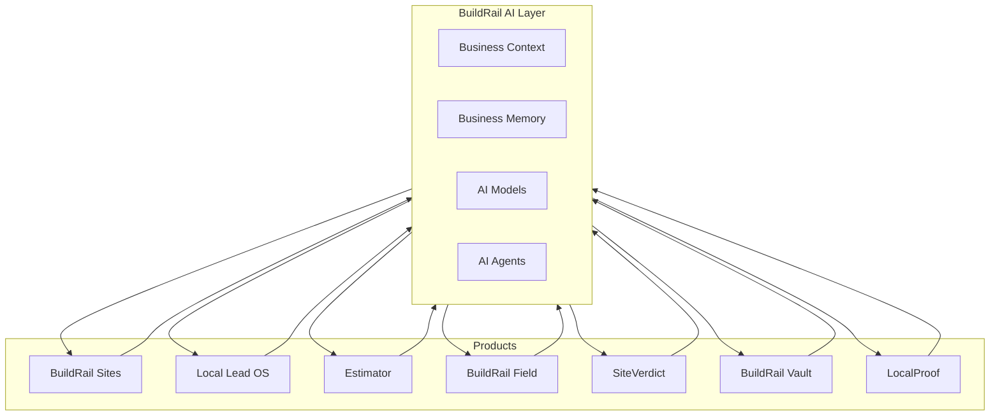
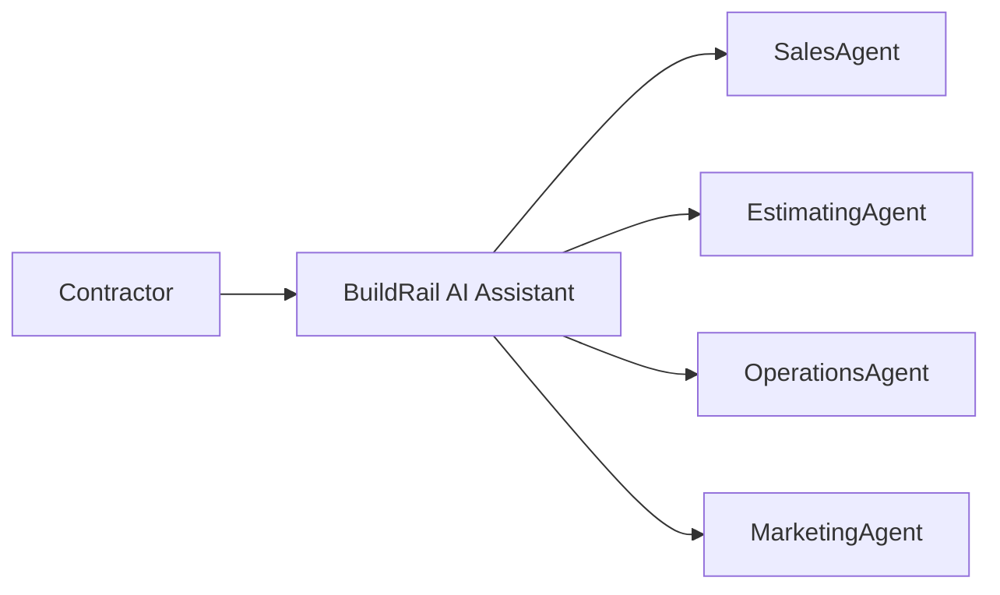
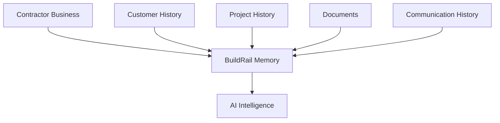

# BuildRail AI Strategy

> **BuildRail uses AI to amplify contractor expertise, not replace it.**

AI is becoming a foundational capability across software.

However, successful AI products will not simply add chat interfaces or generate text.

They will understand workflows, context, history, and business goals.

BuildRail's AI strategy is built around one idea:

> Every contractor interaction creates intelligence that helps the next decision become better.

---

# 1. AI Vision

Traditional contractor software:

```
Input data

↓

Store information

↓

Display information
```

BuildRail:

```
Input data

↓

Understand context

↓

Generate intelligence

↓

Recommend actions

↓

Improve outcomes
```

---

# 2. The BuildRail Intelligence Layer

AI exists above all BuildRail products.



---

# 3. AI Principles

## Principle 1 — Context Before Generation

AI should understand:

- contractor
- customer
- project
- history
- business goals

before generating output.

Bad:

```
Generate estimate
```

Good:

```
Generate estimate based on:

- contractor pricing history
- project type
- local market
- previous margins
```

---

# Principle 2 — AI Assists Experts

BuildRail does not replace contractors.

It makes good contractors faster and more professional.

Examples:

AI should:

✅ summarize

✅ recommend

✅ draft

✅ organize

✅ detect patterns

AI should not:

❌ make final business decisions

❌ hide assumptions

❌ remove human control

---

# Principle 3 — Every Action Creates Learning

A completed project is not the end.

It becomes training data.

Example:

```
Estimate

↓

Actual Cost

↓

Margin Result

↓

AI learns pricing accuracy
```

---

# 4. AI Capability Layers

BuildRail AI is organized into layers.

---

# Layer 1 — AI Assistance

Simple productivity improvements.

Examples:

- write customer emails
- summarize notes
- create descriptions
- generate proposals

---

# Layer 2 — AI Automation

AI completes workflows.

Examples:

- respond to inquiries
- qualify leads
- prepare reports
- create marketing drafts

---

# Layer 3 — AI Intelligence

AI provides recommendations.

Examples:

- identify risky projects
- recommend pricing
- prioritize leads
- detect trends

---

# Layer 4 — AI Agents

AI takes action across systems.

Examples:

- follow up with customers
- prepare weekly reports
- monitor project progress
- generate marketing campaigns

---

# 5. BuildRail AI Agents

Future architecture:



---

# 6. Sales Intelligence Agent

## Purpose

Help contractors win more work.

Inputs:

- leads
- conversations
- response times
- customer history

Outputs:

- lead priority
- suggested responses
- follow-up reminders

Example:

User:

> "Who should I call today?"

AI:

```
Priority Leads:

1. Sarah Johnson
   Kitchen remodel
   Requested pricing yesterday

2. Mike Davis
   Roofing repair
   High intent
```

---

# 7. Estimating Intelligence Agent

## Purpose

Improve pricing decisions.

Inputs:

- estimates
- actual costs
- labor hours
- materials
- margins

Outputs:

- pricing suggestions
- risk warnings
- profitability insights

Example:

```
Your last 12 bathroom remodels averaged:

Cost:
$18,400

Margin:
32%

Suggested estimate:
$27,500-$29,000
```

---

# 8. Operations Intelligence Agent

## Purpose

Help projects finish successfully.

Inputs:

- schedules
- updates
- photos
- customer communication

Outputs:

- project risks
- delays
- missing documentation

Example:

```
Warning:

Project has no customer update
for 14 days.

Recommended action:
Send progress update.
```

---

# 9. Marketing Intelligence Agent

## Purpose

Turn completed work into growth.

Inputs:

- completed projects
- photos
- customer feedback

Outputs:

- case studies
- social posts
- website updates

Example:

```
Completed Project Found:

Kitchen Remodel

Generate:

✓ Website story
✓ Instagram post
✓ Email campaign
```

---

# 10. AI Memory Architecture

The most valuable AI capability is memory.



---

# 11. AI Data Sources

AI may use:

| Source          | Example            |
| --------------- | ------------------ |
| Customer Data   | Names, preferences |
| Project History | Completed work     |
| Estimates       | Pricing patterns   |
| Photos          | Visual evidence    |
| Documents       | Contracts          |
| Communications  | Conversations      |
| Analytics       | Business trends    |

---

# 12. AI Safety Standards

BuildRail AI must:

## Protect Customer Data

Never expose one organization’s information to another.

---

## Explain Recommendations

AI suggestions should include reasoning.

Example:

```
Recommended increase:

Reason:
Similar projects exceeded estimated labor by 18%.
```

---

## Maintain Human Approval

Critical actions require approval.

Examples:

- sending contracts
- changing prices
- communicating legal information

---

# 13. AI Architecture Standards

AI functionality should use:

```
User Request

↓

Application Context

↓

Permission Check

↓

AI Service

↓

Structured Response

↓

User Approval

```

---

# 14. Prompt Engineering Standards

Prompts should be:

## Versioned

Store important prompts.

---

## Tested

Evaluate outputs.

---

## Contextual

Include relevant business information.

---

## Structured

Prefer schemas over free text.

Example:

```typescript
{
 recommendation: string,
 confidence: number,
 reasoning: string
}
```

---

# 15. AI Product Roadmap

## Phase 1 — AI Assistance

Current focus:

- content generation
- summaries
- reports
- proposal assistance

---

## Phase 2 — Workflow Automation

Next:

- AI receptionist
- automated follow-up
- marketing generation

---

## Phase 3 — Business Intelligence

Future:

- pricing intelligence
- project prediction
- operational insights

---

## Phase 4 — Autonomous Agents

Long-term:

- AI business assistant
- proactive recommendations
- cross-product automation

---

# 16. The BuildRail AI Advantage

Most AI software:

```
Prompt

↓

Answer
```

BuildRail:

```
Business Activity

↓

Context

↓

Memory

↓

Intelligence

↓

Action
```

---

# Final Principle

BuildRail should become the contractor's AI operating partner.

Not another chatbot.

Not another automation tool.

A system that understands:

- their customers
- their projects
- their pricing
- their history
- their goals

and helps them make better decisions every day.

The future of BuildRail is:

```
Software that remembers.

AI that understands.

A business that improves.
```
