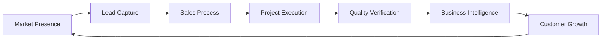
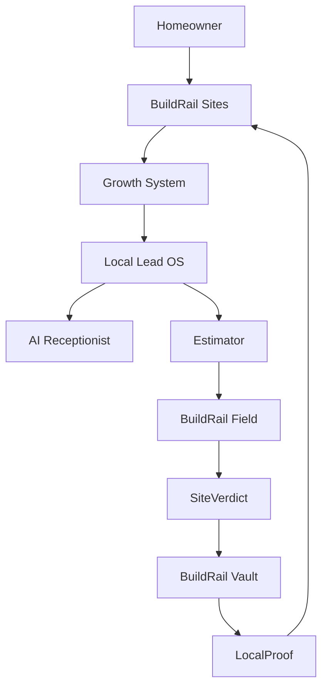
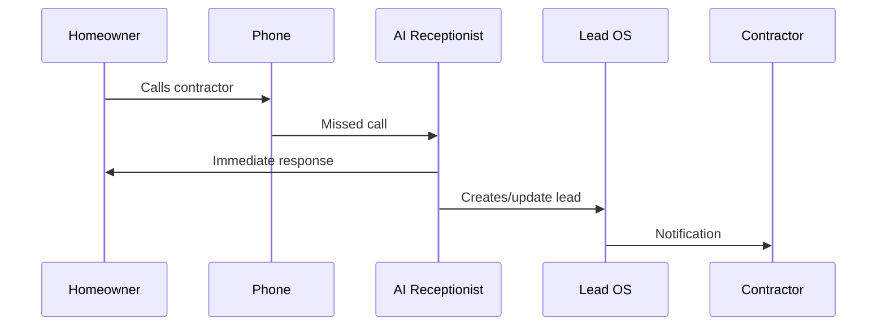

# BuildRail Customer Lifecycle

> **From first customer interaction to completed project and future growth.**

BuildRail is designed around one fundamental idea:

A contractor does not operate a collection of disconnected tasks.

They operate a continuous business lifecycle.

A homeowner:

1. discovers a contractor
2. makes contact
3. requests pricing
4. approves work
5. participates in the project
6. reviews the outcome
7. generates future referrals

BuildRail connects every step.

---

# 1. The BuildRail Flywheel

Traditional contractor software is fragmented.

A contractor may use:

- one tool for websites
- another for leads
- spreadsheets for estimates
- texts for communication
- photos stored on phones
- separate accounting systems

Information disappears between systems.

BuildRail creates a connected operating system.



Each completed project makes the contractor stronger.

---

# 2. The Complete Customer Journey



---

# 3. Stage One — Discovery

## Goal

Help contractors get discovered and establish trust.

## Product

# BuildRail Sites

The contractor's digital storefront.

Responsibilities:

- professional website
- service information
- project gallery
- reviews
- local SEO
- lead capture

Customer experience:

```
Homeowner searches:

"Bathroom remodel contractor near me"

↓

Finds contractor website

↓

Builds trust

↓

Requests information
```

---

# 4. Stage Two — Lead Capture

## Goal

Never lose an opportunity.

## Product

# Local Lead OS

The system of record for incoming opportunities.

Captures:

- contact information
- project details
- source
- communication history
- qualification status

Example:

```
New Opportunity

Customer:
Sarah Johnson

Project:
Kitchen Remodel

Budget:
$40,000

Timeline:
60 days

Status:
Qualified
```

---

# 5. Stage Three — Instant Response

## Goal

Respond faster than competitors.

## Product

# AI Receptionist

Many contractors lose jobs because nobody answers.

AI Receptionist provides:

- immediate responses
- qualification questions
- appointment preparation
- missed-call recovery

Workflow:



---

# 6. Stage Four — Estimating and Sales

## Goal

Convert opportunities into profitable work.

## Product

# BuildRail Estimator

Estimator connects customer needs with contractor pricing intelligence.

Workflow:

```
Lead

↓

Project Information

↓

Estimate

↓

Proposal

↓

Approval
```

The system helps contractors:

- price consistently
- protect margins
- create professional proposals
- reduce estimating time

---

# 7. Stage Five — Project Execution

## Goal

Deliver projects professionally.

## Product

# BuildRail Field

Field manages active work.

Responsibilities:

- project communication
- updates
- documentation
- photos
- progress tracking

Workflow:

```mermaid
flowchart LR

Estimate

--> Approved

--> Active Project

--> Progress Updates

--> Completion

```

---

# 8. Stage Six — Quality Verification

## Goal

Create trust through documented proof.

## Product

# SiteVerdict

SiteVerdict provides inspection intelligence and verification.

Capabilities:

- AI-assisted inspections
- findings
- evidence tracking
- resolution verification

Example:

```
Inspection Finding:

Issue:
Improper flashing

Status:
Resolved

Evidence:
Photo + timestamp
```

---

# 9. Stage Seven — Business Memory

## Goal

Never lose valuable business knowledge.

## Product

# BuildRail Vault

Vault becomes the contractor's long-term business memory.

Stores:

- customers
- projects
- documents
- history
- outcomes

The value compounds over time.

---

# 10. Stage Eight — Creating More Growth

## Goal

Turn completed work into future opportunities.

## Product

# LocalProof

Completed projects become marketing assets.

Creates:

- before/after stories
- customer proof
- social content
- reputation assets

Workflow:

```
Completed Project

↓

Photos

↓

Story

↓

Marketing Content

↓

New Leads
```

---

# 11. The Closed-Loop Business Model

The strongest advantage of BuildRail is the data loop.

```mermaid
flowchart LR

Projects

--> Costs

--> Estimates

--> Outcomes

--> Intelligence

--> Better Future Estimates

--> Better Projects

```

Every project improves future decisions.

---

# 12. Product Relationship Map

| Customer Need      | BuildRail Product |
| ------------------ | ----------------- |
| Get discovered     | Sites             |
| Capture inquiries  | Local Lead OS     |
| Respond quickly    | AI Receptionist   |
| Price work         | Estimator         |
| Manage projects    | Field             |
| Verify quality     | SiteVerdict       |
| Store knowledge    | Vault             |
| Generate referrals | LocalProof        |

---

# 13. Data Flow Principles

BuildRail follows these rules:

## One customer identity

A homeowner should not exist as separate records.

Example:

```
Customer

↓

Lead

↓

Estimate

↓

Project

↓

History
```

---

## Information should move forward

A lead should become:

```
Lead

↓

Customer

↓

Project

↓

Business Intelligence
```

Never restart from zero.

---

## Completed work creates future value

Every finished project should produce:

- knowledge
- proof
- marketing
- better estimates

---

# 14. Future AI Intelligence Layer

As BuildRail matures, AI can operate across the lifecycle.

Future examples:

## Sales Intelligence

"Which leads should we contact today?"

---

## Estimating Intelligence

"Based on past projects, what should this cost?"

---

## Operations Intelligence

"Which projects are at risk?"

---

## Growth Intelligence

"Which completed projects should become marketing campaigns?"

---

# 15. The BuildRail Vision

Traditional contractor software:

```
Separate tools

+
Manual transfer

+
Lost information
```

BuildRail:

```
One connected operating system

+
Continuous business intelligence

+
Compounding improvement
```

---

# Final Principle

BuildRail exists to transform the contractor business from a collection of disconnected activities into a connected operating system.

The lifecycle:

```
Discover

↓

Capture

↓

Convert

↓

Build

↓

Verify

↓

Remember

↓

Grow

↓

Repeat
```

Every interaction strengthens the next one.

That is the BuildRail advantage.
