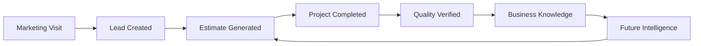
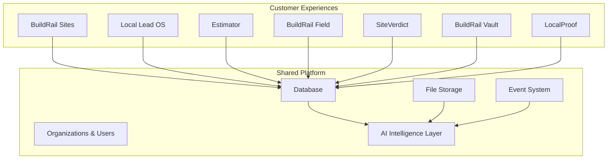
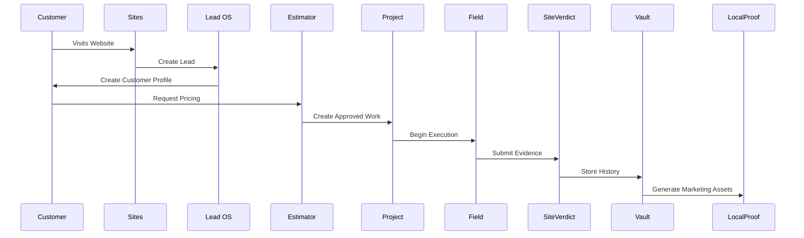
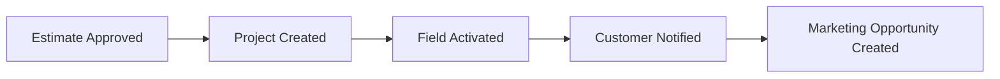
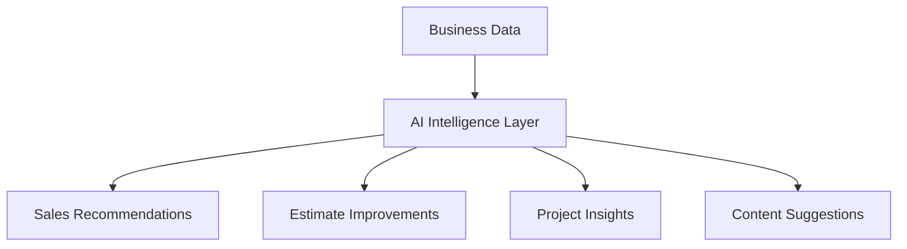

# BuildRail Data Flow Architecture

> **BuildRail becomes more valuable as information moves through the ecosystem.**

Individual applications solve immediate contractor problems.

The BuildRail platform creates long-term value by connecting those applications into a shared intelligence system.

A website visit becomes a lead.

A lead becomes a project.

A project becomes operational knowledge.

Operational knowledge becomes better estimates, better marketing, and better decisions.

---

# 1. Core Data Flow Principle

BuildRail follows one fundamental rule:

> Data should be captured once, enriched over time, and reused throughout the customer lifecycle.

Traditional software:

```text
Customer enters information

        ↓

Different apps recreate the same information

        ↓

Data becomes fragmented
```

BuildRail:

```text
Customer enters information

        ↓

Shared platform identity

        ↓

Every product enriches the same record
```

---

# 2. The BuildRail Intelligence Loop



Every completed project improves future decisions.

---

# 3. High-Level Data Architecture



---

# 4. Core Business Entities

BuildRail revolves around a small number of foundational entities.

---

# Organization

Represents the contractor company.

Example:

```typescript
Organization {
  id
  name
  subscription_plan
  settings
}
```

Everything belongs to an organization.

---

# User

Represents people using BuildRail.

Examples:

- owner
- estimator
- project manager
- employee

```typescript
User {
  id
  organization_id
  role
}
```

---

# Customer

Represents the homeowner.

```typescript
Customer {
  id
  organization_id
  name
  phone
  email
  address
}
```

The customer record is shared across the ecosystem.

---

# Lead

Represents an opportunity.

```typescript
Lead {
  id
  customer_id
  source
  status
  project_type
}
```

Lifecycle:

```
Lead

↓

Qualified Lead

↓

Estimate

↓

Project
```

---

# Estimate

Represents pricing and proposals.

```typescript
Estimate {
  id
  customer_id
  project_type
  amount
  status
}
```

---

# Project

Represents active work.

```typescript
Project {
  id
  customer_id
  estimate_id
  status
  start_date
  completion_date
}
```

---

# Evidence

Represents proof and documentation.

Examples:

- photos
- videos
- inspections
- documents

```typescript
Evidence {
  id
  project_id
  type
  storage_path
}
```

---

# 5. Customer Data Flow



---

# 6. Product Data Ownership

Each product owns workflows, not duplicate customer data.

| Data Type        | Owner                   |
| ---------------- | ----------------------- |
| Company          | Organizations           |
| Users            | Authentication          |
| Customers        | Platform Customer Model |
| Leads            | Local Lead OS           |
| Estimates        | Estimator               |
| Projects         | Field                   |
| Inspections      | SiteVerdict             |
| Documents        | Vault                   |
| Marketing Assets | LocalProof              |

---

# 7. Event-Driven Architecture

Future BuildRail versions should communicate through events.

Example:



Events allow products to remain independent.

---

# 8. Example Event Definitions

## Lead Created

```json
{
	"event": "lead.created",
	"organizationId": "123",
	"customerId": "456",
	"source": "website"
}
```

---

## Estimate Approved

```json
{
	"event": "estimate.approved",
	"estimateId": "789",
	"customerId": "456"
}
```

---

## Project Completed

```json
{
	"event": "project.completed",
	"projectId": "555",
	"photosAvailable": true
}
```

---

# 9. AI Intelligence Flow

The AI layer should learn from business activity.



---

# 10. Example Intelligence Improvements

## Estimating

Input:

```
100 completed roofing projects

+

Actual costs

+

Labor hours

+

Materials
```

Output:

```
Recommended estimate range

Confidence score

Margin warning
```

---

## Sales

Input:

```
Lead source

Response time

Conversion history
```

Output:

```
Prioritize these leads today
```

---

## Operations

Input:

```
Project timeline

Photos

Communication history
```

Output:

```
Project risk detected
```

---

# 11. Storage Architecture

BuildRail separates structured data from files.

## Database

Stores:

- customers
- projects
- estimates
- permissions
- metadata

---

## Storage

Stores:

- images
- videos
- PDFs
- documents

Example:

```
storage/

organization/

  customer/

    project/

      photos/

      documents/

      reports/
```

---

# 12. Multi-Tenant Data Isolation

Every record belongs to an organization.

Example:

```sql
projects

id
organization_id
customer_id
status
```

Security rule:

```text
User can only access records
where organization_id matches
their organization.
```

---

# 13. Data Quality Standards

BuildRail data should be:

## Complete

Required information should be captured.

---

## Consistent

One customer should have one identity.

---

## Traceable

Important changes should have history.

---

## Useful

Data should improve future decisions.

---

# 14. Data Flow Anti-Patterns

Avoid:

## Duplicate Customer Records

Bad:

```
Sites Customer

Lead OS Customer

Field Customer
```

Good:

```
Platform Customer

+
Product relationships
```

---

## Hidden Product Databases

Avoid products becoming isolated islands.

---

## Manual Data Transfer

Avoid:

```
Export CSV

↓

Import elsewhere
```

---

# 15. Future Data Platform Evolution

Future capabilities:

## Unified Search

"Find every project related to this customer."

---

## AI Assistant

"Summarize this contractor's last 20 projects."

---

## Business Intelligence

"Which services produce the highest margins?"

---

## Predictive Insights

"Which customers are likely to need future work?"

---

# 16. BuildRail Data Philosophy

The goal is not to collect data.

The goal is to create business intelligence.

A completed project should answer:

- What did we build?
- What did it cost?
- How long did it take?
- Was the customer satisfied?
- Can this become future business?

---

# Final Principle

BuildRail's competitive advantage is the connection between products.

The applications create workflows.

The platform creates memory.

The data creates intelligence.

The intelligence creates advantage.

```
Workflow

↓

Data

↓

Knowledge

↓

Intelligence

↓

Better Decisions
```

That is the BuildRail data flywheel.
