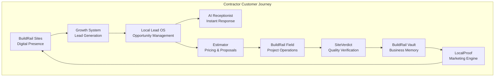

# BuildRail Product Map

> **BuildRail is not a collection of applications. It is a unified operating system for modern contractors.**

This document defines the relationship between BuildRail products, shared platform services, and the customer lifecycle.

The purpose of this document is to answer:

- What products exist?
- What problem does each product solve?
- How do products communicate?
- What belongs in the platform layer?
- Where should future features be built?

---

# 1. BuildRail Ecosystem Overview

