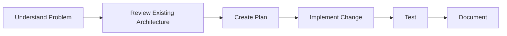

# BuildRail AI Development Standards

> **AI is a force multiplier for engineering judgment, not a replacement for engineering responsibility.**

BuildRail is built using an AI-assisted development model.

AI assistants are considered engineering collaborators that help:

- accelerate development
- explore solutions
- generate implementation ideas
- review code
- improve documentation
- reduce repetitive work

Human engineering judgment remains responsible for:

- architecture decisions
- security
- product decisions
- quality standards

---

# 1. AI Development Philosophy

BuildRail follows this principle:

> Use AI to increase engineering velocity while maintaining professional software standards.

The goal is not:

```
Generate more code faster
```

The goal is:

```
Build better software with fewer mistakes
```

---

# 2. AI Role Definition

AI assistants can help with:

## Discovery

Examples:

- understanding existing code
- analyzing architecture
- exploring implementation options
- identifying risks

---

## Planning

Examples:

- creating implementation plans
- breaking features into tasks
- suggesting architecture improvements

---

## Development

Examples:

- writing components
- creating tests
- generating migrations
- improving documentation

---

## Review

Examples:

- identifying bugs
- suggesting improvements
- checking consistency

---

# 3. Required AI Workflow

All AI-assisted development should follow:



Skipping steps creates technical debt.

---

# 4. Before Asking AI To Code

Provide context.

Good prompts include:

```
Project:

Affected files:

Current behavior:

Desired behavior:

Constraints:

Expected outcome:
```

Example:

```
Project:
SiteVerdict

Problem:
Public audit pages cannot update findings.

Files:
VerdictReport.tsx

Current behavior:
Switch updates UI but not database.

Need:
Persist changes using existing Supabase patterns.
```

---

# 5. Repository Understanding

Before making significant changes, AI should review:

```
CLAUDE.md

AGENTS.md

docs/

package.json

existing components

database schema
```

The AI should understand:

- architecture
- conventions
- naming patterns
- security model

before generating code.

---

# 6. Planning Before Implementation

For meaningful changes, AI should produce:

## Problem

What is being solved?

---

## Proposed Solution

What changes will be made?

---

## Files Affected

Example:

```
apps/siteverdict/

components/
lib/
types/

```

---

## Risks

Consider:

- breaking changes
- migrations
- authentication
- tenant isolation
- performance

---

# 7. Code Generation Standards

AI-generated code must follow BuildRail standards.

Requirements:

- TypeScript compliant
- readable
- documented where needed
- consistent with existing patterns
- production ready

Avoid:

- throwaway prototypes
- excessive abstraction
- duplicate logic

---

# 8. AI and TypeScript

AI should not solve TypeScript errors by weakening types.

Never:

```typescript
as any
```

or:

```typescript
// eslint-disable
```

unless explicitly justified.

Preferred approach:

1. Understand the type problem
2. Improve interfaces
3. Add proper validation
4. Fix the root cause

---

# 9. AI and React

AI should avoid unnecessary state management.

Before adding:

```tsx
useEffect();
```

ask:

> Is this synchronizing with an external system?

Avoid:

```tsx
state derived from props
```

Prefer:

```tsx
computed values
```

---

# 10. AI and Database Changes

Database changes require extra caution.

AI must consider:

- schema impact
- existing users
- migrations
- Row Level Security
- indexes
- tenant isolation

Never modify production schemas without understanding consequences.

---

# 11. AI and Supabase

BuildRail uses Supabase as the backend platform.

AI-generated Supabase code should consider:

## Authentication

Who is making the request?

---

## Authorization

Should they have access?

---

## Organization Boundaries

Does the data belong to the correct tenant?

---

## Security

Are secrets protected?

---

# 12. AI Code Review Checklist

Before accepting AI-generated code:

## Correctness

☐ Does it solve the intended problem?

☐ Does it handle errors?

☐ Does it work with existing architecture?

---

## Maintainability

☐ Is the code understandable?

☐ Is duplication avoided?

☐ Are names clear?

---

## Security

☐ Are permissions correct?

☐ Are secrets protected?

☐ Is tenant isolation maintained?

---

## Quality

☐ Does lint pass?

☐ Does typecheck pass?

☐ Does build pass?

---

# 13. AI Documentation Responsibilities

AI should update documentation when introducing:

- architecture changes
- new services
- database patterns
- workflows
- product capabilities

Documentation is part of completion.

---

# 14. AI Agent Instructions by Tool

## Claude

Read:

```
CLAUDE.md
```

before development.

Best used for:

- architecture
- large refactors
- planning
- documentation

---

## Cursor / IDE Agents

Read:

```
AGENTS.md
```

Best used for:

- local implementation
- iteration
- debugging

---

## ChatGPT

Best used for:

- architecture discussions
- product decisions
- debugging strategy
- technical review

---

# 15. Prompting Standards

Good prompts provide:

## Context

What exists today?

## Goal

What should happen?

## Constraints

What cannot change?

## Validation

How do we know it works?

---

# 16. Avoid AI Drift

AI can unintentionally introduce inconsistency.

Watch for:

- different naming conventions
- duplicate components
- different UI patterns
- unnecessary libraries

Always compare against existing BuildRail standards.

---

# 17. Feature Development Example

A typical BuildRail feature:

```
Request

↓

Product discussion

↓

Architecture review

↓

Implementation plan

↓

AI-assisted coding

↓

Testing

↓

Documentation

↓

Release
```

---

# 18. The BuildRail AI Principle

AI should make engineers:

- faster
- more thoughtful
- more consistent

not:

- careless
- dependent
- disconnected from architecture

---

# Final Rule

AI writes code.

Engineers own the system.

Every AI-assisted change must improve the long-term health of BuildRail.
