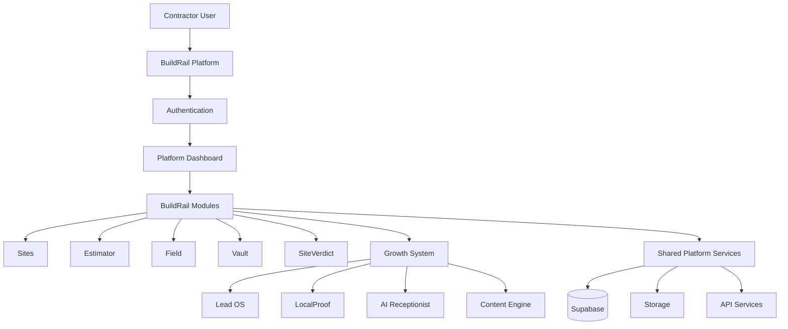
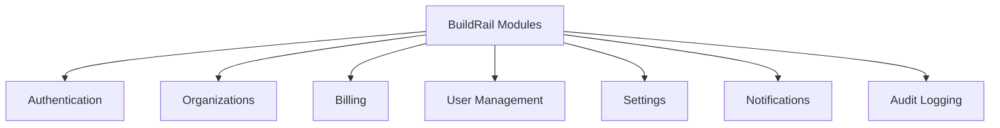
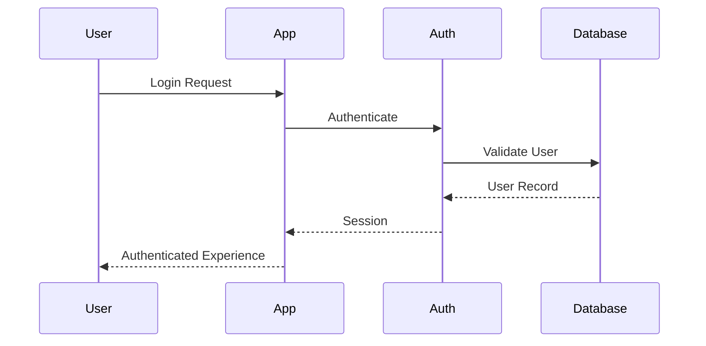
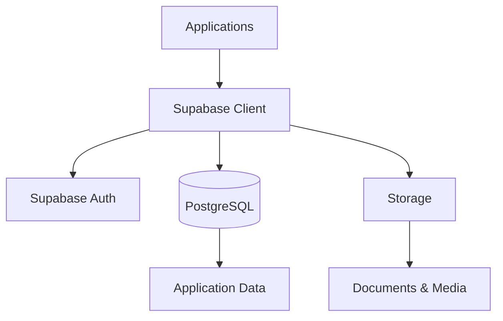
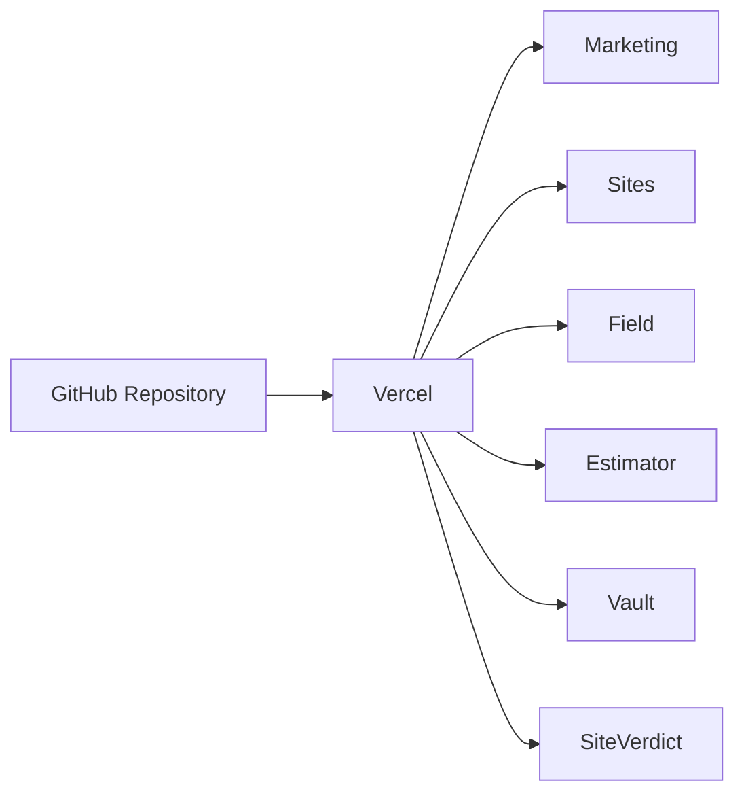
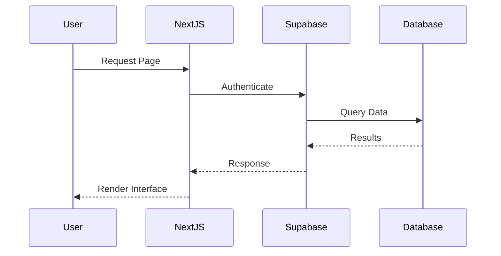
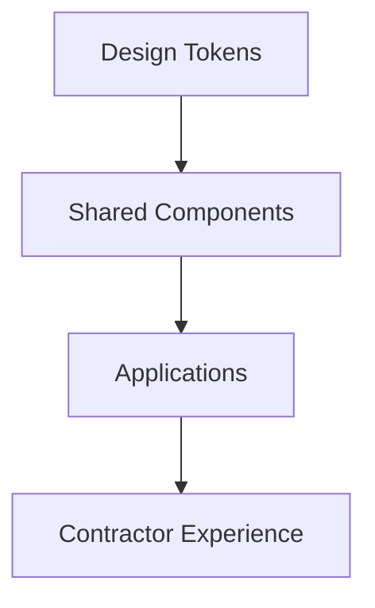
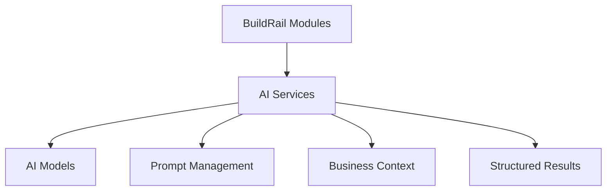

# BuildRail Architecture

> **A modular contractor operating system built as a connected ecosystem.**

This document describes the technical architecture of the BuildRail platform.

It explains how applications, shared packages, infrastructure, and services work together to create a unified software ecosystem for contractors.

---

# Architecture Philosophy

BuildRail follows a modular platform architecture.

The goal is not to build one large application.

The goal is to build a collection of focused products that share:

- A common identity system
- A common design language
- Common engineering standards
- Shared infrastructure
- Shared customer context

Each module solves a specific contractor problem.

Together, they form the BuildRail operating system.

---

# High-Level Platform Architecture



---

# Repository Architecture

BuildRail uses a pnpm workspace monorepo.

The repository contains all applications and shared packages required to operate the ecosystem.

```text
buildrail/

├── apps/
│
├── packages/
│
├── docs/
│
├── package.json
│
├── pnpm-workspace.yaml
│
└── pnpm-lock.yaml
```

---

# Application Layer

Applications represent complete user-facing products.

Each application should:

- Own its business logic
- Be independently deployable
- Follow shared standards
- Consume shared packages when appropriate

Current applications:

| Application                   | Purpose                             |
| ----------------------------- | ----------------------------------- |
| marketing                     | Public website, pricing, onboarding |
| sites                         | Contractor website platform         |
| estimator                     | Project estimating tools            |
| field                         | Field operations                    |
| vault                         | Document management                 |
| siteverdict                   | AI inspection intelligence          |
| growth-system/lead-os         | Lead management                     |
| growth-system/localproof      | Local marketing automation          |
| growth-system/ai-receptionist | AI customer communication           |
| growth-system/content-engine  | Marketing content generation        |

---

# Application Boundaries

Applications should not directly depend on another application's internal code.

Correct:

```text
Sites App

        |
        |
        v

Shared UI Package
```

Incorrect:

```text
Sites App

        |
        |
        v

Estimator App Components
```

Applications communicate through:

- Shared packages
- APIs
- Database contracts
- Platform services

---

# Shared Package Layer

Packages contain reusable capabilities.

```mermaid
flowchart LR

APPS[Applications]

APPS --> UI[@buildrail/ui]

APPS --> TYPES[@buildrail/types]

APPS --> UTILS[@buildrail/utils]

APPS --> DB[@buildrail/database]

APPS --> AUTH[@buildrail/auth]
```

---

# Package Philosophy

Packages exist to solve repeated problems.

A package should only be created when:

1. Multiple applications need the functionality.
2. The abstraction is stable.
3. Ownership is clear.

Avoid creating packages simply because code could theoretically be shared.

---

# Platform Layer

The platform layer provides capabilities used across BuildRail.



---

# Authentication Architecture

BuildRail uses centralized authentication.



Authentication provides:

- User identity
- Organization membership
- Permissions
- Session management

---

# Organization Model

BuildRail is designed around organizations.

A typical structure:

```text
Organization

├── Owner

├── Administrators

├── Employees

├── Projects

├── Customers

└── Data
```

Organizations provide:

- Data isolation
- Billing ownership
- Team management
- Permissions

---

# Data Architecture

BuildRail uses Supabase as the primary backend platform.



---

# Database Principles

Database design follows these rules:

| Principle              | Description                           |
| ---------------------- | ------------------------------------- |
| Organization First     | Data belongs to organizations         |
| Explicit Relationships | Avoid unclear connections             |
| Strong Types           | Database types flow into applications |
| Secure Access          | Row Level Security required           |
| Migration Driven       | Schema changes are version controlled |

---

# Deployment Architecture

BuildRail applications deploy independently.



---

# Environment Strategy

Each application maintains:

- Development environment
- Preview environment
- Production environment

Environment variables are never committed.

Example:

```text
.env.local

NEXT_PUBLIC_SUPABASE_URL=
NEXT_PUBLIC_SUPABASE_ANON_KEY=
SUPABASE_SERVICE_KEY=
```

---

# Request Flow

A typical user interaction:



---

# Design System Architecture

The design system provides visual consistency.



Shared standards include:

- Typography
- Colors
- Spacing
- Components
- Interaction patterns

---

# AI Architecture

AI features are treated as platform capabilities.



AI systems should:

- Produce predictable outputs
- Preserve customer context
- Be explainable
- Support human review

---

# Scaling Strategy

BuildRail scales through modular growth.

The platform should grow by adding modules, not increasing complexity inside existing modules.

Future modules should follow this pattern:

```text
New Module

+

Shared Platform Services

+

Shared Design System

+

Shared Authentication

=

Native BuildRail Experience
```

---

# Architecture Decision Guidelines

Before introducing a major architectural change, ask:

1. Does this simplify the system?
2. Does this improve customer value?
3. Does this reduce future complexity?
4. Does this fit existing patterns?
5. Is the decision documented?

---

# Current Architectural Priorities

## Foundation

- Stable monorepo structure
- Shared packages
- Documentation
- Engineering standards

## Platform

- Authentication
- Organizations
- Billing
- Shared services

## Products

- Complete existing modules
- Improve integrations
- Expand contractor workflows

## Growth

- Customer acquisition
- Onboarding
- Self-service adoption

---

# Future Architecture Improvements

Planned areas:

- Central API layer
- Event-driven workflows
- Background job processing
- Advanced analytics
- Enterprise permissions
- Multi-region support

---

# Related Documents

- `handbook.md`
- `principles.md`
- `coding-standards.md`
- `monorepo.md`
- `deployment.md`

---

> **BuildRail Architecture Principle**

> **Independent modules. Shared foundation. One contractor operating system.**
