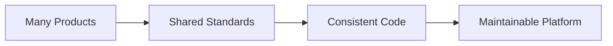
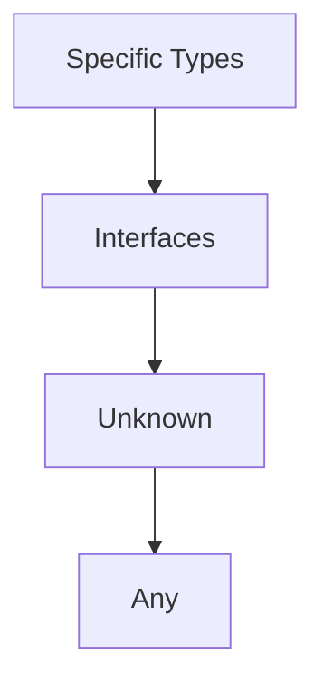
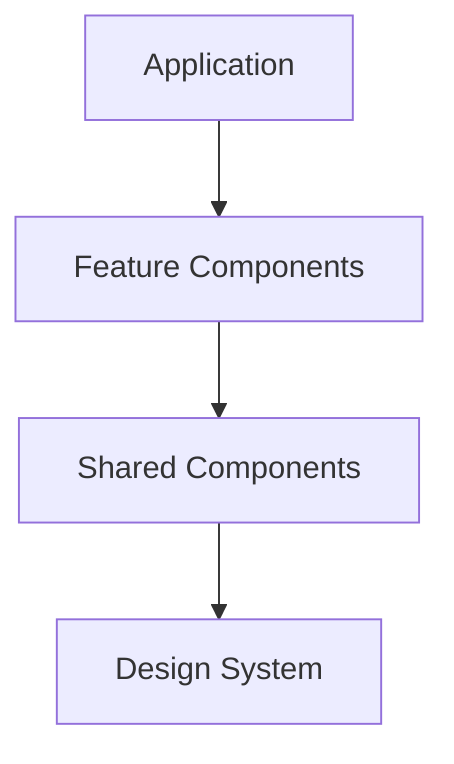

# BuildRail Coding Standards

**Document:** TypeScript, React, and Next.js Engineering Standards
**Location:** `docs/engineering/coding-standards.md`
**Status:** Living Document
**Audience:** BuildRail Engineers, AI Development Agents, Future Contributors

---

# 1. Purpose

This document defines the coding standards used across the BuildRail ecosystem.

The purpose is consistency.

BuildRail contains multiple applications:

- Marketing
- Contractor websites
- Field intelligence
- CRM systems
- AI tools
- Estimation platforms
- Customer-facing products

Without shared standards, each application becomes its own ecosystem.

The goal:



---

# 2. Core Principles

## Principle 1 — Readability Over Cleverness

Prefer code that another engineer can understand immediately.

Good:

```typescript
const customerName = customer.name;
```

Avoid:

```typescript
const n = c?.n ?? '';
```

unless there is a clear reason.

---

## Principle 2 — Explicit Over Implicit

BuildRail favors obvious code.

Prefer:

```typescript
async function createCustomer(input: CreateCustomerInput) {
	return database.customer.create(input);
}
```

Over:

```typescript
async function create(data: any) {
	return db.create(data);
}
```

---

## Principle 3 — Reuse Before Duplication

Before creating:

```
components/Button.tsx
```

Ask:

"Does this already exist?"

Shared functionality belongs in:

```
packages/
```

---

# 3. TypeScript Standards

## TypeScript Is Required

All new code should use:

```typescript
.ts
.tsx
```

Avoid:

```
.js
.jsx
```

unless integrating external code.

---

# 4. Type Safety Philosophy

BuildRail uses TypeScript to prevent mistakes, not slow development.

The preferred hierarchy:



---

# 5. Avoid `any`

`any` removes TypeScript protection.

Avoid:

```typescript
const data: any = response;
```

Prefer:

```typescript
const data: Customer = response;
```

---

## When `unknown` Is Appropriate

External data should start unknown.

Example:

```typescript
try {
} catch (error: unknown) {}
```

Then narrow:

```typescript
if (error instanceof Error) {
	console.log(error.message);
}
```

---

# 6. Interfaces and Types

Use interfaces for object contracts.

Example:

```typescript
interface Contractor {
	id: string;
	name: string;
	email: string;
}
```

Use types for unions.

Example:

```typescript
type Status = 'pending' | 'approved' | 'rejected';
```

---

# 7. Component Standards

React components should:

- Have one responsibility
- Be easy to test
- Avoid excessive logic
- Prefer composition

---

## Good Component

```tsx
<CustomerCard customer={customer} />
```

---

Avoid:

```tsx
<CustomerCard data={everything} mode="customer" type="dashboard" />
```

when responsibilities become unclear.

---

# 8. Component File Structure

Preferred:

```
components/

CustomerCard.tsx
CustomerForm.tsx
CustomerList.tsx
```

For complex components:

```
components/

CustomerCard/

├── index.ts
├── CustomerCard.tsx
├── CustomerAvatar.tsx
└── types.ts
```

---

# 9. React State Standards

Use state only when needed.

Prefer:

```typescript
const customerName = customer.name;
```

over:

```typescript
const [customerName, setCustomerName];
```

when the value is derived.

---

# 10. useEffect Rules

Effects should synchronize with external systems.

Good:

```typescript
useEffect(() => {
	window.addEventListener('resize', handler);

	return () => {
		window.removeEventListener('resize', handler);
	};
}, []);
```

---

Avoid:

```typescript
useEffect(() => {
	setLoading(false);
}, []);
```

when state can be initialized correctly.

---

# 11. State Initialization

Prefer:

```typescript
const [items, setItems] = useState<Item[]>([]);
```

Avoid:

```typescript
const [items, setItems] = useState<any>([]);
```

---

# 12. Next.js App Router Standards

BuildRail uses:

```
Next.js App Router
```

Structure:

```
app/

├── layout.tsx
├── page.tsx
├── loading.tsx
├── error.tsx
└── api/
```

---

# 13. Server Components Default

Default:

```tsx
export default function Page() {}
```

Use client components only when required.

---

Client components require:

```typescript
'use client';
```

Use for:

- State
- Effects
- Browser APIs
- Event handlers

---

# 14. Data Fetching

Prefer server-side fetching.

Example:

```typescript
export default async function Page(){

const data =
 await getCustomers();

return (
 <CustomerList data={data}/>
)

}
```

---

Avoid unnecessary client fetching.

---

# 15. API Standards

API routes should:

- Validate input
- Return predictable responses
- Handle errors

Example:

```typescript
return Response.json({
	success: true,
	data,
});
```

---

Errors:

```typescript
return Response.json(
	{
		error: 'Customer not found',
	},
	{
		status: 404,
	},
);
```

---

# 16. Styling Standards

BuildRail uses:

- Tailwind CSS
- Shadcn UI
- Lucide Icons

---

Avoid:

```tsx
style={{
 color:"blue"
}}
```

Prefer:

```tsx
className = 'text-blue-600';
```

---

# 17. UI Component Hierarchy

The preferred hierarchy:



---

Example:

```
apps/siteverdict

uses

packages/ui/Button
```

---

# 18. Naming Standards

## Components

PascalCase:

```
CustomerProfile.tsx
AuditReport.tsx
```

---

## Functions

camelCase:

```
createCustomer()
calculateEstimate()
```

---

## Constants

UPPER_CASE:

```
MAX_UPLOAD_SIZE
DEFAULT_TIMEOUT
```

---

# 19. File Organization

Preferred:

```
feature/

├── components/
├── hooks/
├── services/
├── types.ts
└── utils.ts
```

---

# 20. Error Handling

Errors should be useful.

Bad:

```typescript
catch(error){
 console.log(error)
}
```

---

Better:

```typescript
catch(error){

console.error(
"Failed creating customer",
error
);

}
```

---

# 21. Loading States

Every async operation should consider:

- Loading
- Success
- Error
- Empty state

Example:

```tsx
if (loading) return <Skeleton />;

if (error) return <ErrorState />;

return <Content />;
```

---

# 22. Forms

Forms should:

- Validate input
- Provide feedback
- Prevent duplicate submissions

Preferred tools:

- React Hook Form
- Zod

---

# 23. Database Types

Database objects should have explicit types.

Example:

```typescript
interface AuditReport {
	id: string;

	property_address: string;

	status: string;
}
```

Avoid passing raw database responses everywhere.

---

# 24. AI Development Rules

AI-generated code must:

Before acceptance:

✓ Follow existing patterns

✓ Pass lint

✓ Pass typecheck

✓ Pass build

✓ Avoid unnecessary abstractions

---

AI should never:

❌ Add `any` to silence errors

❌ Disable ESLint rules without approval

❌ Remove TypeScript checks

❌ Rewrite unrelated files

---

# 25. Definition of Quality Code

Quality BuildRail code is:

| Quality    | Meaning                     |
| ---------- | --------------------------- |
| Typed      | Mistakes caught early       |
| Simple     | Easy to understand          |
| Reusable   | Benefits ecosystem          |
| Tested     | Confidence exists           |
| Documented | Future engineers understand |

---

# Final Principle

BuildRail is a platform, not a collection of applications.

Every line of code should answer:

> "Does this make the entire ecosystem stronger?"

If yes, build it.

If no, simplify it.
