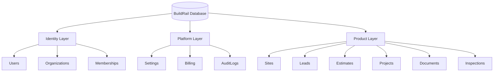
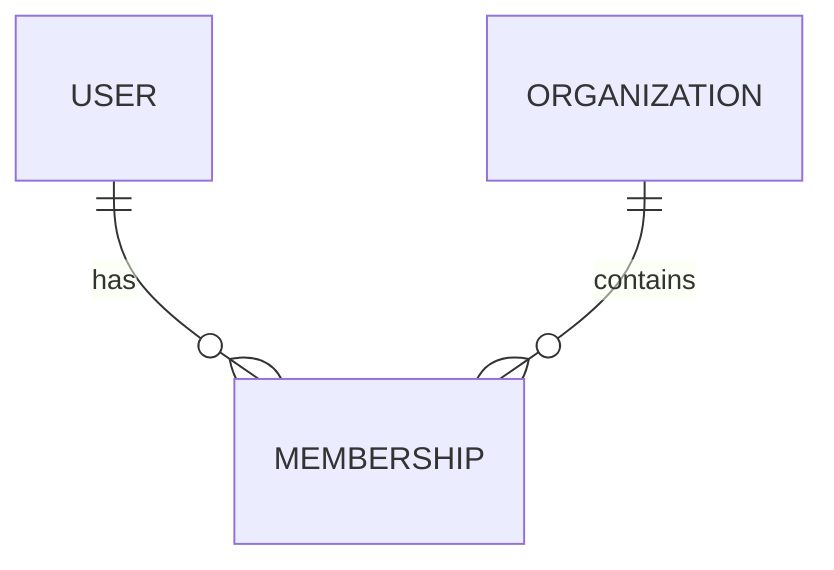
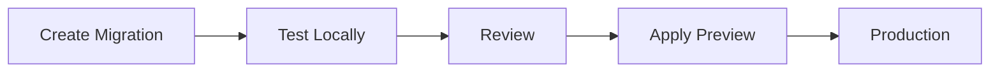

# BuildRail Database Standards

**Document:** `docs/engineering/database-standards.md`
**Status:** Living Document
**Owner:** BuildRail Engineering
**Audience:** Developers, AI coding assistants, database administrators, future engineering teams

---

# 1. Purpose

The BuildRail database is the shared foundation of the platform ecosystem.

BuildRail is not a collection of independent applications.

It is a unified SaaS platform where multiple products operate on shared business entities.

The database must support:

- Multi-tenant organizations
- Shared users and permissions
- Product interoperability
- Secure customer data isolation
- Future product expansion

This document defines:

- Database architecture
- Naming standards
- Schema patterns
- Migration practices
- Supabase conventions
- Row Level Security requirements

---

# 2. Database Philosophy

## Data Belongs to the Platform

Applications do not own customer data.

The platform owns customer data.

Example:

A contractor is not:

```
Sites Contractor
+
Estimator Contractor
+
Vault Contractor
```

The contractor is:

```
                Contractor Organization

                       |
        ---------------------------------
        |               |               |
      Sites         Estimates        Documents
```

Products consume shared platform data.

---

# 3. BuildRail Data Architecture



---

# 4. Database Layers

BuildRail tables belong to one of three categories.

| Layer    | Purpose               | Examples             |
| -------- | --------------------- | -------------------- |
| Identity | Who users are         | users, organizations |
| Platform | Shared infrastructure | billing, settings    |
| Product  | Application features  | estimates, audits    |

---

# 5. Naming Standards

## Tables

Use:

- lowercase
- plural nouns
- snake_case

Correct:

```sql
contractor_profiles
project_documents
inspection_reports
```

Avoid:

```sql
Contractor
ProjectDocument
tblUsers
```

---

# 6. Primary Keys

All tables use UUID primary keys.

Standard:

```sql
id uuid PRIMARY KEY DEFAULT gen_random_uuid()
```

Example:

```sql
CREATE TABLE projects (

id uuid PRIMARY KEY DEFAULT gen_random_uuid(),

name text NOT NULL

);
```

---

# 7. Required Timestamp Fields

All major tables should include:

```sql
created_at timestamptz
updated_at timestamptz
```

Example:

```sql
created_at timestamptz DEFAULT now(),

updated_at timestamptz DEFAULT now()
```

---

# 8. Organization Ownership

All customer-owned data requires:

```sql
organization_id uuid NOT NULL
```

Example:

```sql
CREATE TABLE estimates (

id uuid PRIMARY KEY,

organization_id uuid NOT NULL,

customer_name text,

amount numeric

);
```

---

# 9. Core Platform Schema

## Organizations

```sql
organizations

id
name
created_at
```

Represents:

- Contractor company
- Agency
- Partner organization

---

## Users

Managed by:

Supabase Auth

Reference:

```sql
auth.users
```

Do not duplicate authentication data.

---

## Memberships

Connect users and organizations.

```sql
organization_memberships

id

organization_id

user_id

role

created_at
```

Relationship:



---

# 10. Role Standards

Initial roles:

| Role   | Purpose             |
| ------ | ------------------- |
| owner  | Organization owner  |
| admin  | Manage organization |
| member | Standard user       |
| viewer | Read-only           |

Example:

```sql
role text CHECK (

role IN (
'owner',
'admin',
'member',
'viewer'
)

)
```

---

# 11. Foreign Key Standards

Always define relationships.

Example:

```sql
ALTER TABLE projects

ADD CONSTRAINT projects_org_fk

FOREIGN KEY (organization_id)

REFERENCES organizations(id);
```

Avoid orphan records.

---

# 12. Row Level Security (RLS)

RLS is mandatory.

Every organization-owned table requires:

```sql
ALTER TABLE table_name

ENABLE ROW LEVEL SECURITY;
```

---

# 13. Standard Organization Policy

Example:

```sql
CREATE POLICY

"Users can access their organization data"

ON projects

FOR ALL

USING (

organization_id IN (

SELECT organization_id

FROM organization_memberships

WHERE user_id = auth.uid()

)

);
```

---

# 14. RLS Rules

Every new table requires:

Checklist:

| Requirement     | Required |
| --------------- | -------- |
| Organization ID | Yes      |
| RLS Enabled     | Yes      |
| Select Policy   | Yes      |
| Insert Policy   | Yes      |
| Update Policy   | Yes      |
| Delete Policy   | Yes      |

---

# 15. Migration Standards

Database changes must use migrations.

Never:

- Modify production manually
- Change tables directly in dashboard
- Create undocumented changes

---

Migration example:

```
supabase/

migrations/

202607070001_create_projects.sql
202607070002_add_project_status.sql
```

---

# 16. Migration Rules

Every migration should:

## Be Small

Good:

```
Add customer_phone column
```

Bad:

```
Redesign entire database
```

---

## Be Reversible

Document rollback strategy.

---

## Be Tested

Run against development first.

---

# 17. Database Change Workflow



---

# 18. Supabase Client Standards

## Browser Client

Use:

```typescript
createBrowserClient();
```

For:

- User interactions
- Client components

---

## Server Client

Use:

```typescript
createServerClient();
```

For:

- Server components
- API routes
- Server actions

---

# 19. Data Access Layer

Avoid scattering database queries everywhere.

Prefer:

```
components
      |
      |
services
      |
      |
Supabase
```

Example:

```
lib/

database/

projects.ts

estimates.ts

organizations.ts
```

---

# 20. Example Data Access Pattern

Instead of:

```typescript
supabase.from('projects').select('*');
```

inside components.

Prefer:

```typescript
const projects = await getProjectsForOrganization(orgId);
```

Benefits:

- Easier testing
- Cleaner components
- Consistent security

---

# 21. JSON Columns

JSONB is allowed for flexible metadata.

Good:

```sql
metadata jsonb
```

Examples:

- AI output
- Integration settings
- External API responses

---

Avoid storing core business data:

Bad:

```json
{
	"name": "Project",
	"customer": "Bob",
	"price": 5000
}
```

Core data should have columns.

---

# 22. Soft Deletes

For important business records:

Prefer:

```sql
deleted_at timestamptz
```

instead of:

```sql
DELETE FROM projects
```

Reasons:

- Audit history
- Recovery
- Customer support

---

# 23. Audit Logging

Important actions should create records.

Example:

```sql
audit_logs

id

organization_id

user_id

action

created_at
```

Examples:

- User invited
- Estimate approved
- Report published
- Document deleted

---

# 24. File Storage Standards

Supabase Storage paths:

Required:

```
organization_id/
    project_id/
        filename
```

Example:

```
abc-company/
    remodel-123/
        photo1.jpg
```

Never:

```
uploads/photo.jpg
```

---

# 25. AI Data Standards

AI-generated data should be identifiable.

Example:

```sql
generated_by text

ai_model text

generated_at timestamptz
```

Example:

```
generated_by:
"openai-gpt-5"

ai_model:
"inspection-agent-v1"
```

---

# 26. Database Review Checklist

Before merging:

## Schema

- Does this belong in the platform?
- Is naming correct?
- Are relationships defined?

## Security

- Is organization isolation enforced?
- Are RLS policies included?

## Performance

- Are indexes needed?
- Are queries efficient?

## Documentation

- Is the schema understandable?

---

# 27. AI Development Rules

AI assistants must not:

- Create duplicate user tables
- Add tables without organization ownership
- Disable RLS
- Store secrets
- Modify production directly

Before creating database changes, AI should explain:

1. Why this table exists
2. How it relates to existing entities
3. Security model
4. Migration plan

---

# 28. Future Expansion

This document will expand with:

- Database indexing strategy
- Query optimization
- Reporting architecture
- Data warehouse patterns
- Analytics pipelines
- Backup and recovery procedures

---

# BuildRail Database Principle

> The database is not where applications store information. It is where the BuildRail platform remembers its business.

---

**BuildRail Engineering Standard**
