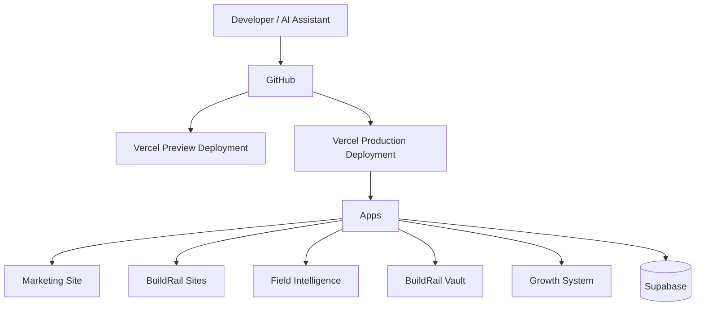
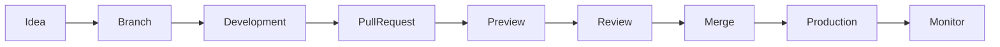

# BuildRail Deployment Standards

**Document:** `docs/engineering/deployment.md`
**Purpose:** Define deployment architecture, environments, release processes, and operational standards.
**Status:** Living Document
**Owner:** BuildRail Engineering
**Last Updated:** 2026-07-07

---

# 1. Overview

BuildRail is a multi-product software ecosystem built as a modern SaaS platform.

Deployment standards exist to ensure:

- predictable releases
- safe production changes
- isolated environments
- reliable customer experiences
- clear ownership of applications and services

The goal is simple:

> BuildRail should deploy like a professional software company, not like a collection of independent experiments.

---

# 2. Deployment Philosophy

BuildRail follows these principles:

| Principle              | Description                                          |
| ---------------------- | ---------------------------------------------------- |
| Production confidence  | Every release should be intentional and reversible   |
| Automation first       | Prefer automated deployments over manual processes   |
| Environment separation | Development, preview, and production remain isolated |
| Small releases         | Ship incremental improvements frequently             |
| Observability          | Know when something breaks and why                   |
| Ownership              | Every application has a clear deployment path        |

---

# 3. Deployment Architecture

BuildRail uses:

- GitHub for source control
- pnpm workspaces for monorepo management
- Vercel for application hosting
- Supabase for backend infrastructure
- Environment variables for configuration

High-level architecture:



---

# 4. Environment Strategy

BuildRail maintains three primary environments.

## Development

Purpose:

- local development
- feature creation
- experimentation

Examples:

```
localhost:3000
localhost:3001
```

Characteristics:

- local environment variables
- local debugging
- incomplete features allowed

---

## Preview

Purpose:

- test before production
- review changes
- collaborate with AI/developers

Created automatically through Vercel.

Example:

```
feature-name-buildrail.vercel.app
```

Characteristics:

- connected to preview environment variables
- safe for testing
- linked to pull requests

---

## Production

Purpose:

- customer-facing applications

Examples:

```
buildrailhq.com
sites.buildrailhq.com
field.buildrailhq.com
vault.buildrailhq.com
```

Characteristics:

- production database
- production secrets
- customer data

---

# 5. Environment Variable Standards

Environment variables should never be committed.

Required files:

```
.env.local
.env.development
.env.production
```

Never:

```
.env
.env.production.local
```

unless specifically required.

---

## Root Environment Strategy

For the BuildRail monorepo:

```
buildrail/

├── .env.local

├── apps/
│
├── packages/
│
└── pnpm-workspace.yaml
```

The default approach:

> Shared infrastructure secrets belong at the repository root.

Examples:

```env
NEXT_PUBLIC_SUPABASE_URL=
NEXT_PUBLIC_SUPABASE_ANON_KEY=
SUPABASE_SERVICE_ROLE_KEY=

NEXT_PUBLIC_APP_URL=
```

---

## Application-Specific Variables

Applications may have additional configuration.

Example:

```
apps/sites/.env.local
```

For example:

```env
STORYBLOK_TOKEN=
SITE_TEMPLATE_ID=
```

Rule:

| Variable Type                  | Location                     |
| ------------------------------ | ---------------------------- |
| Shared platform configuration  | Root                         |
| Product-specific configuration | App directory                |
| Secrets                        | Vercel Environment Variables |

---

# 6. Vercel Project Structure

Each major application receives its own Vercel project.

Example:

```
BuildRail Ecosystem

                Vercel

                  |
        -----------------------
        |          |          |
     Marketing    Sites     Field

```

Recommended mapping:

| Application           | Vercel Project      |
| --------------------- | ------------------- |
| apps/marketing        | buildrail-marketing |
| apps/sites            | buildrail-sites     |
| apps/field            | buildrail-field     |
| apps/vault            | buildrail-vault     |
| apps/siteverdict      | siteverdict         |
| apps/growth-system/\* | individual products |

---

# 7. Domain Standards

Domains represent products, not repositories.

Example:

```
buildrailhq.com
        |
        |
        +-- Marketing Platform


sites.buildrailhq.com
        |
        |
        +-- Contractor Websites


field.buildrailhq.com
        |
        |
        +-- Field Operations


vault.buildrailhq.com
        |
        |
        +-- Documents / Assets
```

---

## Domain Rules

| Rule                              | Reason                  |
| --------------------------------- | ----------------------- |
| One product = one clear URL       | User clarity            |
| Avoid exposing Vercel URLs        | Professional appearance |
| Use subdomains for major products | Scalable SaaS structure |
| Use paths for simple modules      | Reduced complexity      |

---

# 8. Deployment Workflow

Standard workflow:



---

# 9. Git Branch Standards

Preferred:

```
main
```

Production branch.

Feature branches:

```
feature/customer-dashboard
feature/site-builder-editor
fix/authentication-error
```

---

## Commit Standards

Use descriptive commits:

Good:

```
feat: add contractor onboarding flow

fix: resolve Supabase session refresh issue

docs: update deployment standards
```

Avoid:

```
changes
updates
stuff
fixed things
```

---

# 10. Production Release Checklist

Before production deployment:

## Code

- [ ] TypeScript passes
- [ ] ESLint passes
- [ ] Tests pass
- [ ] Build succeeds

Commands:

```bash
pnpm lint

pnpm typecheck

pnpm build
```

or:

```bash
pnpm verify
```

---

## Database

Verify:

- [ ] migrations applied
- [ ] RLS policies enabled
- [ ] production credentials configured

---

## Environment

Verify:

- [ ] production variables exist
- [ ] secrets are correct
- [ ] URLs point to production

---

## User Experience

Verify:

- [ ] authentication works
- [ ] critical workflows complete
- [ ] mobile experience works
- [ ] error states handled

---

# 11. Rollback Strategy

A failed release should be reversible.

Primary rollback options:

## Option 1: Vercel Rollback

Preferred.

Restore previous deployment.

---

## Option 2: Git Revert

Example:

```bash
git revert HEAD

git push
```

---

## Option 3: Database Recovery

For migrations:

- never delete production data casually
- prefer additive migrations
- document destructive changes

---

# 12. Preview Deployment Rules

Preview deployments are not production.

Do not:

- send real customer emails
- modify production data
- test destructive workflows

Preview environments should use:

- test accounts
- preview databases
- sandbox services

---

# 13. AI-Assisted Deployment Rules

AI tools are part of BuildRail engineering.

AI may:

- create deployment configuration
- diagnose failures
- improve workflows
- generate documentation

AI must not:

- expose secrets
- bypass review
- make destructive production changes without approval

---

# 14. Monitoring Standards

Every production application should eventually include:

## Application Monitoring

Track:

- runtime errors
- failed requests
- slow pages

---

## Infrastructure Monitoring

Track:

- deployment failures
- database availability
- API failures

---

## Customer Impact

Prioritize:

1. authentication failures
2. payment failures
3. data loss
4. broken customer workflows

---

# 15. Future Improvements

Planned evolution:

- automated CI pipelines
- GitHub Actions
- automated testing
- deployment previews
- uptime monitoring
- error tracking
- release notes generation

---

# Final Principle

Deployment is not the final step of development.

Deployment is the process of delivering trust.

Every BuildRail release should represent:

- quality
- stability
- professionalism
- confidence

The standard:

> BuildRail products should feel like they are operated by a serious software company.
