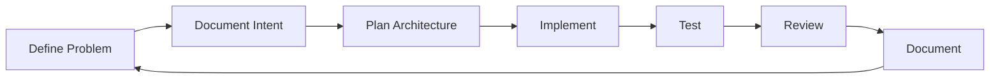
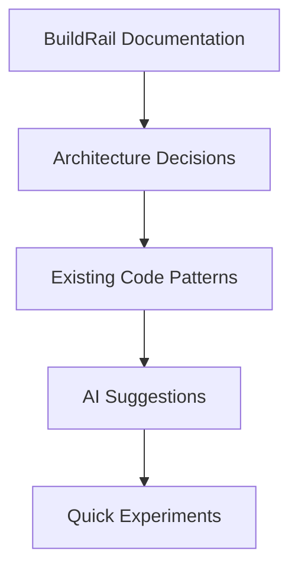
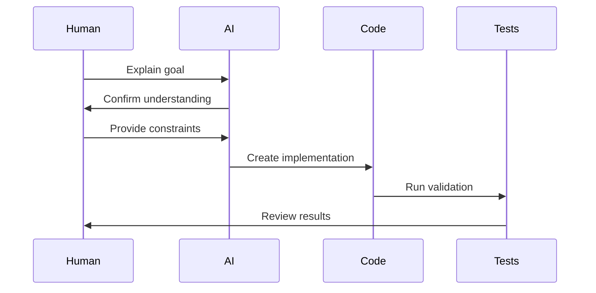
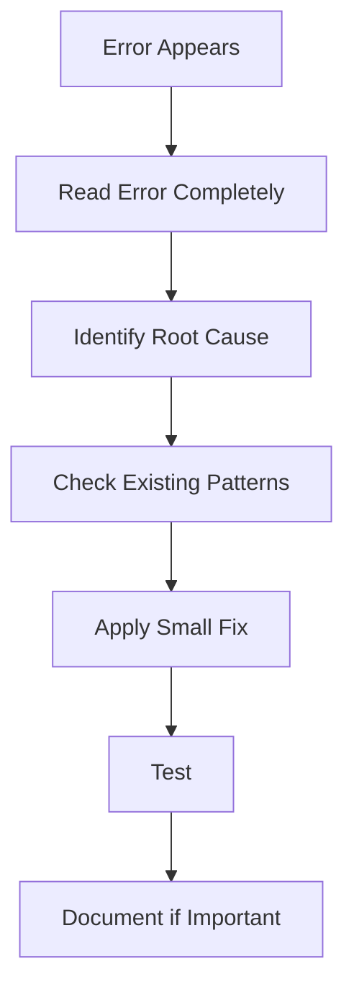
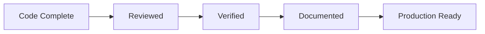

# BuildRail Development Workflow

**Document:** Daily Development & AI Collaboration Workflow
**Location:** `docs/engineering/development-workflow.md`
**Status:** Living Document
**Audience:** BuildRail Engineering Team, AI Development Agents, Future Contributors

---

# 1. Purpose

BuildRail is developed using a modern software workflow that combines:

- Human product judgment
- AI-assisted implementation
- Automated quality checks
- Documentation-driven development

The goal is not simply to write code faster.

The goal is:

> Build a durable software platform where humans and AI can collaborate without sacrificing quality.

---

# 2. Development Philosophy

BuildRail follows this development loop:



Every feature should move through this cycle.

---

# 3. Source of Truth Hierarchy

When making decisions, use this order:



Priority:

| Rank | Source                       |
| ---- | ---------------------------- |
| 1    | Engineering documentation    |
| 2    | Architecture standards       |
| 3    | Existing production patterns |
| 4    | AI recommendations           |
| 5    | Temporary experiments        |

---

# 4. Starting a Development Session

Every session begins with:

## Step 1 — Understand Current State

Review:

```bash
git status
```

Check:

- Current branch
- Uncommitted changes
- Active work

---

## Step 2 — Read Project Context

Before modifying code:

Review:

```
CLAUDE.md
README.md
docs/
```

Understand:

- Product purpose
- Architecture
- Current limitations
- Coding standards

---

## Step 3 — Define the Task

Avoid:

> "Make dashboard better"

Prefer:

> "Add customer activity timeline component to Field Intelligence dashboard using existing UI patterns."

---

# 5. AI Development Workflow

AI agents should operate as engineering partners.

The preferred workflow:



---

# 6. Prompting AI Effectively

Good AI requests include:

## Context

Example:

```
We are working in BuildRail SiteVerdict.

Architecture:
- Next.js App Router
- TypeScript
- Supabase
- Tailwind
- Shadcn UI

Follow existing patterns.
```

---

## Goal

Example:

```
Create a customer-facing audit report page.
```

---

## Constraints

Example:

```
Do not introduce new dependencies.
Use existing UI components.
Maintain strict typing.
```

---

## Expected Output

Example:

```
Provide:
1. Files changed
2. Code changes
3. Testing steps
```

---

# 7. AI Rules of Engagement

AI agents should:

✅ Read existing code before modifying

✅ Preserve existing architecture

✅ Explain significant changes

✅ Avoid unnecessary dependencies

✅ Create reusable components

✅ Update documentation when appropriate

AI agents should not:

❌ Rewrite entire applications unnecessarily

❌ Remove type safety to silence errors

❌ Introduce duplicate patterns

❌ Modify unrelated files

❌ Guess business requirements

---

# 8. Feature Development Workflow

Every feature follows:

## Phase 1 — Plan

Create:

```
docs/features/feature-name.md
```

Include:

- Purpose
- User story
- Technical approach
- Database changes
- UI changes

---

## Phase 2 — Build

Implementation order:

```
Database
 ↓
Types
 ↓
Server Logic
 ↓
Components
 ↓
UI Polish
```

---

## Phase 3 — Validate

Run:

```bash
pnpm verify
```

Expected:

```
✓ lint

✓ typecheck

✓ build
```

---

## Phase 4 — Review

Before committing:

Ask:

- Does this belong here?
- Can this be reused?
- Does this follow standards?
- Did documentation change?

---

# 9. Local Development

## Start Entire Environment

```bash
pnpm dev
```

---

## Start Specific Application

Example:

```bash
pnpm --filter siteverdict dev
```

or:

```bash
pnpm --filter sites dev
```

---

# 10. Debugging Workflow

When encountering errors:

Do not immediately patch.

Follow:



---

# 11. TypeScript Standards

BuildRail prefers:

## Good

```typescript
interface Customer {
	id: string;
	name: string;
}
```

---

## Avoid

```typescript
const customer: any = data;
```

---

## Exception

Temporary unknown external data:

```typescript
catch(error: unknown)
```

Then narrow:

```typescript
if (error instanceof Error) {
	console.log(error.message);
}
```

---

# 12. Database Changes

Supabase changes require:

Document:

```
docs/database/
```

Include:

- Tables affected
- Schema changes
- Migration steps
- Security considerations

Never silently modify production schemas.

---

# 13. Git Workflow

Before committing:

```bash
git status
```

Review:

```bash
git diff
```

Then:

```bash
git add .
git commit -m "describe change"
```

---

# 14. Commit Standards

Good commits:

```
feat: add customer audit sharing

fix: resolve report loading state

refactor: extract shared card component

docs: update architecture guide
```

---

# 15. Pull Request Checklist

Before merging:

| Check                       | Complete |
| --------------------------- | -------- |
| Feature works               | ☐        |
| Tests pass                  | ☐        |
| TypeScript passes           | ☐        |
| Lint passes                 | ☐        |
| Documentation updated       | ☐        |
| No unnecessary dependencies | ☐        |

---

# 16. Working With Multiple AI Sessions

Because AI context is limited:

Large tasks should be documented.

Create:

```
docs/work-in-progress/
```

Example:

```
siteverdict-report-refactor.md
```

Include:

- Current state
- Completed work
- Remaining tasks
- Known issues

This allows any AI assistant to continue effectively.

---

# 17. BuildRail AI Memory System

The repository itself is the memory.

Important context belongs in:

```
CLAUDE.md
docs/
README.md
architecture.md
```

Not inside private chat history.

---

# 18. Definition of Done

A feature is complete when:



---

# Final Principle

BuildRail is not built by typing code.

It is built by creating a system where:

- Ideas become documented plans
- Plans become reliable software
- Software becomes products
- Products become a platform

The workflow protects that system.
