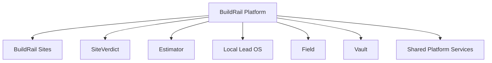
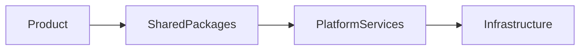
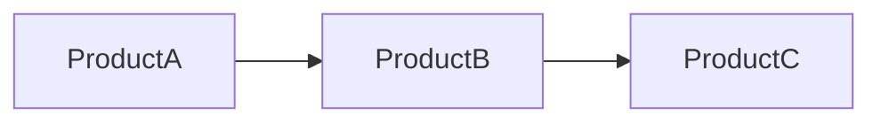
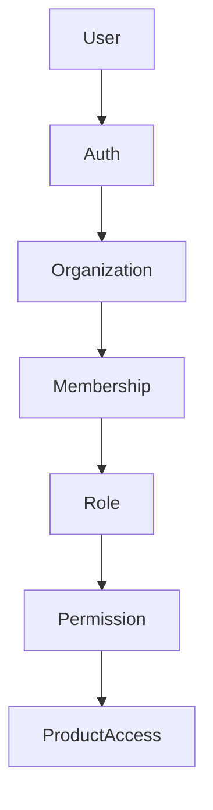
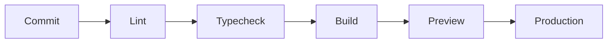

# BuildRail Platform Stabilization Plan

> **Transform the BuildRail codebase from a working monorepo into a reliable software platform capable of supporting customers, products, and future growth.**

---

# 1. Purpose

BuildRail has evolved from individual product experiments into a multi-product SaaS ecosystem.

The next engineering phase is not adding more features.

The priority is creating a stable foundation that allows BuildRail to:

- support paying customers
- ship products faster
- safely use AI-assisted development
- maintain consistent engineering standards
- scale without increasing complexity

---

# 2. Current State

BuildRail currently contains:

- multiple Next.js applications
- shared packages
- Supabase backend services
- Vercel deployments
- AI-assisted development workflows
- product documentation
- platform documentation

Current ecosystem:



---

# 3. Stabilization Goal

The target state:

```text
A developer can clone BuildRail

        ↓

Install dependencies

        ↓

Run applications

        ↓

Understand architecture

        ↓

Deploy safely

        ↓

Add new products without breaking existing systems
```

---

# 4. Definition of Success

Platform stabilization is complete when:

## Repository

✅ `pnpm install` works

✅ `pnpm lint` works

✅ `pnpm typecheck` works

✅ `pnpm build` works

✅ `pnpm verify` works

---

## Development

✅ New developers understand structure

✅ AI agents follow conventions

✅ Shared patterns are documented

---

## Platform

✅ Authentication is standardized

✅ Organizations are supported

✅ Permissions are defined

✅ Secrets are managed correctly

---

## Deployment

✅ Production deployments are repeatable

✅ Environment strategy is documented

✅ Releases are predictable

---

# 5. Stabilization Principles

## Principle 1

## Fix foundations before features

Do not add complexity on unstable systems.

---

## Principle 2

## Prefer consistency over cleverness

A predictable codebase scales better than an impressive one.

---

## Principle 3

## Build platform capabilities once

Shared functionality belongs in platform services.

---

## Principle 4

## Products consume the platform

Products should not recreate:

- authentication
- billing
- permissions
- notifications
- storage

---

# 6. Stabilization Roadmap

---

# Phase 1 — Repository Health

## Objective

Create a reliable development baseline.

---

## Tasks

### Build Verification

Ensure:

```bash
pnpm install

pnpm lint

pnpm typecheck

pnpm build

pnpm verify
```

all execute successfully.

---

### Dependency Review

Review:

- duplicate dependencies
- unused packages
- inconsistent versions
- unnecessary libraries

---

### Workspace Validation

Verify:

```
apps/

packages/

docs/

tooling/
```

follow repository conventions.

---

# Phase 2 — Environment Standardization

## Objective

Create a predictable configuration model.

---

## Environment Strategy

Preferred structure:

```
buildrail/

.env.example

apps/

    sites/
        .env.local

    siteverdict/
        .env.local

    estimator/
        .env.local
```

---

## Rules

Never commit:

```
.env.local

.env.production

secrets
```

---

Every application should document:

- required variables
- purpose
- deployment location

---

# Phase 3 — Shared Package Audit

## Objective

Create clean ownership boundaries.

---

Review:

```
packages/
```

Questions:

| Question                          | Expected |
| --------------------------------- | -------- |
| Does this solve a shared problem? | Yes      |
| Does it have clear ownership?     | Yes      |
| Does it have documentation?       | Yes      |
| Does it have stable exports?      | Yes      |

---

Preferred dependency direction:



Avoid:



Products should not depend on each other.

---

# Phase 4 — Authentication Foundation

## Objective

Create one identity model across BuildRail.

---

Target architecture:



---

Core concepts:

## User

Individual account.

---

## Organization

Customer/company account.

Example:

```
Smith Roofing LLC
```

---

## Membership

Relationship between user and organization.

---

## Role

Defines responsibility.

Example:

```
Owner

Admin

Manager

Employee
```

---

## Permission

Controls access.

Example:

```
view_projects

edit_estimates

manage_billing
```

---

# Phase 5 — Supabase Hardening

## Objective

Ensure secure multi-tenant data.

---

Every customer-owned table should include:

```sql
organization_id
```

---

Every query should respect:

```
User

↓

Organization

↓

Data Access
```

---

Required review:

☐ Tables

☐ Indexes

☐ Foreign keys

☐ RLS policies

☐ Migrations

---

# Phase 6 — Shared UI System

## Objective

Create consistent product experiences.

---

Shared UI belongs in:

```
packages/ui
```

Examples:

- buttons
- dialogs
- forms
- tables
- cards
- layouts

---

Products should compose shared components.

Example:

Good:

```
SiteVerdict

↓

@buildrail/ui
```

Bad:

```
SiteVerdict

↓

copy/pasted button component
```

---

# Phase 7 — Application Standards

Every application should provide:

## Loading States

Example:

```
Loading audit...
```

---

## Empty States

Example:

```
No projects found.
```

---

## Error States

Example:

```
Unable to load project.
Try again.
```

---

## Notifications

Use consistent:

- success messages
- warnings
- errors

---

# Phase 8 — Observability

## Objective

Understand what happens after deployment.

---

Implement:

## Logging

Track:

- failures
- important actions
- integrations

---

## Error Tracking

Capture:

- exceptions
- failed requests
- user impact

---

## Audit History

Track:

- security events
- customer actions
- administrative changes

---

# Phase 9 — Deployment Standardization

## Objective

Make releases predictable.

---

Deployment flow:



---

Environment model:

```
Development

↓

Preview

↓

Production
```

---

# Phase 10 — Product Readiness

After platform stabilization, products move through readiness.

---

## Product Readiness Checklist

| Area             | Complete |
| ---------------- | -------- |
| Authentication   | ☐        |
| Organizations    | ☐        |
| Permissions      | ☐        |
| Billing          | ☐        |
| Error Handling   | ☐        |
| Documentation    | ☐        |
| Deployment       | ☐        |
| Customer Support | ☐        |

---

# 7. Prioritization Strategy

BuildRail should not stabilize every product equally.

The goal is:

```
Platform

+

One excellent product

+

Real customers

+

Revenue
```

---

Avoid:

```
10 unfinished products
```

Prefer:

```
1 customer-ready product
```

---

# 8. Recommended Execution Order

## Sprint 1 — Foundation Green

Complete:

☐ Repository builds

☐ Environment cleanup

☐ TypeScript consistency

☐ Lint cleanup

☐ Deployment verification

---

## Sprint 2 — Platform Core

Complete:

☐ Authentication

☐ Organizations

☐ Permissions

☐ Shared services

---

## Sprint 3 — First Customer Product

Choose one primary revenue product.

Recommended candidates:

## BuildRail Sites

Focus:

- contractor websites
- lead generation
- conversion

---

## Local Lead OS

Focus:

- missed call capture
- lead response
- sales pipeline

---

# 9. AI Development During Stabilization

AI assistants should:

- inspect before modifying
- follow repository conventions
- avoid duplicate solutions
- update documentation
- preserve architectural decisions

AI should accelerate stabilization, not create more cleanup.

---

# 10. Final Definition

BuildRail Platform Stabilization is complete when:

> BuildRail can safely support its first paying customers without requiring the engineering team to fight the foundation.

The platform should become invisible.

Developers should think about products.

Customers should think about value.

The foundation should simply work.
