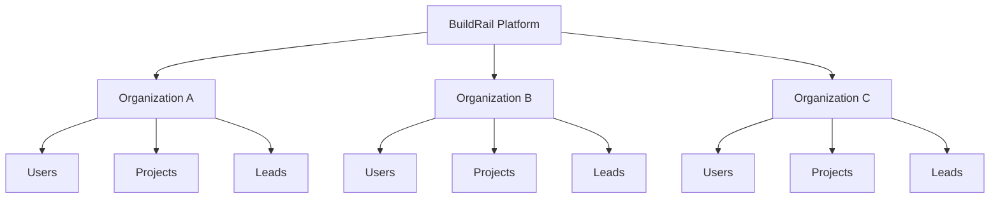
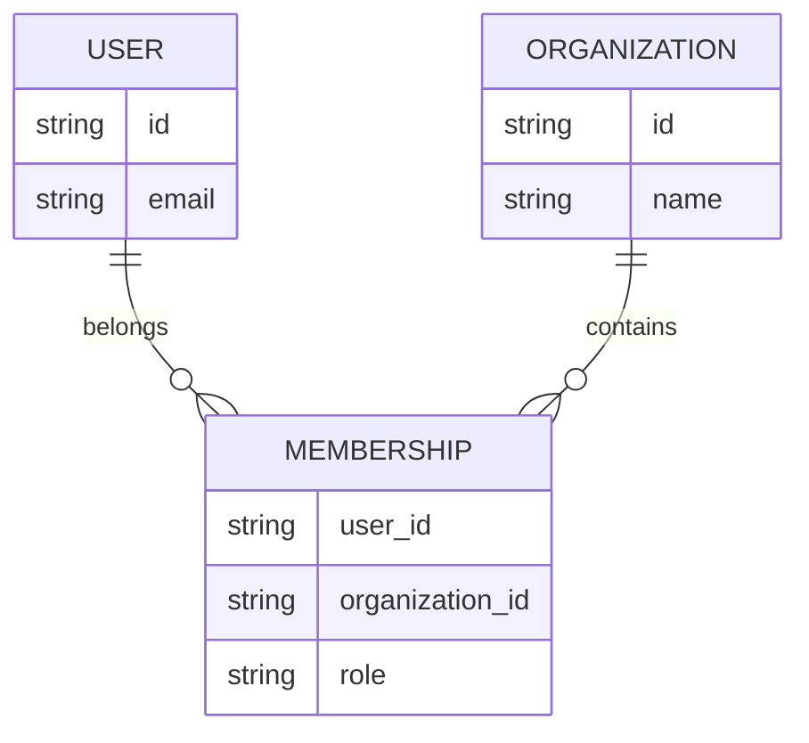

# BuildRail Security Standards

**Document:** `docs/engineering/security.md`
**Status:** Living Document
**Owner:** BuildRail Engineering
**Audience:** Developers, AI coding assistants, infrastructure operators, future engineering teams

---

# 1. Purpose

Security is a foundational requirement of the BuildRail platform.

BuildRail is a multi-product, multi-tenant SaaS ecosystem. Customers trust BuildRail with:

- Business information
- Customer leads
- Project details
- Estimates
- Photos
- Documents
- Communication history
- Operational data

Security failures can impact every product in the ecosystem.

This document defines standards for:

- Authentication
- Authorization
- Supabase usage
- Secrets management
- Organization isolation
- Database security
- API protection

---

# 2. BuildRail Security Philosophy

## Secure by Architecture

Security should be built into the platform design.

The goal is:

```
Secure Defaults
        +
Clear Ownership
        +
Explicit Permissions
        +
Continuous Verification
```

Security should not depend on developers remembering every time.

---

# 3. BuildRail Security Model

BuildRail follows a multi-tenant SaaS architecture.



The fundamental security rule:

> An organization can only access its own data.

---

# 4. Identity vs Access

BuildRail separates two concepts.

## Authentication

"Who are you?"

Handled by:

- Supabase Auth
- Session management
- User identity

Example:

```
steve@example.com
        |
        ↓
Authenticated User
```

---

## Authorization

"What can you do?"

Handled by:

- Organization membership
- Roles
- Permissions
- Row Level Security

Example:

```
Authenticated User

        ↓

Organization Member

        ↓

Can edit projects
```

---

# 5. Authentication Standards

## Required

All authenticated applications must use the shared authentication pattern.

Example:

```typescript
const supabase = createClient();

const {
	data: { user },
} = await supabase.auth.getUser();
```

---

Do not:

- Create independent auth systems
- Store passwords manually
- Duplicate user tables
- Bypass Supabase sessions

---

# 6. User Model

The BuildRail identity model:



Users belong to organizations through memberships.

---

# 7. Organization Isolation

Every customer-owned record should contain:

```sql
organization_id
```

Example:

```sql
projects

id
organization_id
name
created_at
```

---

Incorrect:

```sql
SELECT *
FROM projects;
```

Correct:

```sql
SELECT *
FROM projects
WHERE organization_id = current_user_org;
```

---

# 8. Supabase Row Level Security

RLS is mandatory.

Every customer table requires policies.

Example:

```sql
ALTER TABLE projects
ENABLE ROW LEVEL SECURITY;
```

---

Example policy:

```sql
CREATE POLICY "Users access their organization projects"

ON projects

FOR SELECT

USING (

organization_id IN (

SELECT organization_id
FROM memberships
WHERE user_id = auth.uid()

)

);
```

---

# 9. Supabase Security Rules

## Never expose service keys

Allowed:

```
NEXT_PUBLIC_SUPABASE_ANON_KEY
```

Client-side:

```
✔ Allowed
```

---

Never expose:

```
SUPABASE_SERVICE_ROLE_KEY
```

Client-side:

```
❌ Forbidden
```

The service role key bypasses security.

---

# 10. Environment Variables

BuildRail uses environment separation.

Structure:

```
buildrail/

.env.local

apps/
 |
 ├── marketing/
 ├── sites/
 ├── vault/
```

---

Recommended:

```
.env.local
```

at repository root for shared development values.

Example:

```env
NEXT_PUBLIC_SUPABASE_URL=
NEXT_PUBLIC_SUPABASE_ANON_KEY=

SUPABASE_SERVICE_ROLE_KEY=
```

---

Rules:

| Variable    | Client | Server |
| ----------- | ------ | ------ |
| Public URL  | Yes    | Yes    |
| Anon Key    | Yes    | Yes    |
| Service Key | No     | Yes    |

---

# 11. Secrets Management

Secrets include:

- Database keys
- API keys
- AI provider keys
- Payment credentials
- Email credentials

Never:

- Commit secrets
- Place secrets in components
- Put secrets in documentation
- Send secrets through chat

---

Bad:

```typescript
const apiKey = 'sk-secret-value';
```

---

Good:

```typescript
process.env.OPENAI_API_KEY;
```

---

# 12. Vercel Environment Standards

BuildRail deployments use:

```
Development

Preview

Production
```

Each environment has separate secrets.

Example:

```
Development Database

Preview Database

Production Database
```

Never test against production data.

---

# 13. Server vs Client Boundaries

Sensitive operations belong on the server.

Client:

```
Browser
 |
 |
Safe public operations
```

Server:

```
Server Component
API Route
Server Action
 |
 |
Database
```

---

Example:

Wrong:

```typescript
'use client';

deleteCustomer();
```

Correct:

```typescript
Server Action

deleteCustomer()
```

---

# 14. API Security

Every API endpoint must validate:

## Identity

Who is calling?

---

## Permission

Are they allowed?

---

## Input

Is the data valid?

---

Example:

```typescript
if (!user) {
	return unauthorized();
}

if (!memberOfOrganization) {
	return forbidden();
}

validate(input);
```

---

# 15. File and Asset Security

BuildRail products handle:

- Photos
- Documents
- Reports
- Customer assets

Storage rules:

Every file path should include ownership.

Example:

```
storage/

organization-id/

project-id/

photo.jpg
```

Never:

```
uploads/photo.jpg
```

---

# 16. AI Feature Security

AI features require special consideration.

Rules:

Never send:

- Passwords
- API keys
- Private credentials
- Unnecessary customer data

Before AI processing:

```
Customer Data

      ↓

Permission Check

      ↓

Data Filtering

      ↓

AI Request
```

---

# 17. Payment Security

BuildRail should never store:

- Credit card numbers
- Payment credentials

Use:

- Payment provider tokens
- Webhook verification
- Server-side billing state

---

# 18. Security Review Checklist

Before releasing a feature:

## Authentication

- Does user identity exist?
- Are sessions validated?

---

## Authorization

- Are permissions checked?
- Is organization ownership verified?

---

## Database

- Does the table have RLS?
- Are policies tested?

---

## Secrets

- Are credentials protected?
- Are environment variables used?

---

## APIs

- Are inputs validated?
- Are errors handled safely?

---

# 19. AI Security Review Rules

AI-generated code must be reviewed for:

- Accidental secret exposure
- Missing authorization
- Missing RLS policies
- Unsafe database queries
- Overly broad permissions

AI commonly optimizes for functionality.

Humans must enforce security.

---

# 20. Future Security Expansion

This document will expand with:

- Security audit procedures
- Penetration testing
- Compliance requirements
- Backup strategies
- Disaster recovery
- SOC 2 preparation
- Customer data policies

---

# BuildRail Security Principle

> Customers should never need to think about security. They should simply trust that it works.

---

**BuildRail Engineering Standard**
