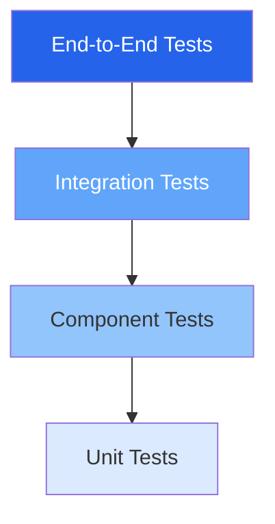
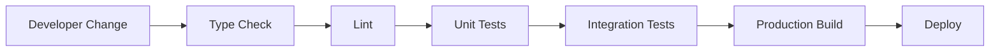

# BuildRail Testing Standards

**Document:** `docs/engineering/testing-standards.md`
**Status:** Living Document
**Owner:** BuildRail Engineering
**Audience:** Developers, AI coding assistants, future engineering teams

---

# 1. Purpose

Testing at BuildRail exists to protect customer trust.

The goal of testing is not simply to increase code coverage.

The goal is to ensure:

- Critical workflows continue working
- New features do not break existing products
- AI-generated code meets engineering standards
- Refactoring remains safe
- Production deployments remain predictable

BuildRail prioritizes confidence over quantity.

---

# 2. Testing Philosophy

## Test Business Outcomes, Not Just Code

A technically correct function can still create a broken customer experience.

Example:

A lead capture form may successfully submit data.

But if:

- the contractor never receives notification
- the lead is not attached to the organization
- the dashboard does not display it

the system is broken.

Testing should follow user journeys.

---

# 3. BuildRail Testing Pyramid



## Testing Distribution

| Level       | Purpose                  | Amount    |
| ----------- | ------------------------ | --------- |
| Unit        | Logic validation         | Many      |
| Component   | UI behavior              | Moderate  |
| Integration | Systems working together | Important |
| End-to-End  | Customer workflows       | Critical  |

---

# 4. Testing Responsibilities

| Area               | Primary Testing         |
| ------------------ | ----------------------- |
| Utility functions  | Unit tests              |
| React components   | Component tests         |
| Forms              | Component + integration |
| Database logic     | Integration             |
| Authentication     | Integration             |
| Payments           | Integration             |
| Customer workflows | End-to-end              |

---

# 5. BuildRail Test Stack

Recommended stack:

| Purpose         | Tool                  |
| --------------- | --------------------- |
| Unit Testing    | Vitest                |
| React Testing   | React Testing Library |
| Browser Testing | Playwright            |
| API Testing     | Vitest / Supertest    |
| Type Validation | TypeScript            |
| Code Quality    | ESLint                |
| Formatting      | Prettier              |

---

# 6. Development Verification Pipeline

Every change should pass:



The standard local command:

```bash
pnpm verify
```

should eventually execute:

```bash
pnpm lint
pnpm typecheck
pnpm test
pnpm build
```

---

# 7. Minimum Requirements Before Commit

Before committing code:

Required:

- TypeScript passes
- ESLint passes
- Application builds
- New business logic has tests

Example:

```bash
pnpm verify
```

No:

```bash
// eslint-disable-next-line
```

or:

```typescript
const data: any;
```

to bypass failures.

---

# 8. Unit Testing Standards

Unit tests verify isolated behavior.

Example:

A pricing calculation.

```typescript
describe('Estimate calculator', () => {
	it('calculates project total', () => {
		expect(calculateEstimate(1000, 0.15)).toBe(1150);
	});
});
```

Good unit tests:

- Are fast
- Have one purpose
- Avoid external systems
- Explain behavior

---

# 9. Component Testing Standards

React components should test user behavior.

Prefer:

```typescript
expect(screen.getByText('Create Estimate')).toBeVisible();
```

Avoid testing implementation:

```typescript
expect(component.state.open);
```

Users interact with interfaces.

Tests should behave the same way.

---

# 10. Form Testing

Forms are critical BuildRail workflows.

Every important form should test:

## Validation

Example:

```
Missing company name
        ↓
Error displayed
```

---

## Submission

Example:

```
User completes form
        ↓
Data saved
        ↓
Success message shown
```

---

## Failure Handling

Example:

```
Database unavailable
        ↓
User sees useful message
```

---

# 11. Database Testing

Database operations must verify:

- Correct records created
- Relationships maintained
- Permissions enforced
- Invalid data rejected

Example:

Contractor organization:

```
Organization
      |
      |
Users
      |
      |
Projects
      |
      |
Leads
```

Test the relationship.

---

# 12. Authentication Testing

Authentication is platform infrastructure.

Required tests:

## New User

```
Signup
 ↓
Organization created
 ↓
Dashboard access
```

---

## Existing User

```
Login
 ↓
Correct organization loaded
 ↓
Correct permissions applied
```

---

## Unauthorized Access

```
User attempts restricted page
 ↓
Access denied
```

---

# 13. Multi-Tenant Testing

BuildRail is organization-based software.

Every product must protect tenant boundaries.

Example:

Incorrect:

```
Contractor A
      |
      |
sees Contractor B leads
```

Correct:

```
Contractor A
      |
      |
only Contractor A data
```

Every database query should consider:

```typescript
organization_id;
```

---

# 14. AI-Generated Code Testing Rules

AI-generated code requires additional review.

Before accepting:

Ask:

- What assumptions did AI make?
- What edge cases exist?
- What happens when data is missing?
- What happens when APIs fail?

Required:

```
AI writes code
        |
        ↓
Human reviews
        |
        ↓
Tests verify
        |
        ↓
Merge
```

---

# 15. End-to-End Critical Workflows

BuildRail should maintain E2E tests for:

## Marketing

```
Visitor
 ↓
Landing Page
 ↓
Signup
 ↓
Account Created
```

---

## Sites

```
Contractor
 ↓
Select Template
 ↓
Customize Site
 ↓
Publish
```

---

## Growth System

```
Lead Generated
 ↓
Lead Captured
 ↓
Follow-up Triggered
 ↓
Conversion Recorded
```

---

## Estimator

```
Project Input
 ↓
Estimate Generated
 ↓
Proposal Created
 ↓
Customer Receives
```

---

## Field

```
Inspection Created
 ↓
Photos Uploaded
 ↓
Report Generated
```

---

# 16. Test Naming Standards

Tests should describe behavior.

Good:

```typescript
it('creates a proposal after estimate approval');
```

Bad:

```typescript
it('button works');
```

---

# 17. Handling Bugs

Every production bug should become:

1. Bug report
2. Reproduction case
3. Automated test
4. Fix

The system should become stronger after every failure.

---

# 18. Testing and Documentation

Major features require:

```
Feature
 |
 ├── Code
 |
 ├── Tests
 |
 └── Documentation
```

A feature is incomplete if future engineers cannot understand it.

---

# 19. Testing Standards for Future AI Agents

Future BuildRail AI agents must:

Before modifying code:

- Locate existing tests
- Understand expected behavior
- Add tests for new behavior
- Run verification

AI should improve the test suite, not bypass it.

---

# 20. Future Expansion

This document will expand with:

- CI/CD testing pipelines
- Preview deployment testing
- Automated regression suites
- Performance testing
- Security testing
- AI-generated test review

---

# BuildRail Testing Principle

> Fast development creates opportunity. Reliable development creates a company.

---

**BuildRail Engineering Standard**
