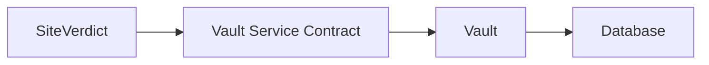
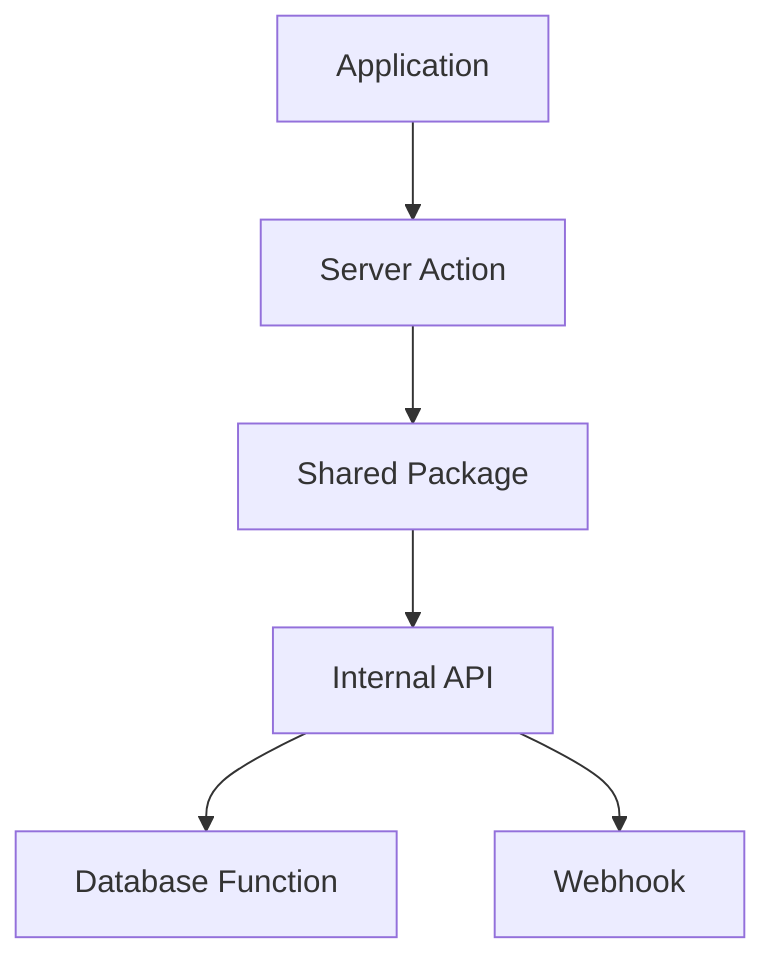
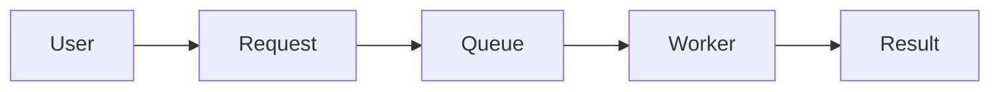

# BuildRail API Standards

**Document:** `docs/platform/api-standards.md`
**Status:** Living Document
**Owner:** BuildRail Engineering
**Last Updated:** 2026-07-07

---

# API Standards

## Purpose

This document defines how BuildRail applications communicate internally and externally.

BuildRail is a modular SaaS platform.

Each product module must be able to:

- operate independently
- share platform services
- evolve without breaking other applications
- maintain clear ownership boundaries

---

# Core Principle

> Communication between BuildRail modules happens through contracts, not assumptions.

Avoid:

```text
SiteVerdict
    |
    |
Direct Database Access
    |
    |
Vault Tables
```

Prefer:



---

# API Architecture

BuildRail uses multiple communication patterns.

| Pattern            | Usage                 |
| ------------------ | --------------------- |
| Server Actions     | Application mutations |
| Internal APIs      | Module communication  |
| Shared Packages    | Common business logic |
| Database Functions | Atomic operations     |
| Webhooks           | Event communication   |
| Background Jobs    | Async processing      |

---

# Communication Hierarchy

Preferred order:



---

# Server Actions

## Purpose

Server Actions handle application-specific mutations.

Examples:

- Create project
- Update settings
- Submit estimate
- Upload document

---

Example:

```typescript
'use server';

export async function createProject(input: CreateProjectInput) {
	const project = await projectService.create(input);

	return project;
}
```

---

# Server Action Rules

Server Actions must:

- validate input
- verify authentication
- check permissions
- call services
- handle errors

Example:

```typescript
export async function updateProject(id: string, data: UpdateProjectInput) {
	await requireUser();

	await requirePermission('project.update');

	return projectService.update(id, data);
}
```

---

# Do Not Put Business Logic In Components

Bad:

```tsx
<Button
	onClick={() => {
		updateDatabase();
	}}
/>
```

Good:

```tsx
<Button onClick={updateProject} />
```

---

# Internal APIs

Internal APIs exist when modules need to communicate.

Examples:

SiteVerdict:

```
POST /api/inspections
```

Vault:

```
POST /api/files
```

AI:

```
POST /api/generate
```

---

# API Route Standards

Structure:

```text
app/

api/

    inspections/

        route.ts

    files/

        route.ts
```

---

Example:

```typescript
export async function POST(request: Request) {
	const body = await request.json();

	return Response.json({
		success: true,
	});
}
```

---

# API Response Format

All APIs return consistent responses.

Success:

```json
{
	"success": true,

	"data": {
		"id": "123"
	}
}
```

---

Error:

```json
{
	"success": false,

	"error": {
		"code": "PERMISSION_DENIED",

		"message": "User cannot access resource"
	}
}
```

---

# Error Codes

Standard codes:

| Code             | Meaning          |
| ---------------- | ---------------- |
| UNAUTHORIZED     | Not logged in    |
| FORBIDDEN        | No permission    |
| NOT_FOUND        | Resource missing |
| VALIDATION_ERROR | Invalid input    |
| CONFLICT         | Duplicate state  |
| INTERNAL_ERROR   | Server failure   |

---

# Data Contracts

Every module defines its inputs and outputs.

Example:

## Inspection Contract

```typescript
interface Inspection {
	id: string;

	organizationId: string;

	projectId: string;

	status: 'draft' | 'complete';

	createdAt: string;
}
```

---

# Contract Ownership

The owning product defines the model.

Example:

| Resource     | Owner       |
| ------------ | ----------- |
| Inspection   | SiteVerdict |
| Website      | Sites       |
| Estimate     | Estimator   |
| Document     | Vault       |
| User         | Platform    |
| Organization | Platform    |

---

# Shared Types

Shared contracts live here:

```text
packages/

contracts/

    inspection.ts

    organization.ts

    file.ts

```

---

Example:

```typescript
import { Inspection } from '@buildrail/contracts';
```

---

# Avoid Database Sharing

Do not:

```typescript
import { supabase } from 'siteverdict';
```

into:

```
apps/sites
```

---

Instead:

```typescript
import { getInspection } from '@buildrail/siteverdict-api';
```

---

# Module Boundaries

Each product owns:

```
apps/product

    components

    workflows

    database

    services

    api
```

---

Example:

```text
apps/siteverdict

    inspections

    findings

    reports
```

---

# Webhooks

Webhooks communicate events asynchronously.

Examples:

- Inspection completed
- Payment succeeded
- File uploaded
- Proposal accepted

---

Architecture:

```mermaid id="api003"
sequenceDiagram

SiteVerdict->>Webhook Service:
inspection.completed

Webhook Service->>Vault:
Store Report

Webhook Service->>Notifications:
Send Email

Webhook Service->>Audit:
Record Event
```

---

# Event Naming

Use:

```
resource.event
```

Examples:

Good:

```
inspection.completed

payment.received

document.uploaded

proposal.accepted
```

Bad:

```
update

finished

button_clicked
```

---

# Event Payload Standards

Example:

```json
{
	"event": "inspection.completed",

	"timestamp": "2026-07-07T10:00:00Z",

	"organizationId": "123",

	"data": {
		"inspectionId": "456"
	}
}
```

---

# Webhook Security

All webhooks require:

- authentication
- signature verification
- replay protection

Example:

```text
X-BuildRail-Signature

X-BuildRail-Timestamp
```

---

# Background Jobs

Long-running work should not happen in requests.

Examples:

- AI generation
- PDF creation
- Image processing
- Bulk imports

---

Flow:



---

# AI Service Communication

AI operations require contracts.

Example:

```typescript
interface AIRequest {
	organizationId: string;

	task: 'proposal' | 'audit' | 'summary';

	input: string;
}
```

---

# External API Standards

Future public APIs:

```
api.buildrail.com/v1
```

Versioning:

```
/v1/projects

/v2/projects
```

Never break existing versions.

---

# Authentication

Internal requests require:

- authenticated user
- organization context
- permission validation

Example:

```typescript
const context = await getRequestContext();
```

Returns:

```typescript
{
	(userId, organizationId, role);
}
```

---

# Multi-Tenant Requirements

Every API request must know:

```
Who?

Which organization?

What permission?
```

Never trust:

```json
{
	"organizationId": "user_input"
}
```

Validate server-side.

---

# Logging Requirements

Every API should log:

- request ID
- user
- organization
- duration
- errors

Example:

```json
{
	"requestId": "abc123",

	"endpoint": "/api/projects",

	"duration": 150
}
```

---

# Testing Standards

Every API requires:

## Contract Test

Does the shape remain correct?

## Permission Test

Can unauthorized users access it?

## Failure Test

Does it fail safely?

---

# API Documentation

Future:

```
docs/api/

    projects.md

    inspections.md

    files.md
```

---

# Product Examples

## SiteVerdict → Vault

Event:

```
inspection.completed
```

Action:

```
Generate report PDF
Store document
```

---

## Estimator → Proposals

Event:

```
estimate.approved
```

Action:

```
Create proposal draft
```

---

## Sites → Notifications

Event:

```
website.published
```

Action:

```
Notify contractor
```

---

# Engineering Checklist

Before creating an API:

- [ ] Define ownership
- [ ] Define contract
- [ ] Define authentication
- [ ] Define permissions
- [ ] Define errors
- [ ] Add audit logging
- [ ] Add tests
- [ ] Document endpoint

---

# Future Enhancements

Potential platform capabilities:

- API gateway
- Service registry
- Event bus
- Public developer API
- GraphQL layer
- Real-time subscriptions

---

# Final Principle

> BuildRail modules should collaborate like professional software systems, not share secrets through database shortcuts.

Clear contracts create a platform that can grow from a single contractor tool into an operating system for the construction industry.
