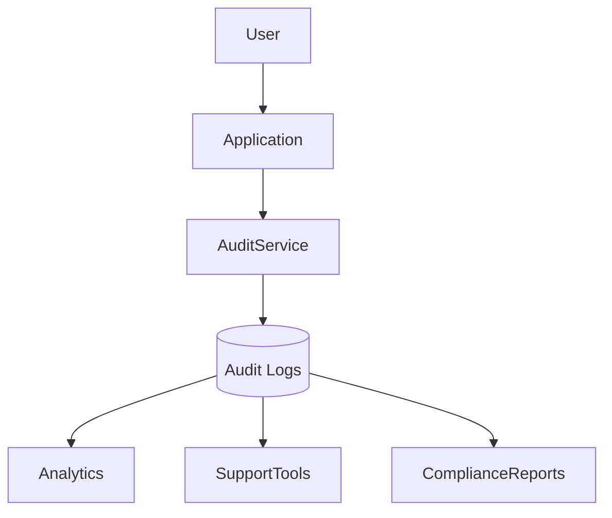

# BuildRail Audit Logging Standards

**Document:** `docs/platform/audit-logging.md`
**Status:** Living Document
**Owner:** BuildRail Engineering
**Last Updated:** 2026-07-07

---

# Audit Logging Standards

## Purpose

This document defines how BuildRail records, stores, and uses system activity history.

Audit logging provides:

- Accountability
- Security visibility
- Customer trust
- Compliance support
- Debugging capability
- Operational intelligence

BuildRail serves businesses where records matter.

Examples:

- A contractor needs to prove an inspection was completed.
- A project owner needs to know who approved a change.
- A team member needs to understand why data changed.
- Support needs to troubleshoot an issue.

Audit history becomes the platform memory.

---

# Core Principle

> Every important action in BuildRail should leave a trace.

Users should never wonder:

- Who changed this?
- When did this happen?
- Was this automatic or manual?
- What was the previous state?

---

# Audit Architecture

Audit logging is a shared platform capability.

All products write into the same audit system.



---

# What Should Be Logged?

Not every database query requires logging.

Audit logs capture meaningful business events.

---

# Required Audit Events

## Authentication Events

Examples:

| Event             | Description          |
| ----------------- | -------------------- |
| user.login        | User signed in       |
| user.logout       | User signed out      |
| user.invited      | User invitation sent |
| user.role_changed | Permission changed   |

---

## Organization Events

Examples:

| Event                | Description              |
| -------------------- | ------------------------ |
| organization.created | New company created      |
| organization.updated | Company settings changed |
| member.added         | User joined              |
| member.removed       | User removed             |

---

## Data Events

Examples:

| Event           | Description             |
| --------------- | ----------------------- |
| record.created  | New object created      |
| record.updated  | Existing object changed |
| record.deleted  | Object removed          |
| record.exported | Data exported           |

---

## Construction Workflow Events

Examples:

| Event              | Product     |
| ------------------ | ----------- |
| inspection.created | SiteVerdict |
| finding.resolved   | SiteVerdict |
| estimate.generated | Estimator   |
| proposal.sent      | Proposals   |
| document.uploaded  | Vault       |
| photo.added        | Field       |

---

# Audit Event Model

Standard schema:

```sql
create table audit_logs (

id uuid primary key,

organization_id uuid not null,

user_id uuid,

action text not null,

resource_type text not null,

resource_id uuid,

description text,

old_values jsonb,

new_values jsonb,

metadata jsonb,

ip_address text,

user_agent text,

created_at timestamp default now()

);
```

---

# Field Definitions

| Field           | Purpose                    |
| --------------- | -------------------------- |
| id              | Unique event ID            |
| organization_id | Tenant ownership           |
| user_id         | Person responsible         |
| action          | Event type                 |
| resource_type   | Object affected            |
| resource_id     | Object identifier          |
| description     | Human-readable explanation |
| old_values      | Previous state             |
| new_values      | New state                  |
| metadata        | Additional context         |
| created_at      | Event timestamp            |

---

# Event Naming Standards

Events follow:

```
resource.action
```

Examples:

Good:

```
project.created

inspection.completed

estimate.sent

member.removed
```

Bad:

```
update1

change

clicked_button
```

Events describe business meaning.

---

# Audit Event Example

Example:

A technician marks an inspection finding as fixed.

```json
{
	"action": "finding.resolved",
	"resource_type": "inspection_finding",
	"resource_id": "abc-123",

	"description": "Technician marked missing flashing issue resolved",

	"old_values": {
		"status": "FAIL"
	},

	"new_values": {
		"status": "PASS"
	}
}
```

---

# Immutable Records

Audit logs are append-only.

Never:

```sql
UPDATE audit_logs
```

Never:

```sql
DELETE FROM audit_logs
```

Preferred:

```
Create Event

↓

Store Forever

↓

Reference Later
```

---

# Audit Service Pattern

Applications should not write directly.

Preferred:

```mermaid
sequenceDiagram

Application->>Audit Service:
Create Event

Audit Service->>Database:
Insert Audit Record

Database-->>Audit Service:
Success

Audit Service-->>Application:
Continue
```

---

# Shared Package

Future structure:

```
packages/

    audit/

        create-event.ts
        event-types.ts
        queries.ts
```

Example:

```typescript
import { createAuditEvent } from '@buildrail/audit';

await createAuditEvent({
	action: 'estimate.generated',

	resourceId: estimate.id,
});
```

---

# Event Metadata

Metadata provides additional context.

Example:

```json
{
	"source": "web",
	"ip": "192.xxx.xxx.xxx",
	"browser": "Chrome",
	"ai_model": "gpt-model",
	"automation": true
}
```

---

# Automated vs Human Actions

BuildRail must distinguish:

## Human Action

Example:

```
Steve changed project status
```

Metadata:

```json
{
	"type": "human"
}
```

---

## Automated Action

Example:

```
AI generated proposal
```

Metadata:

```json
{
	"type": "automation",
	"service": "buildrail-ai"
}
```

---

# Security Requirements

Audit logs contain sensitive information.

Requirements:

- Organization isolation
- RLS enabled
- No public access
- Restricted deletion
- Admin visibility controls

---

# Row Level Security

Example:

```sql
create policy

"Users view organization audit logs"

on audit_logs

for select

using (

organization_id IN (

select organization_id

from memberships

where user_id = auth.uid()

)

);
```

---

# User Interface Standards

Audit history should be understandable.

Example:

```
July 7, 2026

✓ Finding resolved

John Smith

SiteVerdict Inspection #452

2 minutes ago


✓ PDF exported

Sarah Jones

Proposal #882

1 hour ago
```

---

# Activity Timeline Component

Shared component:

```
packages/ui/

    ActivityTimeline.tsx
```

Used by:

- Dashboard
- Projects
- Inspections
- Vault
- Customer portals

---

# Troubleshooting Usage

Audit logs help answer:

## "Why did this change?"

Check:

```
resource_id
+
new_values
+
old_values
```

---

## "Who changed this?"

Check:

```
user_id
```

---

## "Was this AI?"

Check:

```
metadata.type
```

---

## "When did it happen?"

Check:

```
created_at
```

---

# Compliance Applications

Audit history supports:

- Customer disputes
- Construction documentation
- Insurance claims
- Quality assurance
- Internal reviews

---

# Retention Policy

Recommended:

| Data Type         | Retention        |
| ----------------- | ---------------- |
| Security events   | Permanent        |
| Customer activity | Account lifetime |
| Debug events      | 90 days          |
| Temporary logs    | 30 days          |

---

# Performance Considerations

Audit tables grow quickly.

Standards:

- Index organization_id
- Index resource_id
- Index created_at
- Partition future large tables

Example:

```sql
create index

audit_logs_org_idx

on audit_logs(organization_id);
```

---

# AI Audit Requirements

AI actions require additional tracking.

Every AI operation should record:

```json
{
	"action": "ai.completed",

	"model": "model-name",

	"input_hash": "abc123",

	"output_reference": "file-id"
}
```

---

# Product Examples

## SiteVerdict

Tracks:

- Audit created
- Photos uploaded
- Findings resolved
- Reports generated

---

## BuildRail Sites

Tracks:

- Website created
- Theme changed
- Content updated
- Domain connected

---

## BuildRail Vault

Tracks:

- Document uploaded
- Document viewed
- Document shared

---

## Estimator

Tracks:

- Estimate created
- Estimate modified
- Proposal generated

---

# Engineering Checklist

Before adding a new workflow:

- [ ] Identify meaningful business events
- [ ] Define event name
- [ ] Define resource type
- [ ] Capture user identity
- [ ] Capture organization
- [ ] Store before/after values when appropriate
- [ ] Add UI visibility where valuable
- [ ] Add tests

---

# Future Enhancements

Potential platform capabilities:

- Customer-facing activity history
- Compliance reports
- Exportable audit packages
- AI anomaly detection
- Security alerts
- Change approval workflows
- Digital signatures

---

# Final Principle

> BuildRail should remember everything important that happened, without slowing the people doing the work.

A trustworthy platform is not only one that performs actions.

It is one that can explain them later.
