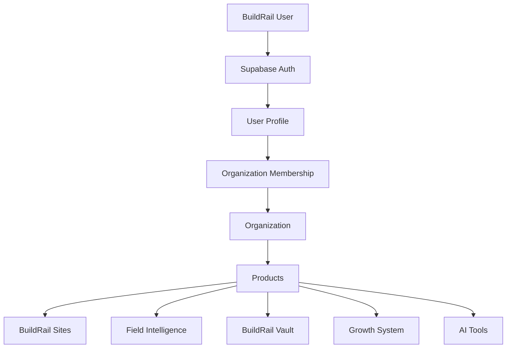
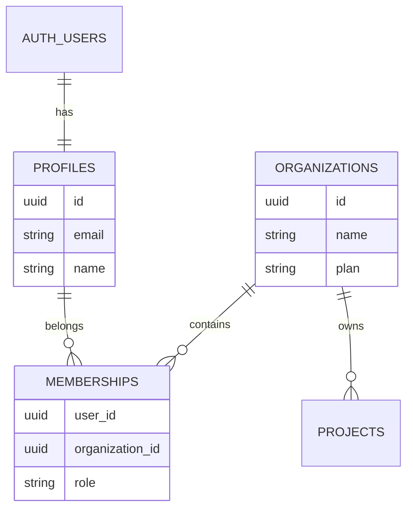
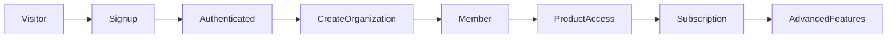

# BuildRail Authentication Standards

**Document:** `docs/platform/authentication.md`
**Purpose:** Define authentication architecture, user identity, sessions, access patterns, and security standards.
**Status:** Living Document
**Owner:** BuildRail Platform Engineering
**Last Updated:** 2026-07-07

---

# 1. Overview

Authentication is the foundation of the BuildRail platform.

Every BuildRail product must answer:

- Who is this user?
- Which organization do they belong to?
- What are they allowed to access?
- Which customer data can they see?
- What actions can they perform?

BuildRail authentication is designed around a SaaS multi-tenant model.

The core principle:

> Users belong to organizations. Organizations own data. Products provide capabilities.

---

# 2. Authentication Philosophy

BuildRail follows these principles:

| Principle            | Description                                  |
| -------------------- | -------------------------------------------- |
| Secure by default    | Access must be explicitly granted            |
| Multi-tenant first   | Every feature assumes organization ownership |
| Centralized identity | One user identity across products            |
| Least privilege      | Users receive only required access           |
| Simple UX            | Authentication should feel invisible         |
| Future ready         | Support enterprise features later            |

---

# 3. Authentication Architecture

BuildRail uses:

- Supabase Auth
- PostgreSQL identity management
- Row Level Security (RLS)
- Organization membership model

High-level architecture:



---

# 4. Identity Model

BuildRail separates:

## Authentication Identity

Managed by Supabase Auth.

Example:

```text
auth.users
```

Contains:

- email
- password/provider
- authentication metadata
- session information

---

## Application Identity

Managed by BuildRail.

Example:

```text
profiles
```

Contains:

- display name
- avatar
- preferences
- role information

---

## Organization Identity

Managed by BuildRail.

Example:

```text
organizations
```

Contains:

- company information
- subscription
- ownership

---

# 5. Database Model

Core authentication tables:



---

# 6. User Lifecycle

A BuildRail user's lifecycle:



---

# 7. User Registration

Standard signup flow:

1. User enters email/password
2. Supabase creates auth identity
3. Profile record created
4. Organization created or invitation accepted
5. User receives default permissions

---

Example:

```typescript
const { data, error } = await supabase.auth.signUp({
	email,
	password,
});
```

---

# 8. Session Management

BuildRail uses Supabase sessions.

Rules:

- Never store authentication tokens manually
- Never expose service role keys
- Always validate server-side
- Refresh sessions automatically

---

## Client Authentication

Example:

```typescript
const supabase = createClient();

const {
	data: { user },
} = await supabase.auth.getUser();
```

---

## Server Authentication

Server components and API routes must validate identity.

Example:

```typescript
const user = await getCurrentUser();

if (!user) {
	redirect('/login');
}
```

---

# 9. Organization Model

BuildRail is organization-centric.

Not:

```
User
 |
 Projects
```

Instead:

```
User
 |
 Membership
 |
 Organization
 |
 Projects
 |
 Products
```

This allows:

- contractors with employees
- agencies managing clients
- multiple team members
- future enterprise plans

---

# 10. Roles and Permissions

Initial roles:

| Role   | Purpose                   |
| ------ | ------------------------- |
| Owner  | Full organization control |
| Admin  | Manage users/settings     |
| Member | Standard product access   |
| Viewer | Read-only access          |

---

Example permission matrix:

| Capability    | Owner | Admin | Member | Viewer |
| ------------- | ----- | ----- | ------ | ------ |
| Billing       | ✓     |       |        |        |
| Invite users  | ✓     | ✓     |        |        |
| Edit projects | ✓     | ✓     | ✓      |        |
| View reports  | ✓     | ✓     | ✓      | ✓      |
| Delete data   | ✓     |       |        |        |

---

# 11. Authorization Rules

Authentication answers:

> Who are you?

Authorization answers:

> What can you do?

Never rely only on frontend checks.

Bad:

```typescript
if (role === 'admin') {
	showButton();
}
```

Good:

Database policy:

```sql
CREATE POLICY "Users access own organization data"
ON projects
FOR SELECT
USING (
 organization_id IN (
   SELECT organization_id
   FROM memberships
   WHERE user_id = auth.uid()
 )
);
```

---

# 12. Supabase Row Level Security

RLS is mandatory.

Every customer-owned table must include:

```sql
organization_id uuid
```

Example:

```sql
CREATE TABLE projects (
 id uuid PRIMARY KEY,
 organization_id uuid NOT NULL,
 name text
);
```

---

Required policy:

```sql
CREATE POLICY organization_access
ON projects
FOR ALL
USING (
organization_id IN (
SELECT organization_id
FROM memberships
WHERE user_id = auth.uid()
)
);
```

---

# 13. Multi-Tenant Security

The golden rule:

> A user should never access another organization's data, even accidentally.

Every query should consider:

- current user
- current organization
- permissions

---

Never:

```typescript
supabase.from('projects').select('*');
```

Without filtering or RLS.

---

Preferred:

```typescript
supabase.from('projects').select('*').eq('organization_id', organizationId);
```

---

# 14. Authentication Providers

Initial:

- Email/password
- Magic links

Future:

- Google
- Microsoft
- Enterprise SSO

Architecture should not prevent expansion.

---

# 15. Protected Routes

Application routes should be categorized.

Example:

```
app/

(public)
/
 /pricing
 /login

(protected)
 /dashboard
 /projects
 /settings

(admin)
 /admin
```

---

Protected routes require:

```typescript
if (!user) {
	redirect('/login');
}
```

---

# 16. Authentication Errors

Authentication errors should be:

- clear
- user friendly
- non-revealing

Avoid:

```
User does not exist
```

Prefer:

```
Invalid email or password
```

---

# 17. Secrets and Keys

Allowed client-side:

```env
NEXT_PUBLIC_SUPABASE_URL
NEXT_PUBLIC_SUPABASE_ANON_KEY
```

Never client-side:

```env
SUPABASE_SERVICE_ROLE_KEY
DATABASE_PASSWORD
PRIVATE_API_KEYS
```

---

# 18. AI Development Rules

AI assistants working on authentication must:

- understand organization boundaries
- preserve RLS policies
- never disable security checks
- never replace backend authorization with UI logic

---

# 19. Future Platform Features

Authentication architecture should support:

## Invitations

Example:

```
Owner invites employee
        |
        |
Employee accepts
        |
        |
Membership created
```

---

## Teams

Future:

```
Organization

 ├── Sales Team
 ├── Field Team
 └── Admin Team
```

---

## Enterprise

Future support:

- SSO
- SCIM
- Audit logs
- Advanced permissions

---

# 20. Authentication Checklist

Every new BuildRail product must verify:

- [ ] Uses shared authentication
- [ ] Validates user sessions
- [ ] Uses organization context
- [ ] Implements RLS
- [ ] Never trusts frontend permissions
- [ ] Handles unauthorized states
- [ ] Protects customer data

---

# Final Principle

Authentication is not a login screen.

Authentication is the foundation of customer trust.

BuildRail products must always know:

- who is using the system
- who owns the data
- who can access it
- why they are allowed

The standard:

> One identity. One organization model. Secure access across the entire BuildRail ecosystem.
