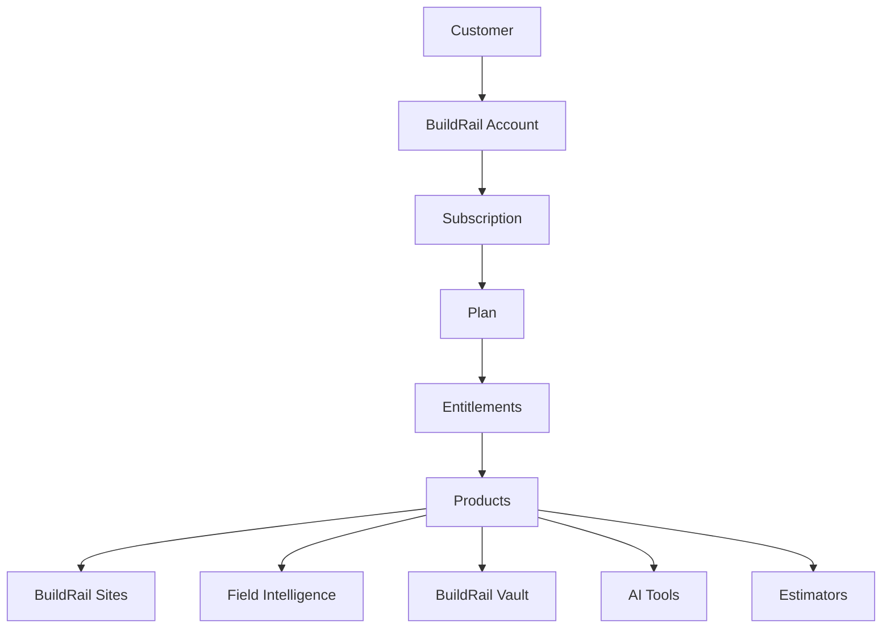
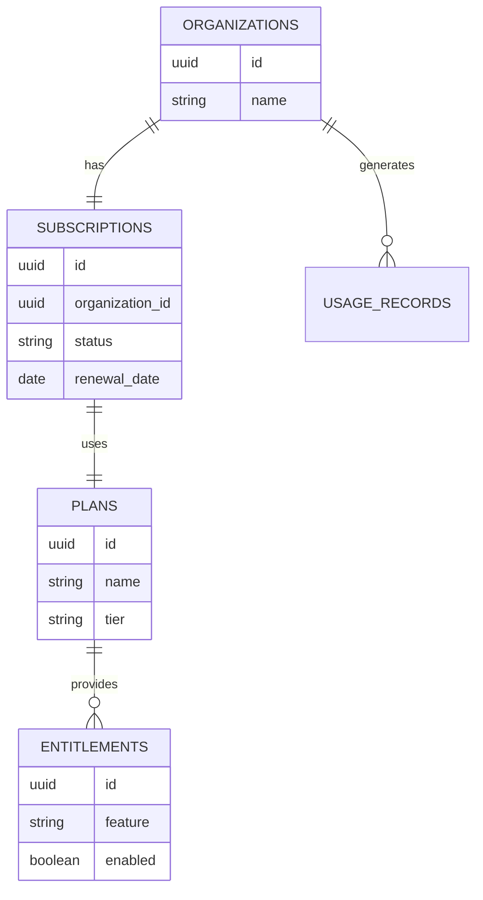
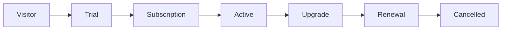
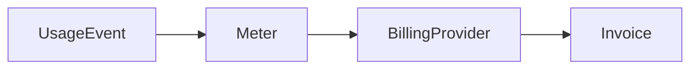
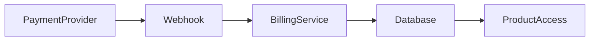

# BuildRail Billing Standards

**Document:** `docs/platform/billing.md`
**Purpose:** Define subscription architecture, plans, payments, entitlements, and revenue model standards.
**Status:** Living Document
**Owner:** BuildRail Platform Engineering
**Last Updated:** 2026-07-07

---

# 1. Overview

Billing is the commercial foundation of the BuildRail platform.

BuildRail is designed as a modular SaaS ecosystem.

Customers should not purchase isolated applications.

Instead:

```
Customer
   |
   |
BuildRail Subscription
   |
   |
Entitlements
   |
   |
Products & Features
```

Example:

A contractor subscribes to BuildRail Pro.

They receive access to:

- Contractor website platform
- Lead management
- AI tools
- Field intelligence
- Document vault
- Estimators

---

# 2. Billing Philosophy

BuildRail billing follows these principles:

| Principle                 | Description                          |
| ------------------------- | ------------------------------------ |
| One customer relationship | Customers have one BuildRail account |
| Product flexibility       | Features can evolve independently    |
| Simple pricing            | Avoid confusing customers            |
| Usage awareness           | Support future metered products      |
| Entitlement driven        | Access controlled by platform rules  |
| Revenue focused           | Billing supports business growth     |

---

# 3. Billing Architecture

High-level model:



---

# 4. Payment Provider

BuildRail supports external payment providers.

Initial options:

- Lemon Squeezy
- Stripe

The architecture should avoid provider lock-in.

Billing provider responsibilities:

| Provider               | BuildRail                 |
| ---------------------- | ------------------------- |
| Collect payment        | Manage access             |
| Handle taxes           | Store entitlements        |
| Process invoices       | Control features          |
| Manage payment methods | Track organization status |

---

# 5. Core Billing Entities

Recommended database model:



---

# 6. Subscription Lifecycle

Customer lifecycle:



---

# 7. Plan Structure

Initial BuildRail plans:

Example:

| Plan         | Customer             | Purpose            |
| ------------ | -------------------- | ------------------ |
| Starter      | Solo contractor      | Basic tools        |
| Professional | Growing contractor   | Full workflow      |
| Agency       | Marketing companies  | Multiple customers |
| Enterprise   | Larger organizations | Custom needs       |

---

# 8. Product Entitlements

Products should not check subscriptions directly.

Avoid:

```typescript
if (subscription === 'pro') {
	showFeature();
}
```

Instead:

```typescript
if (hasEntitlement('sites.website_builder')) {
	showFeature();
}
```

---

# 9. Entitlement Model

Example:

```json
{
	"organization": "abc123",
	"features": {
		"sites.website_builder": true,
		"field.inspections": true,
		"vault.storage": true,
		"ai.prompts": true
	}
}
```

---

# 10. Feature Flags vs Entitlements

They are different.

## Feature Flags

Used internally:

Example:

```
new_dashboard_beta = true
```

Purpose:

- testing
- gradual rollout

---

## Entitlements

Used commercially:

Example:

```
field.inspections = true
```

Purpose:

- paid access
- customer permissions

---

# 11. Billing Database Standards

Every subscription-related table should include:

```sql
created_at timestamp
updated_at timestamp
```

Example:

```sql
CREATE TABLE subscriptions (
id uuid PRIMARY KEY,
organization_id uuid NOT NULL,
provider text NOT NULL,
provider_subscription_id text,
status text NOT NULL,
created_at timestamp DEFAULT now()
);
```

---

# 12. Subscription Status

Standard states:

| Status    | Meaning         |
| --------- | --------------- |
| trialing  | Trial period    |
| active    | Paid customer   |
| past_due  | Payment problem |
| cancelled | Ending          |
| expired   | No access       |

---

# 13. Access Control

Application access flow:

```mermaid
flowchart TD

User

--> Authenticate

--> Identify Organization

--> Check Subscription

--> Load Entitlements

--> Allow Feature
```

---

Example:

```typescript
const canUseSites = await hasEntitlement(
	organizationId,
	'sites.website_builder',
);
```

---

# 14. Free Trials

Trials should be supported.

Example:

```
New contractor signup

↓

14-day BuildRail Pro trial

↓

Convert to paid

↓

Continue access
```

---

Trial rules:

- expiration is server controlled
- never rely on client dates
- notify before expiration

---

# 15. Usage-Based Billing

Future BuildRail services may require usage billing.

Examples:

## AI

Usage:

```
AI generations
tokens
documents processed
```

---

## Storage

Usage:

```
photos uploaded
documents stored
```

---

## Websites

Usage:

```
number of active websites
```

---

Architecture:



---

# 16. Product Expansion Model

New products should integrate through billing.

Example:

Adding:

```
BuildRail AI Receptionist
```

requires:

1. Define entitlement

```
ai.receptionist
```

2. Add to plans

3. Implement access checks

4. Update marketing

---

# 17. Payment Webhooks

Payment providers communicate through webhooks.

Example events:

```
subscription.created

subscription.updated

subscription.cancelled

payment.failed
```

Flow:



---

# 18. Security Standards

Never:

- trust frontend billing state
- expose provider secrets
- manually modify production subscriptions

Always:

- validate webhook signatures
- log billing events
- audit changes

---

# 19. Customer Experience Standards

Billing UI should show:

- current plan
- available upgrades
- billing status
- renewal date
- feature access

Example:

```
BuildRail Professional

✓ Website Builder
✓ Lead Management
✓ AI Tools
✓ Field Intelligence

Renews:
August 7, 2026
```

---

# 20. AI Development Rules

AI assistants modifying billing systems must:

- preserve subscription logic
- understand entitlements
- never bypass payment checks
- never hardcode plans

---

# 21. Future Billing Features

Planned:

- coupons
- referral programs
- partner accounts
- usage billing
- invoices
- reseller plans
- white-label subscriptions

---

# Billing Implementation Checklist

Every monetized feature requires:

- [ ] Entitlement defined
- [ ] Database support
- [ ] Subscription mapping
- [ ] Access checks
- [ ] Billing UI updates
- [ ] Documentation

---

# Final Principle

Billing is not a payment page.

Billing is the connection between customer value and BuildRail's growth.

The standard:

> Customers should subscribe once, access many capabilities, and clearly understand the value they receive from the BuildRail ecosystem.
