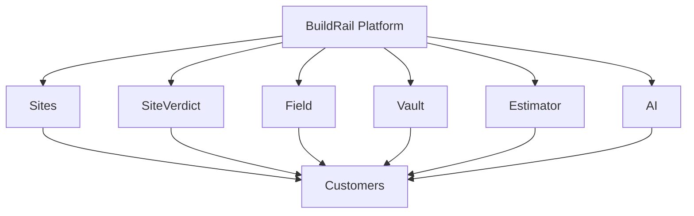
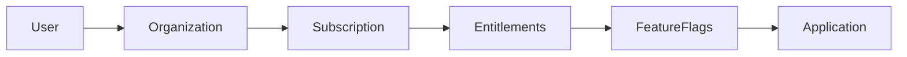
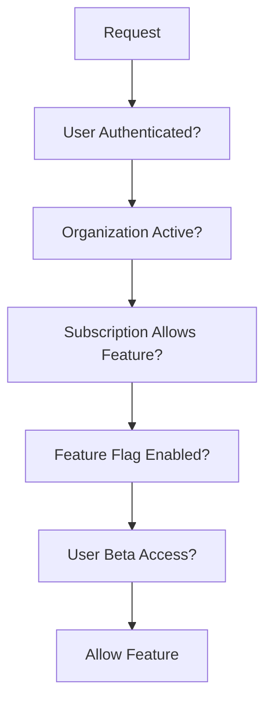

# BuildRail Feature Flag Standards

**Document:** `docs/platform/feature-flags.md`
**Status:** Living Document
**Owner:** BuildRail Engineering
**Last Updated:** 2026-07-07

---

# Feature Flag Standards

## Purpose

This document defines how BuildRail manages feature availability across the platform.

Feature flags allow BuildRail to separate:

- Code deployment
- Product release
- Customer access
- Subscription entitlements

A feature can exist in production without being visible to every user.

---

# Core Principle

> Deploy continuously. Release intentionally.

BuildRail should be able to:

- merge code safely
- deploy frequently
- activate features gradually
- control customer access

---

# Why BuildRail Needs Feature Flags

BuildRail is not a single SaaS product.

It is an ecosystem:



Each product may have:

- different maturity levels
- different pricing tiers
- different beta groups
- different rollout schedules

---

# Feature Flag Categories

BuildRail uses four primary flag types.

| Type               | Purpose                        |
| ------------------ | ------------------------------ |
| Product Flags      | Enable entire modules          |
| Feature Flags      | Enable individual capabilities |
| Beta Flags         | Limited user testing           |
| Subscription Flags | Paid access control            |

---

# Product Module Flags

Product-level examples:

```typescript id="j6g8d4"
modules.siteverdict;

modules.field;

modules.vault;

modules.estimator;

modules.ai_tools;
```

Example:

```typescript id="q6k4rx"
if (flags.modules.siteverdict) {
	showSiteVerdict();
}
```

---

# Feature Flags

Feature-level examples:

SiteVerdict:

```text
siteverdict.ai_analysis

siteverdict.photo_uploads

siteverdict.fix_tracking

siteverdict.customer_portal
```

Sites:

```text
sites.custom_domains

sites.ai_copywriter

sites.analytics
```

AI:

```text
ai.chat_assistant

ai.proposal_writer

ai.review_generator
```

---

# Beta Access Flags

Beta features require controlled access.

Example:

```text
siteverdict.beta
```

Access:

| User              | Enabled |
| ----------------- | ------- |
| BuildRail team    | Yes     |
| Internal testers  | Yes     |
| Beta contractors  | Yes     |
| General customers | No      |

---

# Subscription Gating

Feature flags work with billing entitlements.

Example:



---

# Subscription Example

Plans:

| Plan         | Features    |
| ------------ | ----------- |
| Starter      | Sites       |
| Professional | Sites + CRM |
| Growth       | AI tools    |
| Enterprise   | Everything  |

---

# Flag Evaluation Order

BuildRail evaluates access in this order:



---

# Database Model

Feature flags should be stored centrally.

Example:

```sql id="7w7n2f"
create table feature_flags (

id uuid primary key,

key text unique not null,

description text,

enabled boolean default false,

created_at timestamp default now()

);
```

---

# Organization Overrides

Some customers need custom access.

Example:

```sql id="6x1b3m"
create table organization_features (

organization_id uuid,

feature_key text,

enabled boolean

);
```

Example:

```text
Company A

siteverdict.enabled = true


Company B

siteverdict.enabled = false
```

---

# User Overrides

For testing:

```sql id="n4p9wy"
create table user_features (

user_id uuid,

feature_key text,

enabled boolean

);
```

Use cases:

- internal testing
- support troubleshooting
- beta users

---

# Feature Flag Service

Applications should not query flags directly.

Preferred:

```text
packages/

    feature-flags/

        index.ts
        evaluate.ts
        types.ts
```

---

Example:

```typescript id="7zq5h9"
import { hasFeature } from '@buildrail/features';

const enabled = await hasFeature({
	organizationId,

	feature: 'siteverdict.fix_tracking',
});
```

---

# Flag Naming Standards

Use:

```
product.area.capability
```

Examples:

Good:

```text
siteverdict.ai_analysis

sites.custom_domains

vault.document_sharing
```

Bad:

```text
new_feature

test1

awesome_button
```

---

# Environment Flags

Some features exist only in development.

Example:

```env
FEATURE_DEBUG_TOOLS=true

FEATURE_AI_EXPERIMENTS=false
```

---

# Development Workflow

## Create Feature

Example:

```text
vault.document_versions
```

---

## Add Database Flag

```text
feature_flags

vault.document_versions
```

---

## Add Code Guard

```typescript
if (await hasFeature('vault.document_versions')) {
	renderVersions();
}
```

---

## Enable Gradually

Rollout:

```text
Developer

↓

Internal Team

↓

Beta Customers

↓

All Customers
```

---

# Rollout Strategies

## Immediate Release

Use when:

- Low risk
- Internal tooling

---

## Percentage Rollout

Future capability:

```text
10%
25%
50%
100%
```

---

## Organization Rollout

Preferred for B2B:

```text
Customer A
Enabled

Customer B
Disabled
```

---

# Emergency Kill Switch

Critical features require disable capability.

Example:

```text
siteverdict.ai_processing = false
```

Use cases:

- API outage
- Cost spike
- Incorrect AI behavior
- Security concern

---

# Feature Flag Rules

## Do

- Keep flags documented
- Remove old flags
- Name clearly
- Test both states

---

## Do Not

Do not:

- Create permanent experimental flags
- Hide security issues behind flags
- Use flags instead of permissions
- Put business logic inside flags

---

# Feature Flags vs Permissions

They are different.

Feature flag:

> Does this capability exist?

Permission:

> Is this user allowed to use it?

Example:

```text
Feature:

AI Proposal Generator exists


Permission:

This user can create proposals
```

Both may be required.

---

# Testing Standards

Every flagged feature requires:

## Enabled Test

```text
Feature ON

Expected behavior works
```

---

## Disabled Test

```text
Feature OFF

Graceful fallback shown
```

---

# Audit Requirements

Feature changes must be logged.

Example:

```json id="9g6s2z"
{
	"action": "feature.enabled",

	"feature": "siteverdict.beta",

	"organization": "ABC Construction",

	"changed_by": "admin"
}
```

---

# Product Examples

## SiteVerdict

Flags:

```text
siteverdict.enabled

siteverdict.ai_analysis

siteverdict.fix_tracking

siteverdict.customer_portal
```

---

## BuildRail Sites

Flags:

```text
sites.ai_builder

sites.custom_domains

sites.analytics
```

---

## Vault

Flags:

```text
vault.document_storage

vault.sharing

vault.versions
```

---

## AI Platform

Flags:

```text
ai.assistant

ai.proposals

ai.automation
```

---

# Engineering Checklist

Before releasing a feature:

- [ ] Feature flag created
- [ ] Subscription relationship defined
- [ ] Permissions reviewed
- [ ] Disabled state works
- [ ] Audit logging added
- [ ] Documentation updated
- [ ] Cleanup date assigned

---

# Future Enhancements

Potential capabilities:

- Admin feature dashboard
- Customer beta portal
- Automatic rollout rules
- Usage-based entitlements
- A/B testing
- AI cost controls
- Enterprise contracts

---

# Final Principle

> Feature flags allow BuildRail to move fast without forcing every customer to move at the same speed.

A professional SaaS platform does not simply ship features.

It controls when, where, and for whom those features become available.
