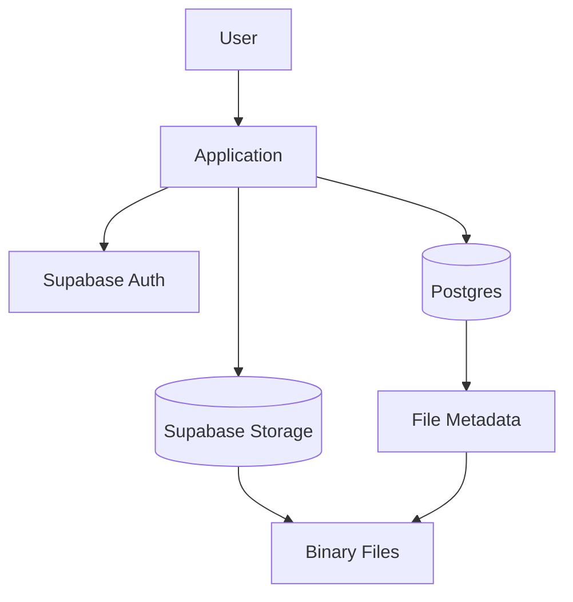
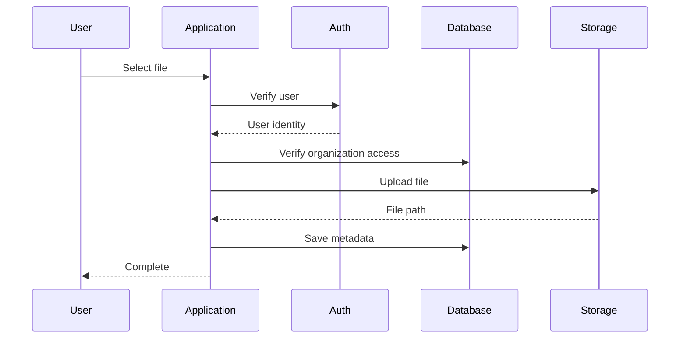
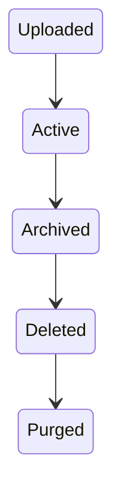

# BuildRail File Storage Standards

**Document:** `docs/platform/file-storage.md`
**Status:** Living Document
**Owner:** BuildRail Engineering
**Last Updated:** 2026-07-07

---

# File Storage Standards

## Purpose

This document defines how BuildRail manages files across the platform.

BuildRail is an ecosystem of connected construction software products. Files are a shared platform capability, not an individual product feature.

Examples:

- SiteVerdict inspection photos
- BuildRail Field project images
- Contractor logos
- Customer website assets
- Proposal documents
- Estimate PDFs
- Signed agreements
- AI-generated reports
- Training materials
- Compliance evidence

A consistent storage architecture ensures:

- Tenant isolation
- Secure access
- Predictable file organization
- Scalable growth
- Easy migration
- Auditability

---

# Storage Philosophy

## Files Are Platform Assets

Files belong to organizations, not individual applications.

A SiteVerdict photo is not owned by SiteVerdict.

It belongs to:

```
Organization
    |
    └── Project
            |
            └── Inspection
                    |
                    └── Evidence Photo
```

The product creates the context.

The platform owns the asset lifecycle.

---

# Storage Architecture

BuildRail uses:

- Supabase Storage
- PostgreSQL metadata tables
- Row Level Security policies
- Signed URLs
- Organization-based access control

Architecture:



---

# Storage Layers

BuildRail separates:

| Layer             | Purpose                     |
| ----------------- | --------------------------- |
| Database          | File metadata and ownership |
| Storage Bucket    | Actual binary files         |
| Application       | Upload/download workflows   |
| Security Policies | Access enforcement          |

Example:

Database:

```text
files

id
organization_id
uploaded_by
bucket
path
filename
mime_type
size
created_at
```

Storage:

```text
buildrail-files/

organizations/

    org_123/

        projects/

            project_456/

                photos/

                    image001.jpg
```

---

# Bucket Standards

BuildRail uses purpose-based buckets.

Recommended buckets:

| Bucket              | Purpose                     |
| ------------------- | --------------------------- |
| public-assets       | Logos, marketing images     |
| organization-files  | Customer-owned files        |
| project-files       | Construction project assets |
| evidence-files      | Inspections and compliance  |
| generated-documents | PDFs, reports, exports      |
| avatars             | User profile images         |

---

# Bucket Rules

## Public Assets

Examples:

- Company logo
- Website images
- Marketing assets

Access:

```
Public read
Authenticated write
```

---

## Private Assets

Examples:

- Inspection photos
- Estimates
- Contracts
- Reports

Access:

```
Private bucket
Signed URLs only
Organization permission required
```

---

# File Naming Standards

Never rely on user filenames.

Bad:

```
IMG_8837.jpg
final-final-real.pdf
photo.jpg
```

Good:

```
{organizationId}/{resource}/{uuid}-{filename}
```

Example:

```
org_123/projects/project_456/evidence/
7d9a2c-inspection-wall-damage.jpg
```

---

# File Metadata Model

Every stored file should have a database record.

Example:

```sql
create table files (

id uuid primary key,

organization_id uuid not null,

uploaded_by uuid,

bucket text not null,

storage_path text not null,

filename text,

mime_type text,

size bigint,

resource_type text,

resource_id uuid,

created_at timestamp default now()

);
```

---

# Resource Ownership Pattern

Every file must have an owner.

Example:

```
File

belongs_to

Organization

belongs_to

Resource
```

Resource examples:

| Resource   | Example            |
| ---------- | ------------------ |
| project    | Remodel project    |
| inspection | SiteVerdict audit  |
| estimate   | Roofing estimate   |
| website    | Contractor website |
| user       | Avatar             |

---

# Upload Flow

Standard upload process:



---

# Download Flow

Private files should never expose permanent URLs.

Correct:

```
User Request

↓

Check permissions

↓

Generate signed URL

↓

Return temporary access
```

Example:

```typescript
const { data } = await supabase.storage
	.from('evidence-files')
	.createSignedUrl(path, 3600);
```

---

# Security Standards

## Never Store Secrets In Files

Do not store:

- API keys
- credentials
- private tokens
- environment files

---

## Tenant Isolation

Every query must include organization context.

Example:

```sql
WHERE organization_id = auth.organization_id()
```

Never:

```sql
SELECT *
FROM files;
```

---

# Row Level Security

Every file metadata table requires RLS.

Example:

```sql
create policy "Users access organization files"

on files

for select

using (

organization_id IN (

select organization_id

from memberships

where user_id = auth.uid()

)

);
```

---

# File Validation

Uploads must validate:

## Size

Examples:

| File Type | Maximum |
| --------- | ------- |
| Images    | 10 MB   |
| PDFs      | 25 MB   |
| Videos    | 250 MB  |

---

## MIME Type

Allowed:

```
image/jpeg
image/png
application/pdf
video/mp4
```

Reject:

```
application/javascript
application/x-executable
```

---

# Image Standards

Construction software is image-heavy.

Requirements:

- Compress before storage
- Generate thumbnails
- Preserve originals when needed
- Store metadata

Example:

```
Original

↓

Processing

↓

Thumbnail
Preview
Original
```

---

# Photo Evidence Standards

For SiteVerdict and Field:

Each photo should capture:

| Field         | Example          |
| ------------- | ---------------- |
| project_id    | UUID             |
| inspection_id | UUID             |
| location      | Exterior wall    |
| timestamp     | 2026-07-07       |
| uploaded_by   | Technician       |
| notes         | Missing flashing |

---

# AI Generated Files

AI outputs must be stored separately.

Examples:

- Generated proposals
- Audit reports
- AI summaries

Pattern:

```
organization/

generated/

resource/

document.pdf
```

Metadata:

```json
{
	"type": "proposal",
	"generated_by": "buildrail-ai",
	"model": "gpt-x",
	"created_at": "timestamp"
}
```

---

# Local Development

Developers should use:

```
.env.local
```

Example:

```env
NEXT_PUBLIC_SUPABASE_URL=
NEXT_PUBLIC_SUPABASE_ANON_KEY=
SUPABASE_SERVICE_ROLE_KEY=
```

Never commit:

```
.env
.env.local
.env.production
```

---

# Storage Helper Pattern

Shared services should expose storage utilities.

Example:

```
packages/

shared/

    storage/

        upload.ts
        download.ts
        permissions.ts
```

Applications consume:

```typescript
import { uploadFile } from '@buildrail/storage';
```

---

# Error Handling

All storage operations must handle:

- Permission failures
- Missing files
- Upload failures
- Network failures
- Invalid file types

Example:

```typescript
try {
	await uploadFile(file);
} catch (error) {
	console.error(error);

	throw new Error('Unable to upload file');
}
```

---

# File Lifecycle

Files follow:



---

# Deletion Rules

Never immediately delete customer files.

Preferred:

```
Soft Delete

↓

Retention Period

↓

Permanent Removal
```

Example:

```
deleted_at = timestamp
```

---

# Backup Strategy

Critical files require:

- Supabase backups
- Export capability
- Disaster recovery plan

Future:

```
Supabase Storage

↓

Backup Provider

↓

Cold Storage
```

---

# Product Usage Examples

## BuildRail Sites

Stores:

- Contractor logos
- Gallery photos
- Website assets

---

## SiteVerdict

Stores:

- Inspection photos
- Evidence files
- Generated reports

---

## BuildRail Vault

Stores:

- Documents
- Contracts
- Customer records

---

## BuildRail Field

Stores:

- Job photos
- Technician uploads
- Project files

---

# Engineering Checklist

Before adding file storage:

- [ ] Define owning organization
- [ ] Define resource relationship
- [ ] Choose correct bucket
- [ ] Add metadata table
- [ ] Add RLS policies
- [ ] Validate uploads
- [ ] Implement signed URLs
- [ ] Add deletion strategy
- [ ] Document lifecycle

---

# Future Enhancements

Potential platform capabilities:

- File search
- AI document extraction
- OCR processing
- Image tagging
- Duplicate detection
- Automatic compression
- Version history
- Customer sharing links

---

# Final Principle

> Files are not attachments. Files are platform assets with ownership, security, and lifecycle.

BuildRail should make storing and accessing construction data feel effortless while maintaining enterprise-grade security.
