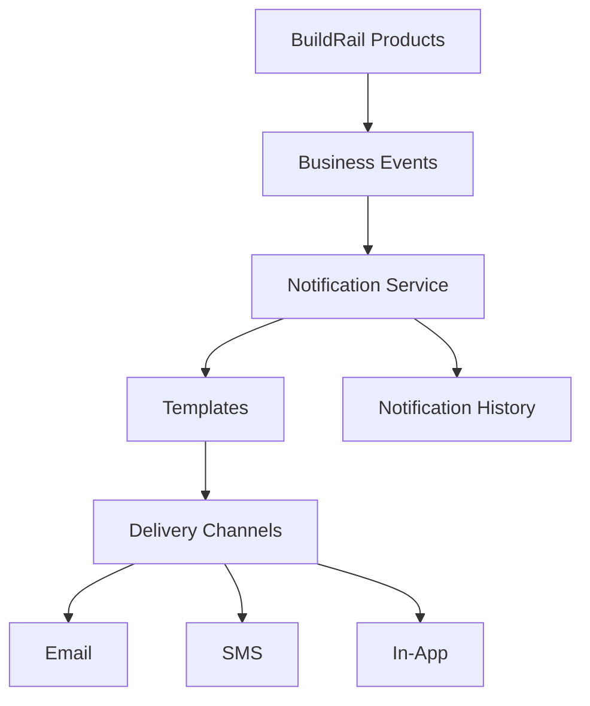
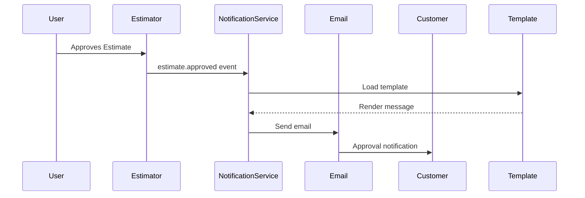
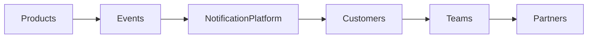

# BuildRail Notifications

**Document:** `docs/platform/notifications.md`
**Status:** Living Document
**Owner:** BuildRail Engineering
**Category:** Platform Architecture

---

# 1. Purpose

This document defines the BuildRail notification architecture.

The notification system provides a centralized way for all BuildRail products to communicate with:

- Organization members
- Customers
- Contractors
- Partners
- External stakeholders

Supported communication channels:

- Email
- SMS
- In-app notifications
- Future push notifications

---

# 2. Notification Philosophy

BuildRail notifications should be:

- Useful
- Timely
- Context-aware
- Permission-aware
- Traceable

Notifications are not marketing noise.

They represent meaningful business events.

Examples:

Good:

> "Your proposal was approved by Martinez Construction."

Good:

> "Your SiteVerdict audit has three unresolved items."

Bad:

> "Check out this new feature!"

---

# 3. Architecture Overview



Products generate events.

The notification platform handles delivery.

---

# 4. Notification Flow

Example:

A contractor approves an estimate.



---

# 5. Notification Service Responsibilities

The notification service manages:

## Delivery

- Email sending
- SMS sending
- In-app alerts

## Templates

- Message formatting
- Branding
- Localization

## Preferences

- User opt-in settings
- Communication rules

## Tracking

- Sent
- Delivered
- Opened
- Failed

---

# 6. Recommended Package Structure

```text
packages/

└── notifications/

    ├── src/
    │
    │── email/
    │
    │── sms/
    │
    │── templates/
    │
    │── events/
    │
    │── preferences/
    │
    ├── package.json
    └── README.md
```

---

# 7. Notification Types

BuildRail separates notifications into categories.

| Type          | Purpose                         |
| ------------- | ------------------------------- |
| Transactional | Required business communication |
| Operational   | Team workflow alerts            |
| Security      | Account protection              |
| Marketing     | Product communication           |

---

# 8. Transactional Notifications

Transactional messages support business workflows.

Examples:

| Event            | Notification               |
| ---------------- | -------------------------- |
| Estimate created | Customer receives estimate |
| Proposal signed  | Team notified              |
| Audit completed  | Customer receives report   |
| Payment received | Receipt sent               |
| Website launched | Owner notified             |

---

# 9. Operational Notifications

Internal team activity.

Examples:

- New lead received
- Missed call captured
- Project assigned
- Task completed

Example:

```ts
lead.created;

project.assigned;

task.completed;
```

---

# 10. Security Notifications

Security events require immediate delivery.

Examples:

- New login
- Password changed
- Permission changed
- API key created

Example:

```ts
security.login_detected;
```

---

# 11. Notification Event Model

Notifications begin with events.

Example:

```ts
{
 type: "estimate.approved",

 organizationId:
 "org_123",

 userId:
 "user_456",

 payload: {

   estimateId:
   "estimate_789"

 }
}
```

---

# 12. Event Naming Convention

All events follow:

```
resource.action
```

Examples:

```
estimate.created

estimate.sent

estimate.approved

audit.completed

site.published

payment.failed
```

---

# 13. Notification API

Example:

```ts
import { notify } from '@buildrail/notifications';

await notify({
	type: 'estimate.approved',

	recipient: customer.email,

	data: {
		estimateId,
	},
});
```

---

# 14. Channel Selection

The notification system determines delivery.

Example:

```ts
{
 type:
 "audit.completed",

 channels:[
   "email",
   "in_app"
 ]
}
```

---

# 15. Email Standards

All BuildRail email must:

- Use shared branding
- Include organization context
- Include unsubscribe handling
- Support mobile layouts

Example structure:

```
BuildRail Logo

Headline

Message

Primary Action Button

Supporting Details

Footer
```

---

# 16. SMS Standards

SMS should be:

- Short
- Action oriented
- Human

Example:

```
BuildRail:

Your SiteVerdict audit is complete.
3 items require attention.

View report:
https://...
```

---

# 17. In-App Notifications

In-app notifications provide workflow awareness.

Example:

Dashboard:

```
Notifications

✓ Proposal signed
  5 minutes ago

✓ New lead received
  1 hour ago
```

---

# 18. Notification Database Model

Recommended tables:

## notifications

```sql
id

organization_id

user_id

type

title

message

read_at

created_at
```

---

## notification_deliveries

```sql
id

notification_id

channel

status

sent_at

delivered_at

error
```

---

## notification_preferences

```sql
id

user_id

notification_type

email_enabled

sms_enabled

in_app_enabled
```

---

# 19. User Preferences

Users control communication preferences.

Example:

```
Marketing emails
ON/OFF

Project updates
ON/OFF

Security alerts
Always ON
```

---

# 20. Tenant Isolation

Every notification must belong to an organization.

Required:

```sql
organization_id
```

Never query:

```sql
SELECT *
FROM notifications
```

Always:

```sql
SELECT *
FROM notifications
WHERE organization_id = current_org
```

---

# 21. Failure Handling

Notifications can fail.

Examples:

- Invalid email
- SMS provider failure
- API timeout

Failures should:

- Retry automatically
- Log failure
- Notify administrators when necessary

---

# 22. Notification Logging

Every notification records:

| Field     | Purpose              |
| --------- | -------------------- |
| Event     | What happened        |
| Recipient | Who received it      |
| Channel   | How it was delivered |
| Status    | Result               |
| Timestamp | When                 |

---

# 23. Product Examples

## BuildRail Sites

Events:

```
site.created

site.preview_ready

site.published
```

---

## SiteVerdict

Events:

```
audit.completed

finding.resolved

report.shared
```

---

## Estimator

Events:

```
estimate.created

estimate.sent

estimate.approved
```

---

## Growth System

Events:

```
lead.created

missed_call.received

followup.sent
```

---

# 24. AI Integration

Future AI notifications:

Examples:

```
AI found pricing opportunity

AI detected missed lead

AI recommends follow-up
```

AI notifications must:

- Identify AI-generated content
- Provide confidence where applicable
- Allow human override

---

# 25. Development Rules

Before creating a notification:

Ask:

- Is this a meaningful business event?
- Should this be reusable?
- Does another product need this?
- Should users control this notification?

---

# 26. Implementation Checklist

When adding notifications:

- [ ] Define event name
- [ ] Create template
- [ ] Define recipients
- [ ] Select channels
- [ ] Add logging
- [ ] Add preferences
- [ ] Test delivery failure

---

# 27. Long-Term Vision

The BuildRail notification platform becomes the communication backbone.



Every BuildRail product communicates consistently because every product uses the same notification infrastructure.

---

# Document History

| Version | Date       | Notes                             |
| ------- | ---------- | --------------------------------- |
| 1.0     | 2026-07-07 | Initial notification architecture |

---
