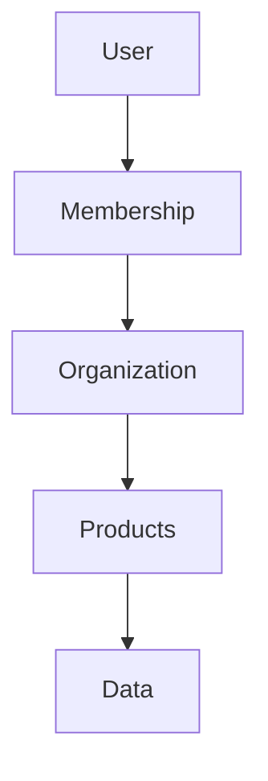
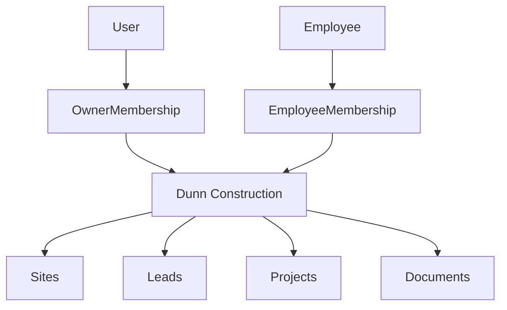
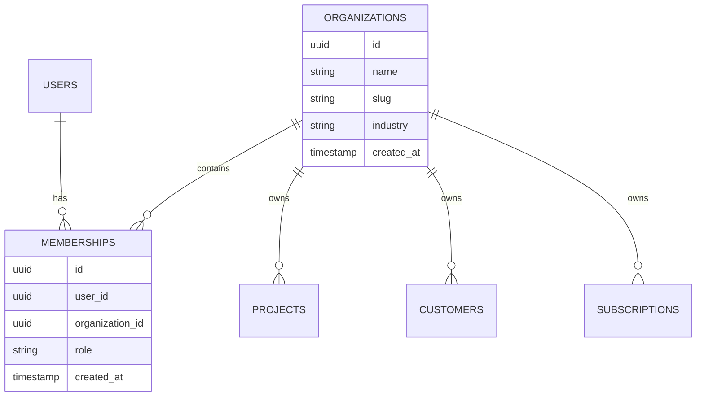
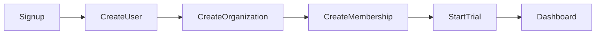
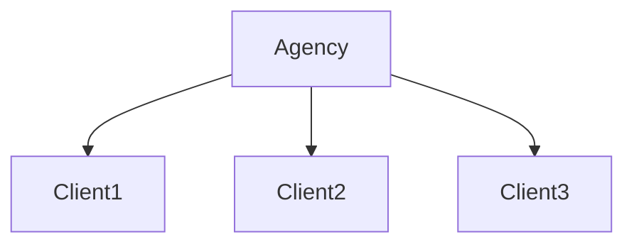

# BuildRail Organization Standards

**Document:** `docs/platform/organizations.md`
**Purpose:** Define the multi-tenant organization model, memberships, ownership, and data isolation standards.
**Status:** Living Document
**Owner:** BuildRail Platform Engineering
**Last Updated:** 2026-07-07

---

# 1. Overview

Organizations are the foundation of BuildRail's SaaS architecture.

BuildRail is not designed around individual users.

BuildRail is designed around businesses.

The core relationship:

```text
User
 |
 |
Membership
 |
 |
Organization
 |
 |
BuildRail Products
 |
 |
Business Data
```

Examples:

- A solo contractor has one organization with one member.
- A construction company has an organization with multiple employees.
- An agency manages multiple client organizations.
- An enterprise company has departments and teams.

---

# 2. Organization Philosophy

BuildRail follows these principles:

| Principle              | Description                                |
| ---------------------- | ------------------------------------------ |
| Organization ownership | Business data belongs to organizations     |
| Multi-tenant first     | Every feature supports multiple companies  |
| Clear boundaries       | Customers never access other customer data |
| Flexible membership    | Users can belong to multiple organizations |
| Product independence   | All apps use the same organization model   |
| Enterprise ready       | Architecture supports future complexity    |

---

# 3. The BuildRail Mental Model

The incorrect model:

```text
User
 |
Projects
 |
Data
```

This fails because businesses are not users.

---

The BuildRail model:



---

# 4. Organization Architecture



---

# 5. Core Database Model

Primary tables:



---

# 6. Organization Entity

Every organization should contain:

```typescript
interface Organization {
	id: string;

	name: string;

	slug: string;

	logo?: string;

	industry?: string;

	created_at: string;
}
```

---

Example:

```json
{
	"id": "org_123",
	"name": "Smith Roofing",
	"slug": "smith-roofing",
	"industry": "roofing"
}
```

---

# 7. Membership Model

Users do not directly belong to organizations.

They have memberships.

Example:

```text
John Smith

Membership 1:
    Smith Roofing
    Owner


Membership 2:
    Smith Construction Group
    Admin
```

---

Database:

```sql
CREATE TABLE memberships (

id uuid PRIMARY KEY,

user_id uuid NOT NULL,

organization_id uuid NOT NULL,

role text NOT NULL

);
```

---

# 8. Organization Roles

Initial roles:

| Role    | Purpose             |
| ------- | ------------------- |
| Owner   | Full control        |
| Admin   | Manage organization |
| Manager | Manage workflows    |
| Member  | Standard user       |
| Viewer  | Read-only access    |

---

Permission example:

| Action              | Owner | Admin | Manager | Member | Viewer |
| ------------------- | ----- | ----- | ------- | ------ | ------ |
| Billing             | ✓     |       |         |        |        |
| Invite users        | ✓     | ✓     |         |        |        |
| Create projects     | ✓     | ✓     | ✓       | ✓      |        |
| Edit records        | ✓     | ✓     | ✓       | ✓      |        |
| Delete organization | ✓     |       |         |        |        |

---

# 9. Organization Context

Every authenticated request should have:

```text
Current User

+

Current Organization

+

Current Permissions
```

Example:

```typescript
const context = {
	userId,
	organizationId,
	role,
};
```

---

# 10. Tenant Isolation

The golden rule:

> No database query should access customer data without organization context.

Every customer-owned table requires:

```sql
organization_id uuid NOT NULL
```

Example:

```sql
CREATE TABLE projects (

id uuid PRIMARY KEY,

organization_id uuid NOT NULL,

name text

);
```

---

# 11. Row Level Security

Supabase RLS protects tenant boundaries.

Example:

```sql
CREATE POLICY "Organization members can access projects"

ON projects

FOR ALL

USING (

organization_id IN (

SELECT organization_id

FROM memberships

WHERE user_id = auth.uid()

)

);
```

---

# 12. Organization Creation Flow

New customer:



---

Example:

User:

```
steve@example.com
```

Creates:

```
Organization:
BuildRail Demo Company

Role:
Owner
```

---

# 13. Invitations

Organizations invite users.

Flow:

```mermaid id="x1j7c8"
flowchart LR

Owner

--> Invitation

--> Email

--> Accept

--> Membership Created
```

---

Invitation table:

```typescript
interface Invitation {
	id: string;

	organization_id: string;

	email: string;

	role: string;

	expires_at: string;
}
```

---

# 14. Multi-Organization Support

BuildRail supports users belonging to multiple organizations.

Example:

```text
Steve

Organizations:

├── BuildRail Demo Company
│
└── Partner Agency
```

Users switch context.

---

UI example:

```
Current Organization

[ Smith Roofing ▼ ]

----------------

Smith Roofing

Smith Construction

Partner Agency
```

---

# 15. Product Integration

Every BuildRail product receives organization context.

Example:

## Sites

```text
Organization

owns

Contractor Websites
```

---

## Field

```text
Organization

owns

Inspections
```

---

## Vault

```text
Organization

owns

Documents
```

---

## AI Tools

```text
Organization

owns

AI usage
```

---

# 16. Agencies and Partners

Future model:



Example:

Marketing agency manages:

- 50 contractor websites
- 50 lead systems
- 50 reporting dashboards

---

# 17. Enterprise Future

The organization model supports:

- departments
- teams
- locations
- permissions
- billing administrators

Future:

```text
Organization

├── West Region

├── East Region

├── Sales Team

└── Operations Team
```

---

# 18. Organization Settings

Future settings:

```typescript
OrganizationSettings {

timezone

currency

branding

notifications

billingContact

}
```

---

# 19. AI Development Rules

AI assistants modifying BuildRail features must:

- include organization context
- preserve tenant isolation
- never query customer tables blindly
- never assume one user equals one company

---

# 20. Development Checklist

Every new BuildRail feature must answer:

## Ownership

- Who owns this data?

## Access

- Which organization can see it?

## Permissions

- Which roles can modify it?

## Billing

- Is this feature tied to an entitlement?

---

# 21. Common Mistakes

Avoid:

## Mistake 1

Creating:

```sql
projects
```

without:

```sql
organization_id
```

---

## Mistake 2

Checking permissions only in React.

Frontend checks are not security.

---

## Mistake 3

Assuming:

```text
one user = one company
```

This prevents future growth.

---

# Final Principle

Organizations are the foundation of BuildRail's SaaS model.

Users come and go.

Employees change.

Companies grow.

The organization owns the relationship.

The standard:

> BuildRail is built for businesses, not accounts. Every product, feature, and database table must respect the organization boundary.
