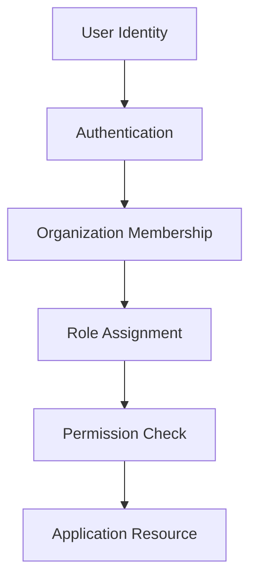
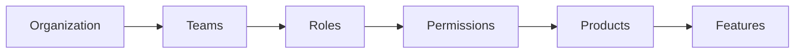

# BuildRail Roles & Permissions

**Document:** `docs/platform/roles-permissions.md`
**Status:** Living Document
**Owner:** BuildRail Engineering
**Category:** Platform Architecture

---

# 1. Purpose

This document defines the BuildRail authorization model.

BuildRail is a multi-tenant SaaS platform serving multiple organizations, teams, and users.

Every product module must follow the same permission framework.

This prevents:

- duplicated authorization logic
- inconsistent security rules
- accidental tenant data exposure
- product-specific permission models

---

# 2. Authorization Model

BuildRail uses a layered authorization model:



Access requires all layers:

```
User
 +
Organization Membership
 +
Role
 +
Permission
 =
Authorized Action
```

---

# 3. Core Concepts

## User

A person with a BuildRail account.

Example:

```ts
{
  id: "user_123",
  email: "owner@company.com"
}
```

A user may belong to multiple organizations.

---

## Organization

The primary tenant boundary.

Examples:

- ABC Roofing LLC
- Dunn Construction
- Martinez Plumbing

All business data belongs to an organization.

Example:

```ts
projects.organization_id;

estimates.organization_id;

customers.organization_id;
```

---

## Membership

The relationship between a user and organization.

Example:

```ts
organization_members;

id;
user_id;
organization_id;
role;
created_at;
```

A user is not automatically trusted because they exist.

They must have membership.

---

# 4. Tenant Isolation Rule

## The Golden Rule

> A user should never access data outside their active organization.

Every database query must include organization context.

Bad:

```ts
supabase.from('projects').select('*');
```

Good:

```ts
supabase.from('projects').select('*').eq('organization_id', organizationId);
```

---

# 5. BuildRail Roles

Initial role hierarchy:

| Role    | Purpose                 |
| ------- | ----------------------- |
| Owner   | Organization owner      |
| Admin   | Organization management |
| Manager | Operational management  |
| Member  | Standard employee       |
| Viewer  | Read-only access        |

---

# 6. Role Definitions

---

# Owner

The highest organization role.

Capabilities:

- Manage subscription
- Delete organization
- Manage admins
- Access all products
- Transfer ownership

Example:

```
Company Founder
Business Owner
Agency Owner
```

---

# Admin

Operational administrator.

Capabilities:

- Invite users
- Remove users
- Manage settings
- Configure products
- View billing information

Cannot:

- Delete organization
- Transfer ownership

---

# Manager

Project and workflow leader.

Capabilities:

- Create projects
- Manage customers
- Assign work
- View reports

Example:

```
Project Manager
Operations Manager
Estimator
```

---

# Member

Standard team user.

Capabilities:

- Work assigned projects
- Create records
- Update assigned items

Example:

```
Estimator
Salesperson
Field Technician
```

---

# Viewer

Read-only access.

Capabilities:

- View dashboards
- View reports
- View projects

Cannot:

- Modify data
- Create records

Example:

```
Client
Partner
Investor
```

---

# 7. Permission Model

Roles are collections of permissions.

Example:

```ts
Role

    ↓

Permissions

    ↓

Actions
```

---

# 8. Permission Naming Convention

Permissions follow:

```
resource.action
```

Examples:

```
projects.create

projects.update

projects.delete

customers.view

estimates.approve

billing.manage
```

---

# 9. Permission Registry

Example:

```ts
export const permissions = {
	projects: {
		create: 'projects.create',
		update: 'projects.update',
		delete: 'projects.delete',
	},

	estimates: {
		create: 'estimates.create',
		approve: 'estimates.approve',
	},

	billing: {
		manage: 'billing.manage',
	},
};
```

---

# 10. Role Matrix

| Permission         | Owner | Admin | Manager | Member | Viewer |
| ------------------ | ----- | ----- | ------- | ------ | ------ |
| View projects      | ✓     | ✓     | ✓       | ✓      | ✓      |
| Create projects    | ✓     | ✓     | ✓       | ✓      |        |
| Delete projects    | ✓     | ✓     |         |        |        |
| Manage users       | ✓     | ✓     |         |        |        |
| Manage billing     | ✓     |       |         |        |        |
| View reports       | ✓     | ✓     | ✓       | ✓      | ✓      |
| Configure products | ✓     | ✓     |         |        |        |

---

# 11. Permission Checking

Never hard-code roles throughout the application.

Bad:

```ts
if(user.role === "admin")
```

Good:

```ts
if (await can(user, 'projects.delete')) {
	deleteProject();
}
```

---

# 12. Frontend Authorization

UI should reflect permissions.

Example:

```tsx
{
	can('projects.create') && <Button>Create Project</Button>;
}
```

Important:

Frontend checks improve UX.

They do NOT provide security.

---

# 13. Backend Authorization

The server is the authority.

Example:

```ts
export async function createProject() {
	const user = await requireUser();

	await requirePermission(user, 'projects.create');
}
```

---

# 14. Supabase Row Level Security

RLS enforces tenant isolation.

Example:

```sql
CREATE POLICY
"Users can view organization projects"

ON projects

FOR SELECT

USING (

organization_id IN (

SELECT organization_id

FROM memberships

WHERE user_id = auth.uid()

)

);
```

---

# 15. Product Permission Examples

## BuildRail Sites

Permissions:

```
sites.create

sites.publish

sites.manage_domain
```

---

## SiteVerdict

Permissions:

```
audits.create

audits.share

audits.complete
```

---

## Estimator

Permissions:

```
estimates.create

estimates.send

estimates.approve
```

---

## Vault

Permissions:

```
documents.upload

documents.share

documents.delete
```

---

# 16. Service Layer Pattern

Products request authorization from the platform.

Example:

```ts
import { requirePermission } from '@buildrail/permissions';

await requirePermission(user, organization, 'estimates.create');
```

---

# 17. Future Expansion

The permission system should support:

## Custom Roles

Example:

```
Senior Estimator

Field Supervisor

Sales Rep
```

---

## Product Entitlements

Example:

Organization has:

```
Sites = enabled

CRM = enabled

AI Receptionist = disabled
```

---

## Feature Flags

Example:

```ts
organization.hasFeature('ai_estimates');
```

---

# 18. Security Principles

## Principle 1

No resource without ownership.

Every table requires:

```
organization_id
```

---

## Principle 2

No authorization in components.

Business rules belong in:

```
packages/permissions
```

---

## Principle 3

No trust from the client.

The browser is never authoritative.

---

## Principle 4

Every sensitive action is logged.

Examples:

- Delete
- Export
- Billing changes
- Permission changes

---

# 19. Implementation Checklist

When creating a new feature:

- [ ] Does the table contain organization_id?
- [ ] Is RLS enabled?
- [ ] Is permission defined?
- [ ] Is backend authorization implemented?
- [ ] Is frontend visibility controlled?
- [ ] Are sensitive actions logged?

---

# 20. Long-Term Vision

BuildRail should eventually support:



A contractor using BuildRail should experience one unified platform.

They should never think about separate applications.

They should simply think:

> "This is my BuildRail operating system."

---

# Document History

| Version | Date       | Notes                              |
| ------- | ---------- | ---------------------------------- |
| 1.0     | 2026-07-07 | Initial authorization architecture |

---
