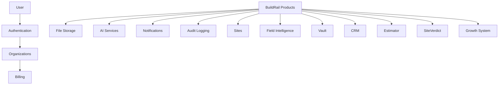

# BuildRail Shared Services

**Document:** `docs/platform/shared-services.md`
**Status:** Living Document
**Owner:** BuildRail Engineering
**Category:** Platform Architecture

---

# 1. Purpose

Shared services are the reusable capabilities that power every BuildRail product.

Rather than building isolated applications, BuildRail operates as a unified platform where products share:

- Authentication
- Organizations
- Users
- Permissions
- Notifications
- AI infrastructure
- File storage
- Audit history
- Analytics
- Billing context
- Common UI patterns

The purpose of shared services is to allow new BuildRail products to be created quickly while maintaining consistency, security, and quality.

---

# 2. BuildRail Platform Model

BuildRail follows a platform-first architecture:



The product layer should remain thin.

The platform owns the difficult problems.

---

# 3. Shared Service Principles

## 3.1 Build Once, Use Everywhere

If multiple products need the same capability:

Do not duplicate.

Create a shared service.

Example:

Bad:

```
apps/sites/lib/email.ts

apps/vault/lib/email.ts

apps/field/lib/email.ts
```

Good:

```
packages/email/
```

---

## 3.2 Platform Services Are Product Agnostic

Shared services should not know about individual products.

Example:

Incorrect:

```ts
sendSiteVerdictNotification();
```

Better:

```ts
sendNotification({
	type: 'audit_completed',
	recipient,
	payload,
});
```

The platform provides capabilities.

Products provide context.

---

# 4. Monorepo Structure

Shared services live primarily inside packages.

Recommended structure:

```
buildrail/

├── apps/
│
│   ├── marketing/
│   ├── sites/
│   ├── field/
│   ├── vault/
│   └── siteverdict/
│
├── packages/
│
│   ├── auth/
│   ├── database/
│   ├── permissions/
│   ├── notifications/
│   ├── ai/
│   ├── storage/
│   ├── analytics/
│   ├── ui/
│   └── config/
│
└── docs/
```

---

# 5. Current Shared Service Inventory

| Service        | Purpose                     | Location                 |
| -------------- | --------------------------- | ------------------------ |
| Authentication | User identity and sessions  | `packages/auth`          |
| Database       | Supabase client patterns    | `packages/database`      |
| Organizations  | Multi-tenant structure      | `packages/organizations` |
| Permissions    | Role checks                 | `packages/permissions`   |
| UI System      | Shared components           | `packages/ui`            |
| AI Services    | AI provider abstraction     | `packages/ai`            |
| Storage        | Files and media             | `packages/storage`       |
| Notifications  | Email/SMS/in-app            | `packages/notifications` |
| Analytics      | Product events              | `packages/analytics`     |
| Configuration  | Shared environment handling | `packages/config`        |

---

# 6. Authentication Service

Authentication provides:

- User login
- Session management
- Identity verification
- User profiles

Example:

```ts
const user = await auth.getCurrentUser();

if (!user) {
	redirect('/login');
}
```

Authentication does not determine product permissions.

That belongs to organizations and roles.

---

# 7. Organization Service

Every BuildRail action should happen within an organization context.

Example:

```ts
{
  user_id: "123",
  organization_id: "abc",
  role: "admin"
}
```

Products should never assume:

```ts
currentUser owns everything
```

Instead:

```ts
currentOrganization.projects;
```

---

# 8. Permission Service

Authorization rules are centralized.

Example:

```ts
can(user, 'create_project');
```

instead of:

```ts
if(user.role === "admin")
```

throughout the codebase.

---

## Permission Model

| Role    | Description               |
| ------- | ------------------------- |
| Owner   | Full organization control |
| Admin   | Manage users and settings |
| Manager | Manage projects           |
| Member  | Standard access           |
| Viewer  | Read only                 |

---

# 9. AI Service Layer

AI capabilities should be accessed through a shared abstraction.

Example:

```ts
import { generateAIResponse } from '@buildrail/ai';

const result = await generateAIResponse({
	task: 'create_estimate',
	context,
});
```

Products should not directly manage:

- API keys
- Model selection
- Rate limits
- Logging
- Cost tracking

---

# 10. Notification Service

All outbound communication flows through one service.

Supported channels:

| Channel | Examples                |
| ------- | ----------------------- |
| Email   | Reports, alerts         |
| SMS     | Customer updates        |
| Push    | Future                  |
| In-app  | Dashboard notifications |

Example:

```ts
await notify({
	userId,
	type: 'proposal_created',
	message,
});
```

---

# 11. Storage Service

Centralizes file handling.

Used for:

- Photos
- Documents
- Estimates
- Contracts
- Audit evidence

Example:

```ts
await storage.upload({
	bucket: 'project-files',
	file,
});
```

Storage rules:

- Never expose private buckets
- Always validate ownership
- Always log access

---

# 12. Audit Logging

Important business actions should be recorded.

Examples:

- User login
- Estimate created
- Proposal sent
- Payment completed
- Document downloaded

Example:

```ts
await audit.log({
	action: 'proposal.sent',
	userId,
	organizationId,
});
```

---

# 13. Shared UI System

All BuildRail applications should share:

- Components
- Typography
- Colors
- Forms
- Navigation patterns

Location:

```
packages/ui
```

Example:

```tsx
import { Button } from '@buildrail/ui';
```

---

# 14. Environment Standards

Shared services use centralized environment handling.

Example:

```
.env.local

NEXT_PUBLIC_SUPABASE_URL=
SUPABASE_SERVICE_ROLE_KEY=
OPENAI_API_KEY=
STRIPE_SECRET_KEY=
```

Rules:

- Never commit secrets
- Never duplicate environment files unnecessarily
- Production secrets managed through Vercel

---

# 15. Adding a New Shared Service

Before creating a new package:

Ask:

1. Is this used by multiple applications?
2. Does it represent platform capability?
3. Will centralization reduce duplication?

If yes:

Create:

```
packages/new-service
```

Include:

```
src/
README.md
package.json
tsconfig.json
```

---

# 16. Development Checklist

Before adding product functionality:

- [ ] Does an existing shared service solve this?
- [ ] Is authentication handled centrally?
- [ ] Is organization context included?
- [ ] Are permissions checked?
- [ ] Are actions logged?
- [ ] Are secrets protected?
- [ ] Can another BuildRail product reuse this?

---

# 17. Long-Term Vision

The BuildRail platform should eventually allow:

```
New Product Idea

        ↓

Existing Platform Services

        ↓

New Application Module

        ↓

Immediate access to:

✓ Users
✓ Organizations
✓ Billing
✓ AI
✓ Storage
✓ Notifications
✓ Analytics
✓ Security
```

The goal is not many applications.

The goal is one platform with many valuable capabilities.

---

# Document History

| Version | Date       | Notes                                       |
| ------- | ---------- | ------------------------------------------- |
| 1.0     | 2026-07-07 | Initial platform shared services definition |

---
