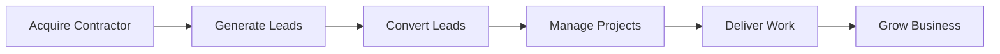
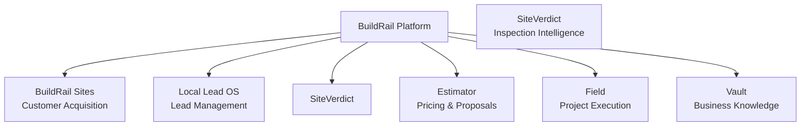

# BuildRail Product Roadmap

> **Build the operating system for modern contractors.**

BuildRail is a platform ecosystem designed to help contractors win more work, operate more efficiently, and deliver better customer experiences.

The roadmap is organized around a simple principle:

> Solve painful operational problems for contractors, then expand into the systems that power their business.

---

# 1. Product Vision

The construction industry is filled with disconnected tools:

- website builders
- estimating software
- CRMs
- inspection tools
- payment systems
- communication platforms

Most contractors do not need more software.

They need one connected operating system.

BuildRail combines:

```
Marketing

+

Lead Management

+

Sales

+

Estimating

+

Field Operations

+

Customer Communication

+

Business Intelligence
```

into one ecosystem.

---

# 2. Product Strategy

BuildRail follows the sequence:



Each product owns a stage of this lifecycle.

---

# 3. Product Ecosystem



---

# 4. Current Product Portfolio

## BuildRail Sites

### Purpose

Professional contractor websites optimized for conversion.

### Customer Problem

Contractors have outdated websites that generate little business.

### Core Value

"Turn your website into a salesperson."

---

Status:

🟢 Active Development

---

## Local Lead OS

### Purpose

Capture, organize, and respond to contractor leads.

### Customer Problem

Missed calls and slow responses lose jobs.

### Core Value

"Never lose another opportunity."

---

Status:

🟢 Active Development

---

## SiteVerdict

### Purpose

AI-powered inspection and compliance reporting.

### Customer Problem

Inspection findings are difficult to communicate and verify.

### Core Value

"Turn inspections into trusted documentation."

---

Status:

🟢 Active Development

---

## Estimator

### Purpose

Fast professional estimates for contractors.

### Customer Problem

Estimating is slow, inconsistent, and difficult to scale.

### Core Value

"Create accurate estimates faster."

---

Status:

🟡 Foundation Complete

---

## Field

### Purpose

Mobile project execution platform.

### Customer Problem

Field teams lack visibility and organization.

### Core Value

"Connect office and job site."

---

Status:

🟡 Planned Expansion

---

## Vault

### Purpose

Central knowledge and document repository.

### Customer Problem

Important information is scattered.

### Core Value

"One source of truth."

---

Status:

🟡 Platform Foundation

---

# 5. Roadmap Phases

---

# Phase 1 — Foundation

## Goal

Create a reliable contractor software foundation.

Timeline:

Current

Focus:

- monorepo architecture
- shared platform services
- authentication
- organizations
- billing foundation
- deployment standards
- documentation system

Success Criteria:

☑ Stable platform foundation

☑ Repeatable development process

☑ AI-assisted engineering workflow

---

# Phase 2 — First Revenue Products

## Goal

Convert products into paying customer solutions.

Priority:

1. BuildRail Sites
2. Local Lead OS
3. SiteVerdict

Why?

These solve immediate contractor pain:

- getting customers
- managing leads
- proving quality

Success Criteria:

☑ First paying customers

☑ Clear pricing

☑ Customer feedback loop

---

# Phase 3 — Contractor Operating System

## Goal

Connect individual products.

Example:

```
Website Lead

↓

Lead OS

↓

Estimator

↓

Project

↓

Field

↓

Vault

```

The contractor experiences one platform.

---

Success Criteria:

☑ Shared customer data

☑ Shared organizations

☑ Unified billing

☑ Unified permissions

---

# Phase 4 — Intelligence Layer

## Goal

Use AI to create business leverage.

Capabilities:

- AI recommendations
- automated follow-up
- proposal generation
- project summaries
- risk detection
- knowledge retrieval

---

# 6. Platform Priorities

Platform capabilities are built before advanced features.

Priority order:

```
Authentication

↓

Organizations

↓

Permissions

↓

Billing

↓

Notifications

↓

Files

↓

Audit Logs

↓

AI Services

```

---

# 7. Feature Prioritization Framework

Every feature should answer:

## Customer Value

Does it solve a painful problem?

---

## Revenue Impact

Can it support pricing?

---

## Strategic Fit

Does it strengthen the platform?

---

## Complexity

Can it be delivered efficiently?

---

Priority formula:

```
Value × Strategic Fit
---------------------
Complexity
```

---

# 8. What BuildRail Will Not Build

Avoid:

- generic productivity tools
- consumer applications
- unnecessary dashboards
- features without customers
- technology experiments without business value

---

# 9. Customer-Driven Development

The roadmap changes based on:

- customer conversations
- usage data
- market feedback
- revenue opportunities

The customer defines priorities.

---

# 10. AI Development Strategy

AI accelerates:

- research
- prototyping
- coding
- testing
- documentation

AI does not replace:

- customer discovery
- product judgment
- engineering ownership

---

# 11. Definition of Product Completion

A feature is complete when:

☑ Works technically

☑ Solves the intended problem

☑ Has documentation

☑ Has error handling

☑ Has testing

☑ Can be supported

☑ Can be sold

---

# 12. Long-Term Vision

BuildRail becomes:

> The operating system for independent contractors.

A platform where contractors can:

- attract customers
- sell jobs
- manage projects
- communicate professionally
- protect their reputation
- grow their business

---

# Final Principle

BuildRail is not a collection of apps.

It is a connected ecosystem.

Every product should make the contractor more successful.

Every engineering decision should move toward that vision.
