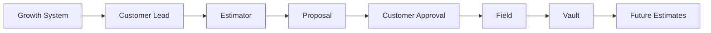
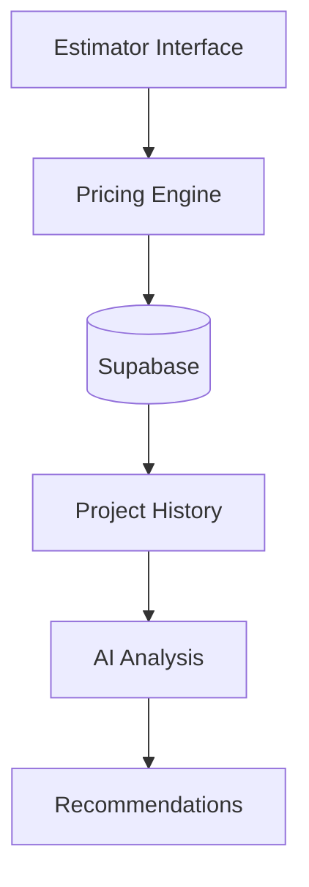

# BuildRail Estimator

> **Turn job details into confident estimates.**

BuildRail Estimator is the pricing intelligence layer of the BuildRail ecosystem.

It helps contractors create faster, more consistent, and more professional estimates by combining:

- trade-specific pricing logic
- project information
- historical data
- AI assistance
- customer-ready proposals

---

# 1. Product Vision

Estimating is one of the most important activities in a contractor's business.

A good estimate must balance:

- accuracy
- speed
- profitability
- customer trust

Traditional estimating processes are often:

- spreadsheets
- handwritten notes
- outdated templates
- tribal knowledge

BuildRail Estimator transforms estimating from an isolated task into an intelligent business process.

---

# 2. The Problem

Contractors commonly struggle with:

| Problem              | Impact                  |
| -------------------- | ----------------------- |
| Slow estimates       | Lost jobs               |
| Inconsistent pricing | Lost margin             |
| Poor documentation   | Customer confusion      |
| No historical data   | Repeated mistakes       |
| Manual calculations  | Administrative overhead |

---

# 3. Product Mission

> Help contractors price work confidently, win more projects, and protect profitability.

---

# 4. Position Within BuildRail Ecosystem

Estimator is the commercial intelligence layer.



The ecosystem loop:

```
Lead
 ↓
Estimate
 ↓
Project
 ↓
History
 ↓
Better Estimates
```

---

# 5. Application Structure

Current location:

```
apps/
└── estimator/
```

Shared packages:

```
packages/
├── estimator-ui
└── estimator-embed
```

---

# 6. Product Components

## 6.1 Estimate Builder

Core estimating workflow.

Users define:

- project type
- scope
- materials
- labor
- options
- adjustments

Example:

```
Project:
Kitchen Remodel

Scope:
Cabinet Replacement

Materials:
$8,500

Labor:
$6,000

Margin:
30%

Estimate:
$20,700
```

---

# 6.2 Trade Calculators

Initial target trades:

| Trade      | Examples                  |
| ---------- | ------------------------- |
| Roofing    | Squares, materials, labor |
| Plumbing   | Fixtures, piping, labor   |
| HVAC       | Equipment sizing          |
| Electrical | Circuits, fixtures        |
| Remodeling | Room-based estimates      |

---

# 6.3 Proposal Generation

Estimator should produce professional customer documents.

Example output:

```
BuildRail Estimate

Project:
Master Bathroom Remodel

Scope:
Complete renovation

Investment:
$34,500

Includes:
✓ Labor
✓ Materials
✓ Cleanup

Next Step:
Schedule project consultation
```

---

# 7. AI Capabilities

AI should enhance estimating, not replace contractor expertise.

---

## Estimate Assistant

Example:

User:

```
Estimate a 900 sq ft roof replacement.
```

AI:

```
Based on typical regional pricing:

Materials:
$8,000-$10,000

Labor:
$6,000-$8,000

Suggested estimate:
$18,500

Consider:
- roof pitch
- disposal requirements
- permit costs
```

---

## Scope Analysis

AI can identify missing information.

Example:

Input:

```
Replace bathroom tile.
```

AI response:

```
Missing details:

□ Square footage
□ Waterproofing requirements
□ Existing damage
□ Disposal needs
```

---

# 8. Architecture



---

# 9. Data Model

## estimates

Stores estimate records.

```sql
estimates
---------
id
organization_id
project_id
customer_id
status
total_amount
created_at
```

---

## estimate_items

Individual line items.

```sql
estimate_items
--------------
id
estimate_id
category
description
quantity
unit_cost
margin
```

---

## pricing_rules

Trade-specific intelligence.

```sql
pricing_rules
-------------
id
organization_id
trade
category
cost
unit
```

---

# 10. Multi-Tenant Design

Every estimate belongs to an organization.

Example:

```typescript
interface Estimate {
	id: string;
	organization_id: string;
	customer_id?: string;
	project_id?: string;
	status: EstimateStatus;
}
```

Required:

- organization isolation
- Row Level Security
- audit history

---

# 11. Integration With Other Products

## Growth System

Lead → Estimate

Example:

```
New roofing lead

↓

Estimator creates opportunity

↓

Proposal generated
```

---

## Field

Field provides:

- measurements
- photos
- observations

Example:

```
Roof inspection photos

↓

Estimator

↓

Replacement estimate
```

---

## Vault

Vault stores:

- previous estimates
- actual costs
- profitability data

---

## SiteVerdict

Inspection findings may influence estimates.

Example:

```
AI finds:

"Water intrusion detected"

↓

Estimator:

Generate repair scope
```

---

# 12. Shared UI Package

Reusable estimator components live in:

```
packages/
└── estimator-ui
```

Purpose:

Allow Estimator functionality to appear inside:

- BuildRail Sites
- Growth System
- Field
- future integrations

---

# 13. Security Requirements

Estimator contains sensitive business data.

Requirements:

- authenticated access
- tenant isolation
- protected pricing information
- audit logging

Related:

- authentication.md
- organizations.md
- database-standards.md

---

# 14. Subscription Positioning

Estimator is a premium feature.

Possible tiers:

| Plan         | Capability                  |
| ------------ | --------------------------- |
| Starter      | Basic calculators           |
| Professional | Estimate builder            |
| Premium      | AI assistance               |
| Enterprise   | Custom pricing intelligence |

---

# 15. Product Roadmap

## Phase 1 — Foundation

Current:

- calculator framework
- estimate creation
- reusable UI components

---

## Phase 2 — Contractor Intelligence

Future:

- saved pricing templates
- historical comparisons
- margin analysis

---

## Phase 3 — AI Estimator

Future:

- photo-based estimating
- voice estimates
- scope generation
- automatic proposals

---

## Phase 4 — Closed Loop Intelligence

Future:

Compare:

```
Estimated Cost

vs

Actual Project Cost
```

Then improve future estimates automatically.

---

# 16. Product Principles

BuildRail Estimator must:

1. Make estimating faster.
2. Protect contractor margins.
3. Create professional customer experiences.
4. Learn from completed projects.
5. Become smarter over time.

---

# Final Principle

BuildRail Estimator is not a calculator.

It is the financial intelligence engine that connects:

Customer demand → Pricing → Profitability → Business knowledge

The goal:

> Every contractor should know what a job is worth before they commit.
