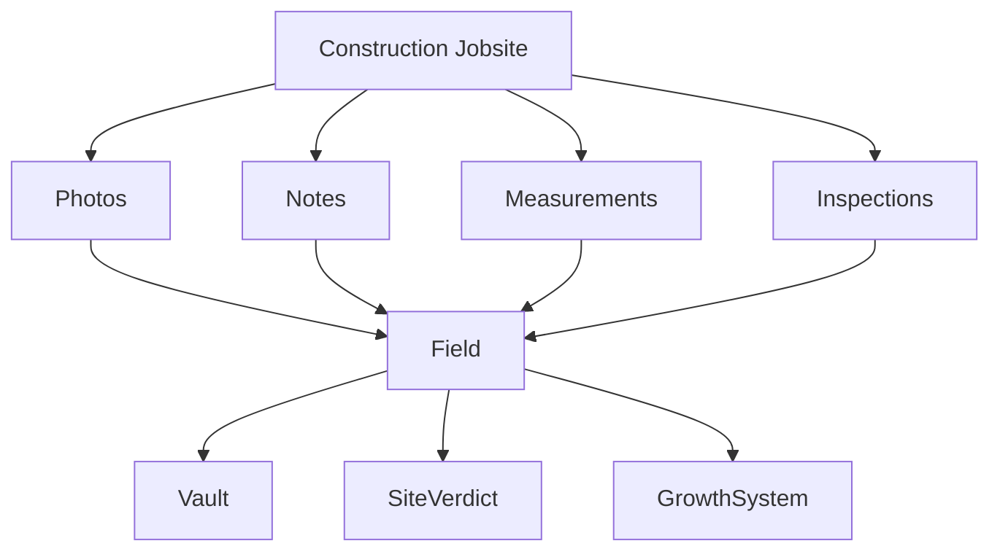
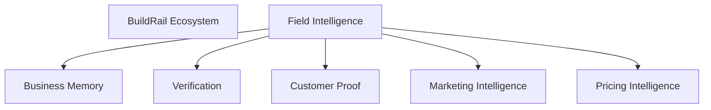
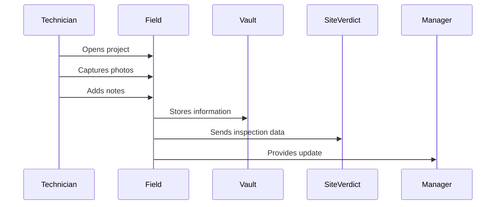
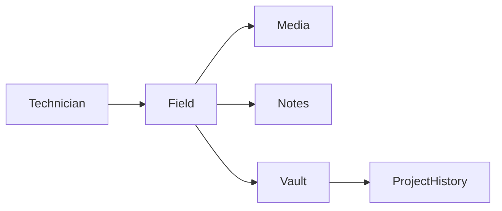
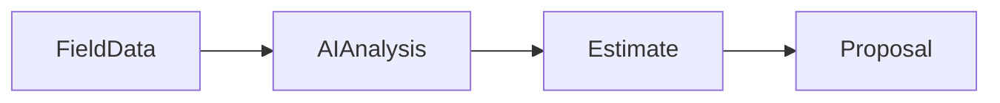

# BuildRail Field

> **Product Documentation**
>
> **Location:** `docs/products/field.md`
> **Product:** BuildRail Field Intelligence
> **Status:** Active Development
> **Owner:** BuildRail Product Team

---

# 1. Overview

## What Is BuildRail Field?

BuildRail Field Intelligence is the operational data capture platform within the BuildRail ecosystem.

It connects the physical jobsite with the digital business system by allowing contractors and field teams to capture:

- project updates
- photos
- measurements
- notes
- inspections
- customer communication
- completion evidence

Field transforms disconnected jobsite activity into structured information that powers the rest of BuildRail.

---

# 2. Product Mission

## Mission Statement

> Bring the construction jobsite into the operating system.

---

# 3. The Problem

Construction businesses operate between two worlds:

## The Physical World

- crews
- tools
- materials
- customers
- inspections
- job progress

## The Digital World

- estimates
- documents
- reports
- marketing
- customer records

The gap creates problems:

| Problem                                | Result                |
| -------------------------------------- | --------------------- |
| Photos stay on phones                  | Lost project history  |
| Notes are handwritten                  | Missing details       |
| Updates are inconsistent               | Poor visibility       |
| Information arrives late               | Slow decisions        |
| Field knowledge stays with individuals | Business cannot scale |

---

# 4. The Field Solution

BuildRail Field creates a structured workflow for capturing jobsite intelligence.



---

# 5. Position Within BuildRail Ecosystem

Field is the **operational input layer**.



---

# 6. Core Capabilities

# Project Capture

Field users can capture:

- project status
- job notes
- photos
- documents
- observations

---

# Photo Intelligence

Photos are not just stored.

They become structured business assets.

Examples:

Before:

```
IMG_4829.jpg
```

After:

```
Project:
Johnson Kitchen Remodel

Category:
Electrical Inspection

Stage:
Rough-In

Uploaded:
Technician Name

AI Summary:
"Electrical box installation visible before drywall."
```

---

# Jobsite Notes

Field supports structured notes:

Example:

```text
Project:
Smith Bathroom Remodel

Update:
Plumbing rough-in complete.

Issue:
Existing drain location requires adjustment.

Next Action:
Schedule plumber review.
```

---

# 7. User Workflows

## Technician Workflow



---

# 8. Application Architecture

Current application:

```text id="x1s8vh"
apps/
 └── field/
     ├── app/
     ├── components/
     ├── lib/
     └── public/
```

---

# 9. Technical Architecture

## Frontend

Technology:

- Next.js
- React
- TypeScript
- Tailwind CSS
- Shadcn UI

---

## Backend

Services:

- Supabase Database
- Supabase Storage
- Edge Functions
- AI processing

---

# 10. Data Model

## field_updates

Stores jobsite activity.

```sql id="sv0z7f"
field_updates
-------------
id
organization_id
project_id
user_id
type
content
created_at
```

---

## field_media

Stores uploaded assets.

```sql id="f8q2ck"
field_media
-----------
id
field_update_id
storage_path
media_type
metadata
```

---

## field_observations

Structured findings.

```sql id="d6v4nm"
field_observations
------------------
id
project_id
category
description
severity
created_at
```

---

# 11. Integration With Vault

Every field activity can become permanent project history.



---

# 12. Integration With SiteVerdict

Field provides inspection inputs.

Example:

```
Technician captures:

- damaged flashing photo
- roof condition note
- measurement

↓

SiteVerdict

↓

AI Compliance Report
```

---

# 13. Integration With Estimator

Future workflow:



Examples:

- measured dimensions
- material observations
- repair recommendations

---

# 14. Integration With BuildRail Sites

Field creates proof-of-work content.

Examples:

- progress photos
- completed projects
- craftsmanship evidence

Flow:

```
Field
 ↓
Vault
 ↓
BuildRail Sites Gallery
```

---

# 15. Offline Capability

Construction environments often have:

- poor connectivity
- remote locations
- unfinished buildings

Future requirements:

- offline capture
- queued uploads
- automatic synchronization

---

# 16. AI Capabilities

Future AI features:

## Photo Understanding

AI identifies:

- materials
- construction stages
- visible issues

---

## Automatic Reports

Example:

Input:

```
25 project photos
3 technician notes
```

Output:

```
Weekly Progress Report

Completed:
Foundation inspection

Issues:
Water intrusion concern

Recommended:
Schedule waterproofing review
```

---

# 17. Security Requirements

Field handles operational business information.

Requirements:

- authenticated users
- organization isolation
- project-level permissions
- secure media uploads
- audit logging

Related:

- `docs/platform/authentication.md`
- `docs/platform/organizations.md`
- `docs/platform/file-storage.md`

---

# 18. Roles

Example:

| Role       | Access            |
| ---------- | ----------------- |
| Owner      | All projects      |
| Manager    | Assigned projects |
| Technician | Assigned jobs     |
| Customer   | Shared updates    |

---

# 19. Product Roadmap

## Phase 1 — Foundation

Completed:

- project capture
- photos
- notes
- uploads

---

## Phase 2 — Field Intelligence

Future:

- AI photo analysis
- automatic summaries
- issue detection
- voice notes

---

## Phase 3 — Connected Operations

Future:

- scheduling
- crew assignments
- customer updates
- material tracking

---

## Phase 4 — Autonomous Construction Assistant

Future:

AI assistant that can answer:

> "What happened on the Martinez project last week?"

Using:

- Field data
- Vault history
- SiteVerdict reports

---

# 20. Product Principles

BuildRail Field must always:

1. Make jobsite information easy to capture.
2. Convert activity into intelligence.
3. Reduce administrative work.
4. Preserve project history.
5. Connect field operations to business growth.

---

# Summary

BuildRail Field Intelligence connects the physical construction world with the digital BuildRail ecosystem.

It captures what happens on the jobsite.

Vault remembers it.

SiteVerdict validates it.

Growth System uses it.

Together they create a complete operating system for contractors.
