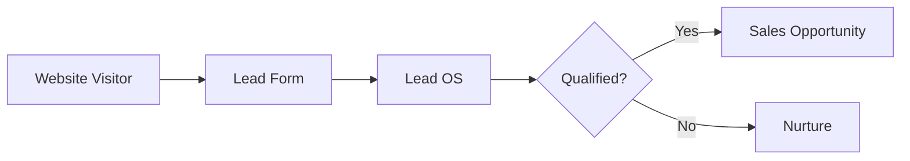
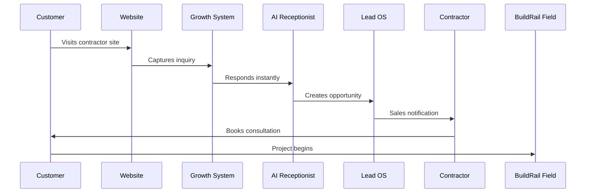
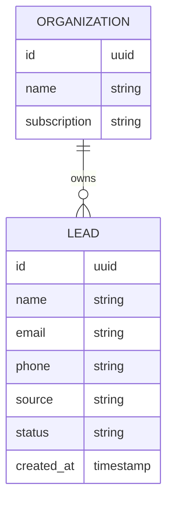

# BuildRail Growth System

> **The growth engine for modern contractors.**

The BuildRail Growth System helps contractors attract more leads, respond faster, convert opportunities, and maintain consistent customer communication.

While other BuildRail products improve operations after a customer is acquired, Growth System focuses on the critical first stage:

**Getting the right customers into the pipeline.**

---

# 1. Product Vision

Most contractors do not fail because they cannot perform the work.

They fail because:

- leads are missed
- calls are unanswered
- follow-ups are inconsistent
- marketing is reactive
- customer acquisition depends on referrals alone

BuildRail Growth System provides contractors with a repeatable customer acquisition machine.

The goal:

> Turn every contractor into a professional sales organization without requiring a dedicated marketing department.

---

# 2. Position Within BuildRail Ecosystem


Growth System sits at the beginning of the customer lifecycle.

| Product       | Primary Function                    |
| ------------- | ----------------------------------- |
| Sites         | Customer-facing web presence        |
| Growth System | Lead generation and conversion      |
| Field         | Project execution and communication |
| Vault         | Business intelligence and records   |
| SiteVerdict   | Quality verification                |
| Estimator     | Sales acceleration                  |

---

# 3. Product Architecture

Growth System is composed of several specialized modules.

```
apps/
└── growth-system/
    |
    ├── lead-os/
    |
    ├── ai-receptionist/
    |
    ├── content-engine/
    |
    └── localproof/
```

---

# 4. Modules

## 4.1 Local Lead OS

**Purpose:**
Capture, organize, and manage contractor leads.

Repository:

```
apps/growth-system/lead-os
```

Core capabilities:

- Lead capture
- Contact management
- Opportunity tracking
- Follow-up reminders
- Lead status pipeline

Example workflow:



---

## 4.2 AI Receptionist

**Purpose:**
Ensure contractors never lose opportunities because they missed a call.

Repository:

```
apps/growth-system/ai-receptionist
```

Capabilities:

- AI-assisted responses
- Missed-call recovery
- Lead qualification
- Appointment preparation
- Customer communication

Core principle:

> The fastest responder often wins the job.

---

## 4.3 Local Content OS

**Purpose:**
Generate consistent local marketing content.

Repository:

```
apps/growth-system/content-engine
```

Capabilities:

- Social posts
- Local SEO content
- Project updates
- Customer education
- Review campaigns

---

## 4.4 LocalProof

**Purpose:**
Turn completed projects into marketing assets.

Repository:

```
apps/growth-system/localproof
```

Capabilities:

- Before/after content
- Customer proof
- Project storytelling
- Reputation building

---

# 5. Customer Journey

The Growth System supports the contractor journey:



---

# 6. Technology Standards

Growth System follows BuildRail engineering standards.

## Frontend

| Technology | Standard           |
| ---------- | ------------------ |
| Framework  | Next.js App Router |
| Language   | TypeScript         |
| Styling    | Tailwind CSS       |
| Components | Shadcn UI          |
| Icons      | Lucide             |

---

## Backend

| Technology     | Purpose                     |
| -------------- | --------------------------- |
| Supabase       | Database and authentication |
| PostgreSQL     | Application data            |
| Storage        | Customer assets             |
| Edge Functions | Automation                  |

---

# 7. Data Model

Core entities:



---

# 8. Multi-Tenant Requirements

Growth System must support multiple contractor organizations.

Every record must belong to an organization.

Example:

```typescript
interface Lead {
	id: string;
	organization_id: string;
	name: string;
	email?: string;
	phone?: string;
	status: LeadStatus;
}
```

Never create customer data without tenant ownership.

---

# 9. Subscription Model

Growth System capabilities are controlled through feature access.

Example:

| Plan         | Features             |
| ------------ | -------------------- |
| Starter      | Lead capture         |
| Professional | Lead OS + automation |
| Premium      | AI Receptionist      |
| Enterprise   | Full Growth Suite    |

---

# 10. Integration Points

Growth System communicates with other BuildRail modules.

## Sites

Website visitor → Lead creation

---

## Vault

Customer information → Long-term business record

---

## Field

Qualified customer → Active project

---

## Notifications

Events:

- New lead
- Missed call
- Appointment created
- Customer response

---

# 11. Development Principles

Growth System follows these principles:

## Build systems, not features

A lead tracker is a feature.

A system that captures, qualifies, responds, and converts leads is a product.

---

## Automate repetitive contractor workflows

Contractors should spend time:

- selling
- managing crews
- completing projects

Not:

- copying information
- chasing leads
- writing follow-ups

---

## AI assists, humans decide

AI should:

- accelerate
- organize
- recommend

AI should not:

- make irreversible business decisions
- replace contractor judgment

---

# 12. Future Roadmap

Potential expansion:

## AI Sales Assistant

- lead scoring
- response suggestions
- objection handling

---

## Marketing Intelligence

- campaign tracking
- ROI measurement
- competitive analysis

---

## Reputation Engine

- review requests
- customer follow-up
- referral generation

---

# 13. Success Metrics

Growth System success is measured by:

| Metric                    | Goal               |
| ------------------------- | ------------------ |
| Lead response time        | Minutes, not hours |
| Lead conversion rate      | Increasing         |
| Missed opportunities      | Decreasing         |
| Customer acquisition cost | Decreasing         |
| Repeat/referral business  | Increasing         |

---

# Final Principle

BuildRail Growth System exists to solve the first question every contractor asks:

> "How do I get more of the right customers?"

The answer is not more random marketing.

The answer is a connected growth system.
