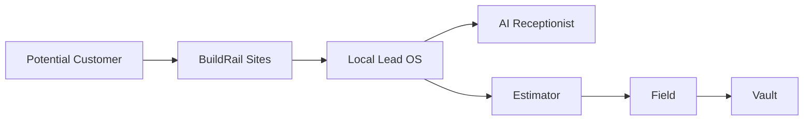
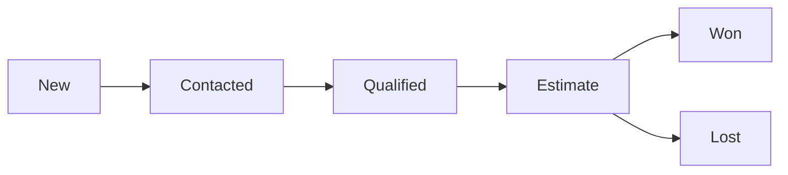
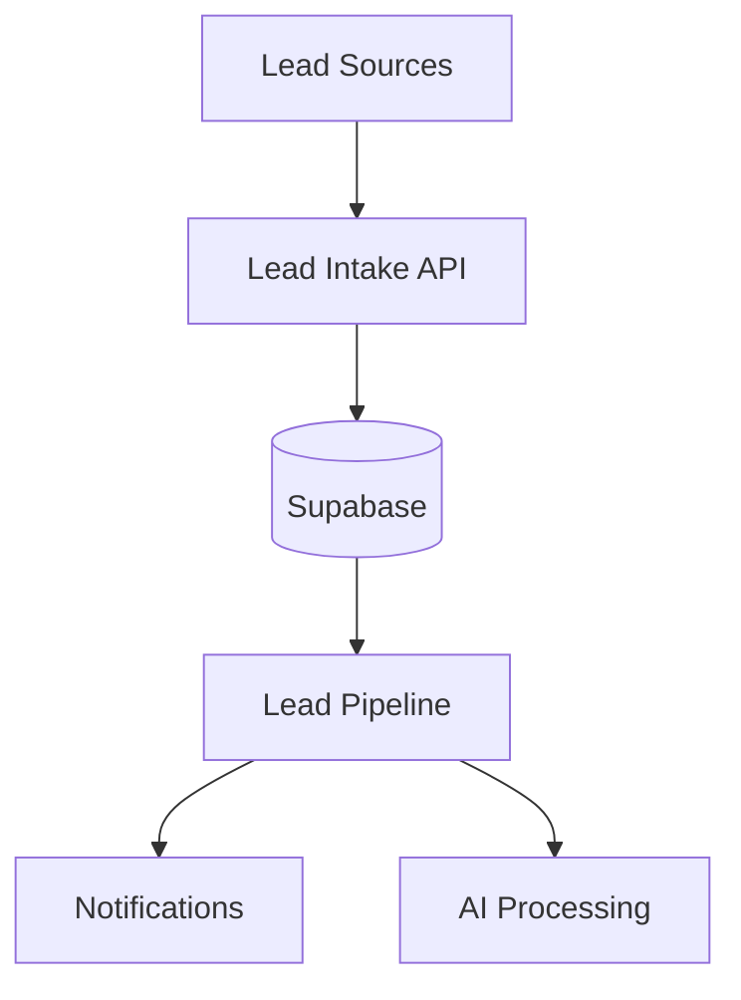

# Local Lead OS

> **Never lose another contractor lead.**

Local Lead OS is BuildRail's lead management and conversion platform designed specifically for local contractors.

It helps contractors capture every opportunity, respond quickly, organize prospects, and convert more inquiries into booked jobs.

---

# 1. Product Vision

Most contractors do not have a lead problem.

They have a **lead handling problem**.

A homeowner may:

- fill out a website form
- call after hours
- request a quote
- send a message
- ask for information

The contractor's response determines whether the opportunity becomes revenue.

Local Lead OS creates a simple system:

```
Capture

↓

Organize

↓

Respond

↓

Qualify

↓

Convert
```

---

# 2. The Problem

Contractors lose revenue because:

| Problem                | Business Impact              |
| ---------------------- | ---------------------------- |
| Missed calls           | Lost jobs                    |
| Slow responses         | Customers choose competitors |
| No tracking            | Leads disappear              |
| Poor follow-up         | Low conversion               |
| No pipeline visibility | Unpredictable revenue        |

---

# 3. Product Mission

> Give every contractor a professional sales process without needing a salesperson.

---

# 4. Position Within BuildRail Ecosystem

Local Lead OS is the entry point into the Growth System.



---

# 5. Application Structure

Current location:

```
apps/
└── growth-system/
    └── lead-os/
```

---

# 6. Core Features

## 6.1 Lead Capture

Sources:

- website forms
- phone inquiries
- manual entry
- imports
- marketing campaigns

Example:

```
New Lead

Name:
Sarah Johnson

Project:
Kitchen Remodel

Phone:
555-555-5555

Source:
Website

Status:
New
```

---

# 6.2 Lead Pipeline

Visual sales pipeline:



---

Pipeline stages:

| Stage     | Meaning              |
| --------- | -------------------- |
| New       | New inquiry received |
| Contacted | Contractor responded |
| Qualified | Project is viable    |
| Estimate  | Proposal requested   |
| Won       | Customer accepted    |
| Lost      | Opportunity closed   |

---

# 6.3 Lead Qualification

Local Lead OS helps determine:

- project type
- budget
- timeline
- location
- urgency

Example:

```
AI Qualification:

Project:
Bathroom Remodel

Timeline:
Within 60 days

Budget:
$20k-$30k

Score:
High Opportunity
```

---

# 6.4 Follow-Up Management

The system prevents leads from being forgotten.

Future capabilities:

- reminders
- automated messages
- follow-up sequences
- appointment scheduling

---

# 7. AI Capabilities

AI should remove administrative burden.

---

## Lead Summaries

Example:

Input:

```
Customer wants kitchen remodel.
Has existing cabinets.
Interested in modern design.
```

AI:

```
Summary:

High-value kitchen renovation opportunity.

Recommended next step:
Schedule consultation.
```

---

## Lead Scoring

Potential factors:

| Signal       | Weight |
| ------------ | ------ |
| Project size | High   |
| Timeline     | Medium |
| Location     | Medium |
| Engagement   | High   |

---

# 8. Architecture



---

# 9. Data Model

## leads

Primary lead record.

```sql
leads
-----
id
organization_id
name
email
phone
source
status
created_at
```

---

## lead_events

Tracks activity history.

```sql
lead_events
-----------
id
lead_id
type
description
created_at
```

Examples:

```
Lead Created

Phone Call

Email Sent

Estimate Requested
```

---

## lead_notes

Stores contractor notes.

```sql
lead_notes
----------
id
lead_id
content
created_by
created_at
```

---

# 10. Multi-Tenant Architecture

All leads belong to an organization.

Example:

```typescript
interface Lead {
	id: string;
	organization_id: string;
	name: string;
	phone?: string;
	email?: string;
	status: LeadStatus;
}
```

Required:

- organization ownership
- Row Level Security
- audit history

---

# 11. Integration Points

## BuildRail Sites

Website visitors become leads.

```
Visitor

↓

Contact Form

↓

Local Lead OS
```

---

## AI Receptionist

Missed calls become opportunities.

```
Phone Call

↓

AI Receptionist

↓

Lead OS
```

---

## Estimator

Qualified leads become estimates.

```
Qualified Lead

↓

Estimate Request

↓

Estimator
```

---

## Vault

Customer information becomes permanent history.

---

# 12. Notifications

Events:

- New lead received
- High-value opportunity
- Customer response
- Follow-up required

Channels:

Future:

- Email
- SMS
- Push notifications

---

# 13. Security Requirements

Local Lead OS contains customer information.

Requirements:

- authentication
- tenant isolation
- encrypted data
- audit logging
- permission controls

Related:

- authentication.md
- organizations.md
- security.md

---

# 14. User Roles

| Role       | Access                       |
| ---------- | ---------------------------- |
| Owner      | All leads                    |
| Manager    | Assigned teams               |
| Sales      | Pipeline management          |
| Technician | Limited customer information |

---

# 15. Subscription Positioning

Local Lead OS is a strong standalone product.

Possible pricing:

| Tier         | Features             |
| ------------ | -------------------- |
| Starter      | Lead capture         |
| Professional | Pipeline + reminders |
| Premium      | AI qualification     |
| Enterprise   | Full Growth System   |

---

# 16. Roadmap

## Phase 1 — Lead Foundation

Current:

- lead records
- pipeline
- organization support

---

## Phase 2 — Automation

Future:

- follow-up sequences
- AI responses
- scheduling

---

## Phase 3 — Sales Intelligence

Future:

- conversion analytics
- revenue forecasting
- recommended actions

---

## Phase 4 — Autonomous Lead Assistant

Future:

AI agent that can:

- answer inquiries
- qualify prospects
- schedule appointments
- prepare estimates

---

# 17. Product Principles

Local Lead OS must:

1. Capture every opportunity.
2. Reduce response time.
3. Make sales visible.
4. Prevent forgotten leads.
5. Increase contractor revenue.

---

# Final Principle

Local Lead OS is not a contact database.

It is the contractor's first revenue engine.

The system exists to answer one question:

> "Did we capture every opportunity, and did we do everything possible to win the job?"
