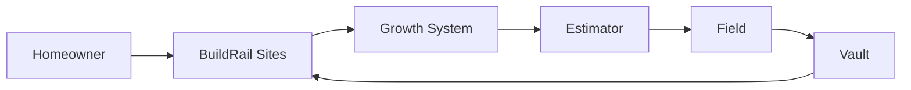
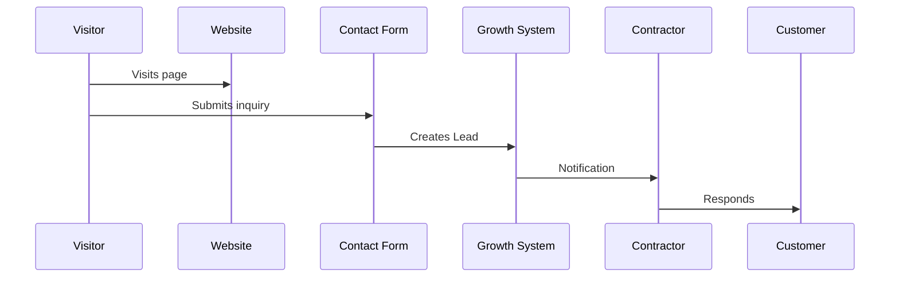
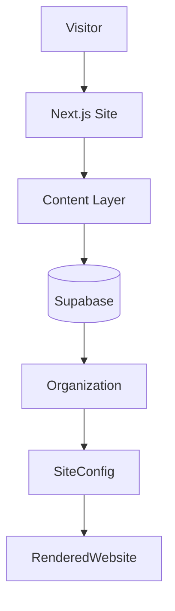

# BuildRail Sites

> **Professional websites built for contractors who need more than a brochure.**

BuildRail Sites creates high-converting, modern websites specifically designed for contractors.

Unlike traditional website builders, BuildRail Sites is connected directly to the BuildRail ecosystem.

A website is no longer just a digital business card.

It becomes:

- a lead generation engine
- a customer trust system
- a project showcase
- a sales assistant
- the first step in the contractor workflow

---

# 1. Product Vision

Most contractor websites fail because they are built like generic marketing pages.

They usually lack:

- clear positioning
- trust signals
- project proof
- lead capture
- conversion paths

BuildRail Sites exists to solve this problem.

The goal:

> Give every contractor an enterprise-quality online presence without needing a marketing agency.

---

# 2. The Problem

Contractors need customers, but most websites are built incorrectly.

Common problems:

| Problem                     | Result               |
| --------------------------- | -------------------- |
| Generic templates           | No differentiation   |
| Poor mobile experience      | Lost leads           |
| No project proof            | Low trust            |
| Weak calls-to-action        | Missed opportunities |
| No connection to operations | Fragmented workflow  |

---

# 3. Product Mission

BuildRail Sites helps contractors:

- look professional
- earn trust faster
- generate qualified leads
- showcase completed work
- connect marketing with operations

---

# 4. Position Within BuildRail Ecosystem

Sites is the customer entry point.



The complete customer lifecycle:

```
Discovery
 ↓
Website
 ↓
Lead
 ↓
Estimate
 ↓
Project
 ↓
Completion
 ↓
Proof
 ↓
More Customers
```

---

# 5. Application Structure

Current location:

```
apps/
└── sites/
```

Related ecosystem components:

```
apps/
├── sites
├── marketing
└── growth-system
```

---

# 6. Core Features

## 6.1 Contractor Website Engine

Sites provides reusable website foundations.

Core pages:

```
Home
Services
Projects
About
Reviews
Contact
```

---

## 6.2 Industry-Specific Templates

Initial target industries:

| Template           | Focus                    |
| ------------------ | ------------------------ |
| General Contractor | Full-service remodeling  |
| Roofing            | Trust and inspections    |
| HVAC               | Service conversion       |
| Plumbing           | Emergency leads          |
| Electrical         | Professional credibility |
| Flooring           | Portfolio showcase       |

---

# 6.3 Project Gallery

Contractors sell completed work.

The gallery system supports:

- before photos
- after photos
- project descriptions
- materials used
- customer outcomes

Example:

```
Project:

Kitchen Transformation

Scope:

Complete renovation

Results:

Modernized layout
Custom cabinetry
Improved functionality
```

---

# 6.4 Lead Capture

Every site connects directly to Growth System.



---

# 7. Architecture



---

# 8. Multi-Tenant Website Model

BuildRail Sites must support many contractor websites from one platform.

Example:

```
BuildRail Platform

        |
        |
 -------------------
 |        |         |
 GC A    GC B      GC C

site.com
site2.com
site3.com
```

Each customer has:

- organization
- branding
- domain
- content
- settings

---

# 9. Domain Architecture

Supported patterns:

## BuildRail Subdomain

Example:

```
company.buildrail.app
```

---

## Custom Domain

Example:

```
www.contractorname.com
```

---

## Domain Mapping

```mermaid
flowchart LR

Domain
--> Vercel

Vercel
--> BuildRail Router

Router
--> Organization Site

Organization Site
--> Content
```

---

# 10. Content Management

Contractors need simple editing.

Future CMS capabilities:

- company information
- services
- photos
- testimonials
- service areas
- promotions

Possible implementation:

```
Site Configuration

        |
        |
Organization Content

        |
        |
Rendered Website
```

---

# 11. Technology Standards

## Frontend

| Technology | Standard     |
| ---------- | ------------ |
| Framework  | Next.js      |
| Language   | TypeScript   |
| Styling    | Tailwind CSS |
| Components | Shadcn UI    |
| Deployment | Vercel       |

---

## Data

| Technology | Purpose         |
| ---------- | --------------- |
| Supabase   | Database        |
| Storage    | Images          |
| Auth       | Users           |
| RLS        | Tenant security |

---

# 12. Integration Points

## Growth System

Purpose:

Capture and convert visitors.

---

## Estimator

Purpose:

Allow visitors to request estimates.

Example:

```
Website visitor

↓

Estimate request

↓

Estimator workflow
```

---

## Field

Purpose:

Connect customer website information to active projects.

---

## Vault

Purpose:

Store customer and business history.

---

# 13. SEO Strategy

Contractors depend heavily on local search.

Sites should support:

- location pages
- service pages
- metadata
- structured data
- reviews
- project content

Example:

```
Roofing Contractor
+
Austin TX

=

Local Search Opportunity
```

---

# 14. Performance Standards

Every BuildRail Site should prioritize:

| Metric             | Goal      |
| ------------------ | --------- |
| Mobile performance | Excellent |
| Page speed         | Fast      |
| Accessibility      | High      |
| SEO readiness      | Built-in  |
| Conversion rate    | Optimized |

---

# 15. Security

Requirements:

- protected admin areas
- organization isolation
- safe content handling
- secure image storage
- audit logging

---

# 16. Subscription Positioning

Sites is the foundation product.

Possible tiers:

| Plan         | Capability               |
| ------------ | ------------------------ |
| Starter      | Basic website            |
| Professional | Custom branding          |
| Premium      | Lead integrations        |
| Enterprise   | Full BuildRail ecosystem |

---

# 17. Roadmap

## Phase 1 — Foundation

Current:

- contractor templates
- responsive layouts
- reusable components

---

## Phase 2 — Intelligence

Future:

- AI website creation
- content generation
- SEO recommendations

---

## Phase 3 — Connected Website

Future:

Website becomes an active business system.

Examples:

- instant estimates
- AI chat
- project updates
- customer portals

---

# 18. Product Principles

BuildRail Sites must:

1. Make contractors look professional.
2. Convert visitors into opportunities.
3. Connect marketing to operations.
4. Showcase proof and trust.
5. Become smarter through ecosystem data.

---

# Final Principle

BuildRail Sites is not a website builder.

It is the contractor's digital storefront connected to the entire business.

The customer journey begins here:

```
Visitor

↓

Website

↓

Lead

↓

Estimate

↓

Project

↓

Proof

↓

Growth
```

BuildRail Sites is where the ecosystem begins.
