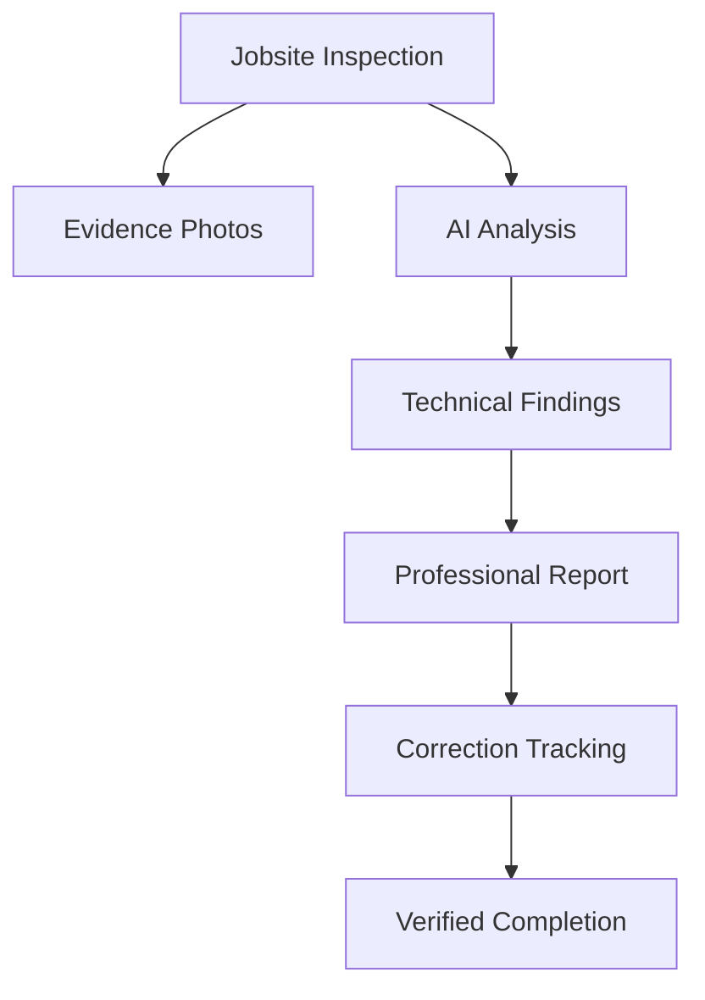
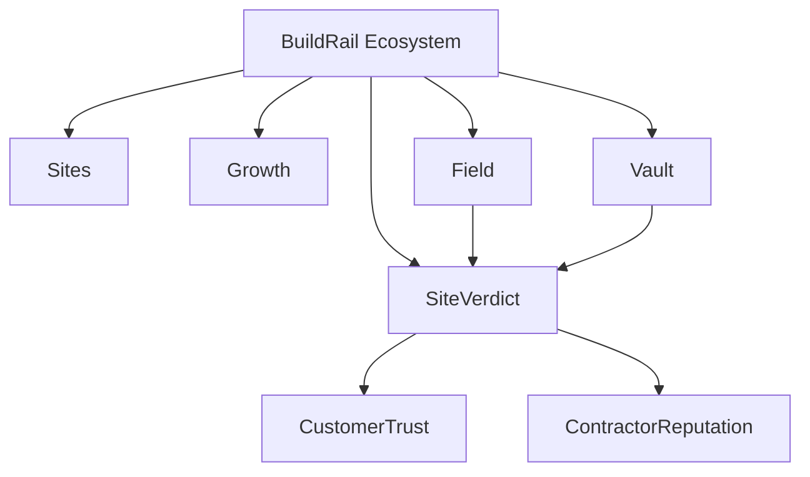
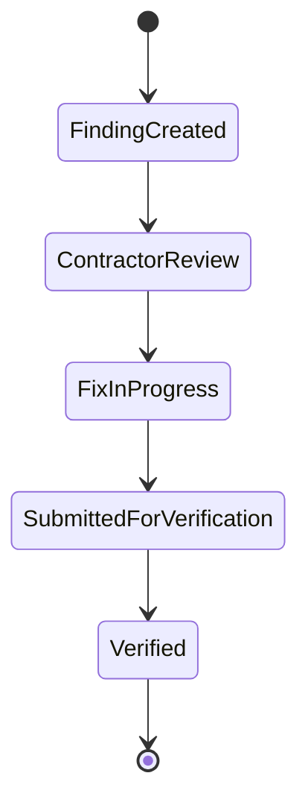
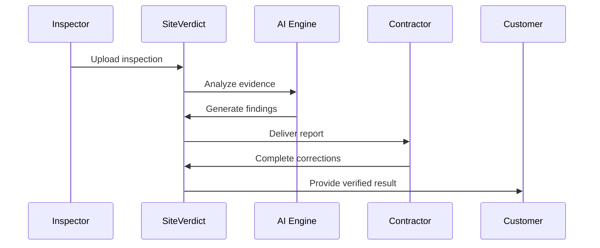

# BuildRail SiteVerdict

> **Product Documentation**
>
> **Location:** `docs/products/siteverdict.md`
> **Product:** BuildRail SiteVerdict
> **Status:** Active Development
> **Owner:** BuildRail Product Team

---

# 1. Overview

## What Is BuildRail SiteVerdict?

BuildRail SiteVerdict is an AI-powered construction inspection intelligence platform that transforms jobsite observations, photos, and technical findings into professional compliance reports.

SiteVerdict provides contractors, inspectors, and project stakeholders with a clear system for:

- identifying issues
- documenting evidence
- tracking corrections
- creating accountability
- communicating project status

The goal is simple:

> Replace uncertainty with documented proof.

---

# 2. Product Mission

## Mission Statement

> Create the trusted communication layer between construction professionals and the people who depend on them.

---

# 3. The Problem

Construction projects frequently suffer from:

| Problem                              | Impact              |
| ------------------------------------ | ------------------- |
| Verbal inspections                   | No permanent record |
| Disputes about responsibility        | Delays and conflict |
| Poor documentation                   | Lost evidence       |
| Homeowners don't understand issues   | Reduced trust       |
| Contractors struggle proving quality | Lost reputation     |

---

# 4. The SiteVerdict Solution

SiteVerdict creates a professional audit trail.

A typical workflow:



---

# 5. Position Within BuildRail Ecosystem

SiteVerdict is the **verification and trust layer** of BuildRail.



---

# 6. Core Capabilities

## AI Inspection Analysis

SiteVerdict analyzes:

- inspection photos
- project documentation
- construction details
- technician observations

Outputs:

- findings
- severity levels
- recommended corrections
- evidence references

---

# 7. Findings System

Each inspection finding follows a standard structure.

Example:

```typescript
interface Finding {
	item: string;
	status: 'PASS' | 'FAIL' | 'WARNING';
	fix: string;
	code_reference?: string;
	evidence_url?: string;
}
```

---

# 8. Report Experience

SiteVerdict reports provide:

## Summary

- project address
- trade category
- inspection status
- AI confidence score

---

## Findings

Each finding includes:

| Field          | Purpose               |
| -------------- | --------------------- |
| Issue          | What was discovered   |
| Status         | PASS / FAIL / WARNING |
| Fix            | Recommended action    |
| Code Reference | Supporting standard   |
| Evidence       | Photo documentation   |

---

# 9. Correction Verification

A major differentiator:

SiteVerdict does not stop at identifying problems.

It tracks resolution.



---

# 10. Public Report Sharing

SiteVerdict supports secure public viewing.

Example:

```
buildrail.com/audit/{id}
```

Public users can:

- view findings
- review evidence
- confirm corrections
- contact contractor

---

# 11. Customer Workflow



---

# 12. Application Architecture

Current application:

```
apps/
 └── siteverdict/
     ├── app/
     ├── components/
     ├── lib/
     └── public/
```

---

# 13. Technical Components

## Frontend

Technology:

- Next.js
- React
- TypeScript
- Tailwind CSS
- Shadcn UI

---

## Backend Services

Uses:

- Supabase Database
- Supabase Storage
- Edge Functions
- AI processing services

---

# 14. Database Model

## verdicts

Primary inspection record.

```sql
verdicts
---------
id
organization_id
property_address
trade_type
status
technician_notes
metadata
created_at
```

---

## findings

Inspection observations.

```sql
findings
--------
id
verdict_id
item
status
fix
code_reference
evidence_url
```

---

## verification_events

Correction history.

```sql
verification_events
-------------------
id
verdict_id
finding_id
action
user_id
timestamp
```

---

# 15. Storage Architecture

Evidence files are stored through BuildRail Storage.

Examples:

```
supabase-storage/

organizations/

  /{organization_id}/

      /siteverdict/

          /reports/

          /photos/

          /evidence/
```

---

# 16. Integration With Other Products

## BuildRail Field Intelligence

Provides:

- inspection capture
- technician workflows
- field observations

Flow:

```
Field App
   |
   v
SiteVerdict
   |
   v
Customer Report
```

---

## BuildRail Vault

Stores:

- photos
- reports
- documentation

---

## BuildRail Sites

Displays:

- completed projects
- certifications
- proof of quality

---

## BuildRail Growth System

Uses SiteVerdict results for:

- marketing content
- customer trust
- lead conversion

---

# 17. Security Requirements

SiteVerdict handles potentially sensitive project information.

Requirements:

- organization isolation
- authenticated access
- signed asset URLs
- audit logging
- role-based permissions

Related:

- `docs/platform/authentication.md`
- `docs/platform/organizations.md`
- `docs/platform/file-storage.md`
- `docs/platform/audit-logging.md`

---

# 18. AI Standards

AI output must always:

- provide confidence indicators
- avoid claiming certainty where unavailable
- reference evidence
- allow human review

AI assists professionals.

AI does not replace professional judgment.

---

# 19. Product Roadmap

## Phase 1 — Foundation

Completed:

- inspection reports
- findings
- public sharing
- correction tracking

---

## Phase 2 — Intelligence Expansion

Future:

- automated code reference suggestions
- photo comparison
- defect detection
- trend analysis

---

## Phase 3 — Contractor Reputation Layer

Future:

- verified quality scores
- customer-facing badges
- project portfolios
- proof-of-work profiles

---

## Phase 4 — Ecosystem Integration

Future:

- Field Intelligence automation
- Vault document linking
- Marketing content generation
- Website trust modules

---

# 20. Product Principles

SiteVerdict must always:

1. Create trust through evidence.
2. Make technical information understandable.
3. Preserve professional accountability.
4. Reduce construction disputes.
5. Turn completed work into business assets.

---

# Summary

BuildRail SiteVerdict transforms construction documentation from a passive record into an active trust system.

It gives contractors proof.

It gives customers confidence.

It gives BuildRail a foundation for verified construction intelligence.
