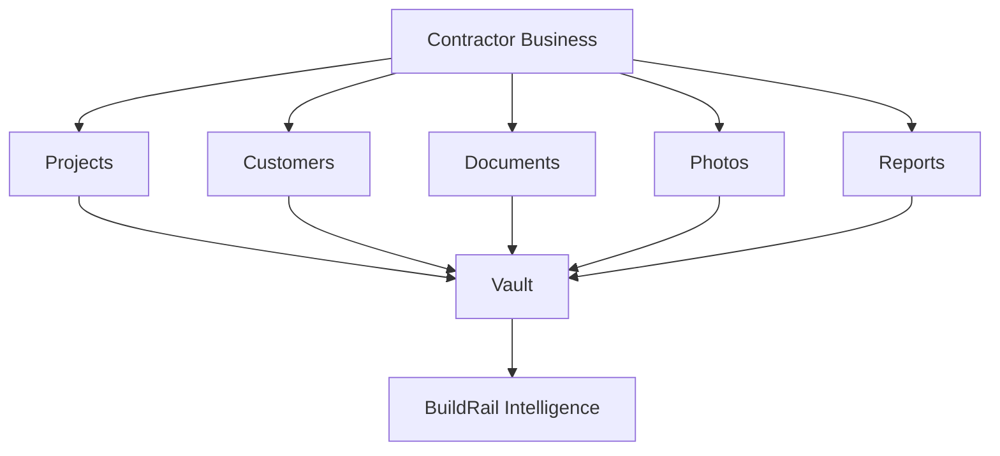
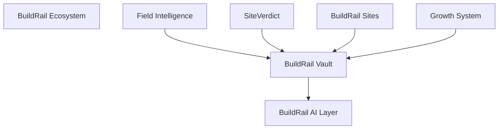
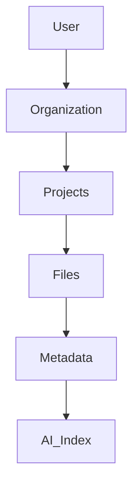
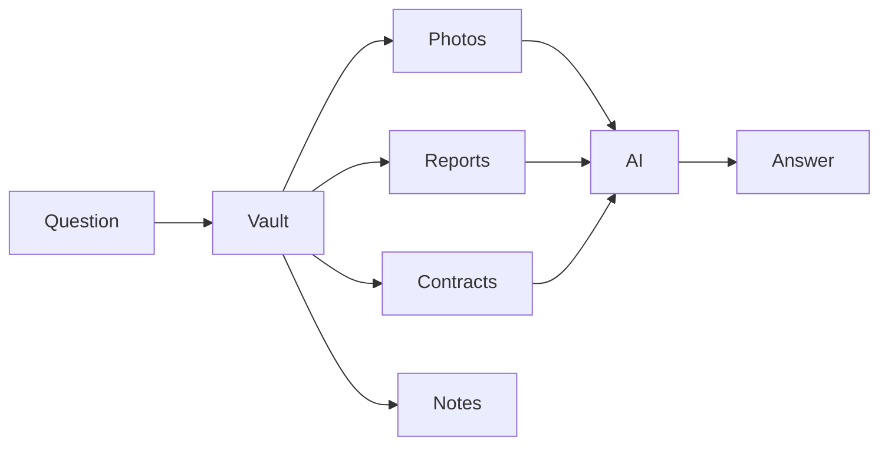

# BuildRail Vault

> **Product Documentation**
>
> **Location:** `docs/products/vault.md`
> **Product:** BuildRail Vault
> **Status:** Active Development
> **Owner:** BuildRail Product Team

---

# 1. Overview

## What Is BuildRail Vault?

BuildRail Vault is the secure document, asset, and project memory system inside the BuildRail ecosystem.

Vault provides a centralized location for contractors to store, organize, retrieve, and use the information generated throughout their business operations.

It manages the digital assets that power the rest of BuildRail:

- project photos
- inspection evidence
- estimates
- contracts
- customer documents
- permits
- invoices
- warranties
- AI-generated reports
- business knowledge

---

# 2. Product Mission

## Mission Statement

> Preserve every important piece of a contractor's business knowledge and make it instantly available when needed.

---

# 3. The Problem

Contractors generate enormous amounts of information:

| Information        | Current Reality         |
| ------------------ | ----------------------- |
| Project photos     | Scattered across phones |
| Contracts          | Lost in email           |
| Estimates          | Different systems       |
| Customer history   | Difficult to find       |
| Inspection reports | Disconnected            |
| Warranty records   | Forgotten               |

The result:

- wasted time
- repeated work
- missed opportunities
- customer frustration

---

# 4. The Vault Solution

BuildRail Vault creates a unified business memory.



---

# 5. Position Within BuildRail Ecosystem

Vault is the **system of record**.



---

# 6. Core Capabilities

## Document Management

Vault stores:

- contracts
- proposals
- invoices
- permits
- inspection reports
- customer documents

---

## Photo Management

Vault manages:

- before photos
- progress photos
- completion photos
- inspection evidence
- marketing assets

---

## Project Memory

Each project develops a permanent history.

Example:

```text
Project:
Smith Kitchen Remodel

Timeline:

01/15
Initial estimate

02/01
Contract signed

02/15
Demo completed

03/10
Inspection passed

03/25
Final photos uploaded
```

---

# 7. Vault Architecture

## Storage Model



---

# 8. Application Structure

Current location:

```text
apps/
 └── vault/
     ├── app/
     ├── components/
     ├── lib/
     ├── storage/
     └── public/
```

---

# 9. Data Model

## vault_files

Primary asset record.

```sql
vault_files
-----------
id
organization_id
project_id
filename
storage_path
file_type
size
uploaded_by
created_at
```

---

## projects

Business project container.

```sql
projects
--------
id
organization_id
customer_id
name
address
status
created_at
```

---

## file_metadata

Additional intelligence.

```sql
file_metadata
-------------
id
file_id
tags
description
ai_summary
classification
```

---

# 10. Storage Architecture

Vault uses Supabase Storage.

Example:

```text
storage/

organizations/

  {organization_id}/

      projects/

          {project_id}/

              photos/

              documents/

              reports/

              exports/
```

---

# 11. AI Integration

Vault becomes the context layer for BuildRail AI.

Example:

User asks:

> "What was the issue with the Johnson bathroom remodel?"

AI retrieves:



---

# 12. Integration With Other Products

## BuildRail Field Intelligence

Field creates:

- photos
- measurements
- technician notes

Stored in:

```
Field
 ↓
Vault
```

---

## BuildRail SiteVerdict

SiteVerdict stores:

- evidence photos
- inspection reports
- verification history

Stored in:

```
SiteVerdict
 ↓
Vault
```

---

## BuildRail Sites

Sites uses Vault assets for:

- galleries
- completed projects
- customer proof

Stored in:

```
Vault
 ↓
Website
```

---

## Growth System

Growth uses Vault content for:

- marketing posts
- case studies
- social proof

---

# 13. Search and Discovery

Future capabilities:

- semantic search
- AI document understanding
- automatic tagging
- duplicate detection
- project timelines

Example:

Search:

> "Show me all roofing projects completed in 2025."

Returns:

- projects
- photos
- customer information
- reports

---

# 14. Security Requirements

Vault contains sensitive business information.

Requirements:

- organization isolation
- role-based access
- encrypted storage
- signed URLs
- audit history
- retention policies

Related:

- `docs/platform/authentication.md`
- `docs/platform/organizations.md`
- `docs/platform/file-storage.md`
- `docs/platform/security.md`

---

# 15. Permissions Model

Example:

| Role       | Access                |
| ---------- | --------------------- |
| Owner      | Everything            |
| Admin      | Business data         |
| Manager    | Projects              |
| Technician | Assigned projects     |
| Customer   | Shared documents only |

---

# 16. Product Roadmap

## Phase 1 — Foundation

Completed:

- file storage
- project organization
- document upload
- photo management

---

## Phase 2 — Intelligence Layer

Future:

- AI summaries
- automatic categorization
- smart search
- document extraction

---

## Phase 3 — Business Memory

Future:

- customer history
- project timelines
- recurring issues
- company knowledge base

---

## Phase 4 — AI Operating System

Future:

Vault becomes the knowledge source for:

- AI assistants
- estimates
- customer communication
- marketing
- reporting

---

# 17. Product Principles

BuildRail Vault must always:

1. Preserve business knowledge.
2. Keep information organized.
3. Make retrieval effortless.
4. Protect customer data.
5. Enable intelligence across the ecosystem.

---

# Summary

BuildRail Vault is the memory layer of the BuildRail operating system.

Every project creates information.

Every interaction creates knowledge.

Vault ensures nothing important is lost.

It transforms scattered contractor data into a permanent, searchable, intelligent business asset.
